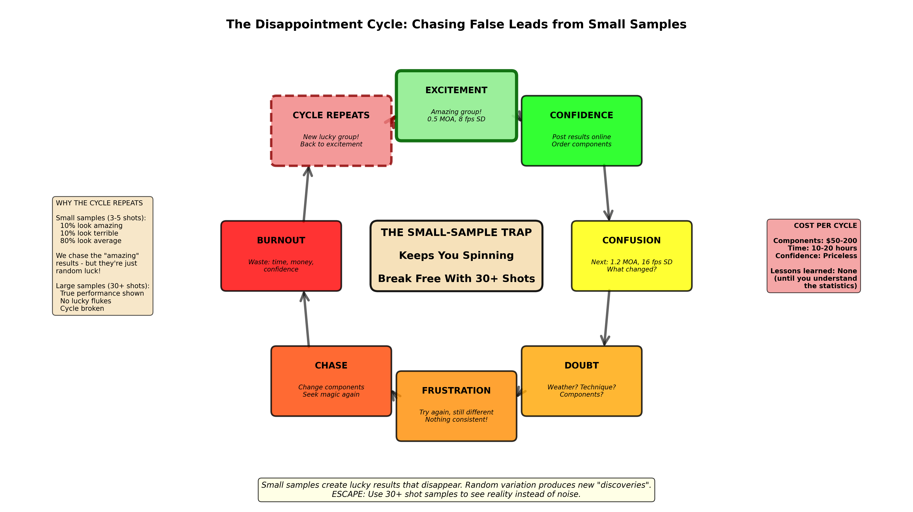

## The Reloading Cycle of Hope and Disappointment

You finally nailed it.

After three range sessions, two pounds of powder, 200 rounds fired, and countless measurements, you've found the perfect load. The chronograph shows 8 fps standard deviation. Your groups are touching. The seating depth is dialed. The node is confirmed.

You pack up, drive home, post the photo online with the caption: "Finally got this rifle figured out!"

**Two weeks later, you're back at the range. Same rifle. Same ammunition. Same rest.**

The chronograph now shows 18 fps SD. Groups are 50% larger. That "node" you found? Gone. Like it never existed.

What happened? Did your powder go bad in two weeks? Wrong primer lot? Barrel carbon buildup? Atmospheric pressure? Scope loosened?

**OR -** and this is the hard truth: Was that perfect session just **luck**?

If you've lived this cycle, you're not alone. Every serious handloader has been there. The perfect load that won't repeat. The amazing group that turns into a tease. The "breakthrough" that evaporates.

This isn't a character flaw. It's not bad technique. It's not even bad luck.

**It's statistics. And nobody taught you how they work.**

**Figure 1:** The emotional cycle of chasing false leads created by small sample sizes. This cycle is familiar to every handloader: initial excitement from a lucky group or low SD, confidence and investment in the "breakthrough," confusion when it doesn't repeat, frustration as you try to recover the magic, and eventually burnout. The cycle repeats because without proper sample sizes, random variation continuously creates new "discoveries" that seem real but won't replicate. Breaking this cycle requires understanding that your best results are often statistical outliers, not true capability.

---
### What Experienced Shooters Already Know

If you've been reloading and shooting for years, you've likely discovered many truths through patient trial and error:

- **Quality bullets matter more than brass prep** - You learned this by testing both
- **Consistent powder charges are important** - But extreme precision (±0.02gr) doesn't help as much as consistency (±0.1gr)
- **Some loads genuinely shoot better than others** - Real interactions between components exist
- **Proper fundamentals trump gear upgrades** - A skilled shooter with factory ammo outperforms a novice with custom loads and rifle
- **Certain techniques work consistently for you** - You've developed processes that deliver results

**This curriculum doesn't dismiss your experience.** You're not wrong about what works.

**What this curriculum adds:**

1. **Efficiency** - Reach the same conclusions with fewer rounds and less wasted time
2. **Confidence** - Know when differences are real vs. when you got lucky
3. **Focus** - Understand which variables matter most so you can prioritize effort
4. **Methodology** - Test systematically so results replicate across sessions

Many top competitive shooters have empirically discovered the same statistical principles we're teaching through decades of testing and thousands of rounds. We're helping you get there faster.

**If you're skeptical:** Good. Skepticism serves you well in this hobby. I'm not asking you to take my word for anything.  I'm teaching you the testing methodology to verify claims yourself with proper sample sizes. Try the methods. Compare your old approach to the statistical approach. Let your data decide.

---

## The Problem We All Face

Reloading is expensive. Not just in components, though that matters, but in:

**Time:** How many hours have you spent at the range chasing results that vanished?

**Money:** Calculate it. Bullets at $0.40+ each. Powder. Primers. Brass life. Barrel throat wear. If you've burned 500 rounds on load development that didn't pan out, that's $200+ down the drain. Many of us have spent thousands.

**Confidence:** The worst part isn't the cost. It's the doubt. "Am I doing something wrong? Is my rifle the problem? Why can't I get consistent results like everyone online?"

**Frustration:** Eventually, many shooters give up. "I'll just shoot factory ammo" or "Good enough is good enough." Not because they don't care—because they're exhausted from chasing ghosts.

Here's the truth that nobody wants to say out loud:

**Most of the "proven methods" circulating in reloading communities are based on sample sizes too small to mean anything. The patterns people see are mostly random noise, not real effects.**

That's not an attack on anyone. We've all done it. The human brain is conditioned to find patterns. It kept our ancestors alive. But that same pattern seeking superpower makes us see meaning in random scatter. We shoot five rounds, get lucky, and declare victory. Then we're confused when it doesn't repeat.

**This course teaches you to outsmart your own brain.** To test honestly, interpret correctly, and stop wasting resources on false leads.

---

## The Cost of Bad Information

Let's get specific. Have you ever:

**Chased a "velocity node"** by loading 10 different powder charges in 0.1-0.2 grain increments, shooting one of each, and circling the "flat spots" on your chronograph data?

**Declared a load "dialed in"** after shooting three tight groups and ignoring the two larger ones?

**Swapped primers or brass brand or bullets**, shot 10 rounds, saw improvement, and concluded the change worked?

**Tested seating depth** with five 3-shot groups at different depths and picked the one that grouped best?

**Spent hours weight-sorting brass** because someone online swore it cut their SD in half?

I'm not judging. **I've done all of these.** So have thousands of other shooters.

Here's the problem: All of these approaches use sample sizes way too small to distinguish real effects from random variation. You're making decisions based on noise, not signal.

### The Cherry-Picked Internet Problem

**Here's a truth that needs saying:** Yes, there ARE real interactions between ammunition components and your specific rifle that can optimize the characteristics you're seeking. Load development isn't fake. Proper testing can reveal genuine improvements.

**BUT—and this is critical—** what you see posted online has left most shooters thinking exceptional results are normal goals. In reality, the vast majority of published results are **cherry-picked tests that represent statistical outliers, not typical performance.**

**What gets posted online:**
- The single 0.4 MOA three-shot group from a 1.2 MOA rifle
- The amazing 6 fps SD from a lucky 10-shot string
- The "perfect" ladder test where a node is obvious
- The seating depth test where one depth is dramatically better

**What doesn't get posted:**
- The four 1.3 MOA groups shot before that 0.4 MOA group
- The next five 10-shot strings that showed 15 fps SD
- The three other ladder tests that showed completely different "nodes"
- The five seating depth retests that showed all depths performing identically

**The result:** You're comparing your honest, representative results to other people's **best-case outliers**. Of course you feel like you're failing. You're competing against statistical luck that's been filtered through confirmation bias.

The only real metric we have for finding genuine improvements is **properly testing with adequate sample sizes to make informed decisions instead of guesses**. When someone posts exceptional results from small samples, they've likely encountered random variation in their favor—not discovered a breakthrough method.

**The practical cost:**

You spend $100 and 8 hours testing 10 different powder charges. You "find a node" at 42.3 grains. You load 100 rounds at that charge. When you test them properly (30+ shots), the performance is identical to 42.0 grains and 42.6 grains.

**You wasted $100 and 8 hours confirming randomness.**

Multiply that across every variable you test—primer, bullet, seating depth, brass prep method, powder type—and you've wasted thousands of dollars and hundreds of hours over your shooting career.

**This curriculum stops the bleeding.** You'll learn to test efficiently, interpret honestly, and make decisions based on real data instead of lucky samples.

---

## You're Smarter Than You Think

Here's the good news: **You don't need a statistics degree to do this right.**

You need three things:
1. **Awareness** that small samples lie
2. **Tools** to test properly (I'll provide these)
3. **Discipline** to trust data over gut feeling

The statistics concepts you'll learn are simpler than you think. Most can be explained with everyday analogies. We'll use:

- **Ocean and cup** - Not population and sample.
- **Spread** - Not standard deviation, at least at first.
- **How many shots you actually need** - Not confidence intervals and power analysis, allthough we'll get there.

By the end, you'll understand the statistics **well enough to use them**. You won't need to derive formulas or understand proofs. You just need to know when 10 shots is enough (very rarely) and when you need 30+ (most of the time).

**Think of it like driving a car.** You don't need to understand thermodynamics and internal combustion. You just need to know: gas makes it go, brake makes it stop, and certain sounds mean "take it to a mechanic."

This course teaches you to "drive" statistical testing. The actual math runs in the background (I've built it into the lessons). You focus on making good decisions.

---

## What You're Actually Learning (The Secret)

Here's something we need to be honest about:

**This course is secretly teaching you fundamental statistics while you think you're learning about reloading.**

We're going to talk about:
- Sample sizes
- Distributions
- Variation
- Confidence
- Statistical power
- Experimental design

These concepts apply to **everything**, not just ammunition testing. Medical research. Marketing. Manufacturing quality control. Election polling. Science in general.

But learning statistics from a textbook is boring. Learning it with abstract examples about coin flips and dice rolls doesn't stick.

**Learning it while testing something you care about? That works.**

By Lesson 12, you'll have a better understanding of basic statistics than most college graduates. Not because **I** lectured you, but because you **did it**. You ran the simulations. You saw the patterns. You tested your own data.

The reloading application is the vehicle. Statistical literacy is the destination.

And once you have it, you'll start seeing the same patterns everywhere:
- News articles citing "studies" based on 15 people
- Product reviews claiming "night and day difference" from one trial
- Political polls with huge margins of error
- Marketing claims that sound amazing until you check the sample size

**My goal is that you'll become much harder to fool. In reloading and in life.**

---

## Who This Course Is For

**This course is designed for:**

- ✅ **Precision rifle shooters** who want to develop loads systematically instead of chasing magic
- ✅ **Hunters** who need confidence their ammunition will perform when it matters
- ✅ **Competitors** who need every edge but can't afford false leads
- ✅ **Anyone tired of conflicting online advice** and wanting to evaluate claims critically
- ✅ **People who "hated math in school"** but are willing to learn if it saves money and frustration
- ✅ **Experienced reloaders** who suspect their methods might be flawed but don't know what to change
- ✅ **Beginners** who want to start with good habits instead of learning the hard way

**This course is NOT for:**

- ❌ **People looking for load recipes** (I don't provide specific loads.  ONLY TESTING METHODOLOGY)
- ❌ **Those who want confirmation their current approach is perfect** (I'm going to challenge a lot of conventional wisdom)
- ❌ **Anyone unwilling to shoot 30+ rounds to test a load** (If you're only willing to shoot 5 shots and call it done, this won't help)
- ❌ **People looking for shortcuts** (Proper testing takes components, but it saves you from wasting MORE components on false leads)

If you're in the first group, let's go. If you're in the second group, that's okay, this might not be your path. No hard feelings.

---

## How This Course Works

**12 interactive lessons, each 10-15 minutes:**

**Phase 1: The Problem (Lessons 00-03)**
- You'll see how small samples lie (Not just told. you'll experience it through simulation.)
- You'll understand why your results don't repeat
- You'll learn what "consistency" actually means
- You'll calculate how many shots you really need

**Emotional journey:** Frustration → Recognition → Hope → Understanding

**Phase 2: The Solution (Lessons 04-08)**
- You'll learn systematic testing (One variable at a time)
- You'll understand velocity data properly (When SD matters, when it doesn't)
- You'll measure group size honestly (Mean radius vs Extreme Spread)
- You'll get templates to analyze your own data

**Emotional journey:** Learning → Application → Critical thinking → Empowerment

**Phase 3: Mastery (Lessons 09-12)**
- You'll understand realistic precision expectations for your equipment
- You'll learn when results are real vs random noise
- You'll develop self-peer-review skills (Spot your own biases)
- You'll understand why "pro" methods might not apply to you

**Emotional journey:** Confidence → Expertise → Independence → Resilience

**By the end, you'll be able to:**
1. Design proper experiments for any reloading question
2. Calculate appropriate sample sizes
3. Interpret your own data correctly
4. Spot red flags in online claims instantly
5. Defend your methodology when challenged
6. Teach others these principles

---

## What Makes This Different

**Other reloading resources:**
- Give you load recipes (Which may or may not work in your rifle)
- Teach specific methods (OCW, ladder testing, Audette, etc.)
- Focus on components and equipment (But, by nature of the topic have to be discussed in general terms)
- Assume small samples are fine

**This course:**
- Teaches you HOW to test, not WHAT to load
- Shows you WHY common methods fail (With simulations proving it)
- Focuses on methodology and interpretation
- Requires proper sample sizes for valid conclusions

**After other resources:** You know some loads to try

**After this course:** You can develop and validate your own loads with confidence

**The difference:** Teaching you to fish instead of giving you a fish.

---

## Interactive Elements: Learning by Doing

Throughout this course, you'll find **interactive simulations** - links or built-in mini-apps.  These let you:

**Experiment risk-free:** Change sample sizes, see what happens. No components wasted.

**Experience the "aha" moments:** Reading "small samples lie" is boring. Watching it happen in front of you is convincing.

**Test your intuitions:** Before revealing the answer, we'll let you guess. You'll learn more when you're surprised.

**Apply to your data:** By Lesson 08, you'll have templates to analyze your actual range sessions.

**For advanced readers** All scripts used to simulate the plots and interactive elements in the curriculum are available free on my GitHub repository, including all of the lessons.  I encourage you to check my work.

Learning statistics by reading is like learning to swim by reading. You need to get in the water. These simulations are the pool.

---

## Before You Start: Check Your Assumptions

**[➡️ Take the Self-Assessment Quiz (Opens in New Tab)](../interactive/00_quiz_fooled.html){:target="_blank"}**

*5 quick yes/no questions about common reloading testing mistakes. Get personalized feedback based on your answers.*

Be honest. No one's judging. We've all been there.

---

## The Honest Cost-Benefit Analysis

**What this course costs you:**
- **Time:** ~2-3 hours to work through all 12 lessons
- **Mental energy:** Challenging some beliefs you might hold strongly
- **Future components:** Proper testing uses more ammo upfront (30+ shots per test vs 5-10)

**What this course saves you:**
- **Money:** Hundreds to thousands of dollars not wasted on false leads
- **Time:** Dozens of range sessions focused on real improvements, not noise
- **Frustration:** No more confusion about why results don't repeat
- **Confidence:** Clear answers instead of doubt and second-guessing

**The math:** If this course prevents you from wasting components on just TWO false leads (a primer swap that didn't really help, a "node" that didn't exist), you'll save $100-200 in components and 10+ hours of range time.

**That's a 50:1 return on investment.**

And you'll apply these skills for the rest of your shooting career.

**[➡️ Launch Cost Calculator (Opens in New Tab)](../interactive/00_calculator_cost.html){:target="_blank"}**

*Compare traditional small-sample testing vs. proper large-sample testing. Enter your component costs to see the real savings from proper methodology.*

---

## What You'll Actually Learn (Lesson by Lesson)

Here's the journey ahead:

**Lesson 01: The Biggest Lie in Reloading Testing**
You'll watch small samples produce wildly varying results from the same rifle. The "lie" is that your 5-shot group represents anything meaningful. Prepare for the scales to fall from your eyes.

**Lesson 02: What We Actually Mean by Consistency**
Ocean and cup analogy. Population vs sample. The foundation for everything else. Most important concept in the curriculum.

**Lesson 03: How Many Shots Do You Really Need**
Decision tree: 10 shots for velocity average, 30+ for measuring spread, 50+ for comparing loads. Cost-benefit analysis included.

**Lesson 04: Testing One Thing at a Time**
Controlled experiments. Why changing multiple variables creates puzzles with no solution. Factorial explosion demonstration.

**Lesson 05: Velocity Data - What to Measure and How to Think About It**
Velocity node myth destroyed. When SD actually matters (hint: probably not for your application). Temperature sensitivity matters more.

**Lesson 06: Group Size and Accuracy - Beyond the Best Group**
Mean radius vs extreme spread. Best group bias (your smallest groups are 30-40% better than true capability). Precision vs accuracy distinction.

**Lesson 07: Real Examples - Dissecting Common Myths**
Specific methods evaluated: OCW, ladder tests, brass sorting, primer swaps, tuners. What works, what doesn't, what's oversold.

**Lesson 08: Your Experiments Template**
Production-ready tools. Paste your data, get analysis. Two-load comparison, charge weight ladder, before/after modification test.

**Lesson 09: Reasonable Expectations - What Real Precision Looks Like**
Equipment-level benchmarks. Dispersion budget (rifle, shooter, recoil). WEZ: when precision actually matters for your shooting.

**Lesson 10: When Is A Result Real**
Statistical significance vs practical significance. "False alarms" and "missed opportunities." The $500 bet heuristic.

**Lesson 11: Peer Review Your Own Data**
10-question checklist. Red flag gallery. Pre-registration template. Building scientific integrity.

**Lesson 12: What About The Pros**
Survivorship bias. Equipment divide. Why pro methods might not work for hobbyists. Skill vs load development priority.

**By the end:** You'll be the most statistically literate shooter at your range. And probably in most online forums.

---

## A Word About Tone

This course is going to challenge some strongly held beliefs. I'll debunk methods that many people swear by. I'll show data contradicting claims from respected sources.

**My approach:**
- **Respectful but honest:** I critique methods, not people
- **Evidence-based:** Every claim backed by simulation or data, I have personally tested all of the methods described.
- **Humble:** I acknowledge we've all made these mistakes
- **Practical:** I won't just tear down.  I'll show what works instead

**"We've all fallen for a lucky 8 fps SD string and declared we found 'the node.' Here's exactly why that happens, how the statistics create the illusion, and how to avoid chasing that particular ghost in the future."**

That's the voice of this course. Not superior, not condescending. I'm a fellow traveler who learned the hard way and want to save you the same journey.

If you see your own mistakes reflected in these lessons, that's good. That means you're learning. We all start somewhere.

---

## Ready to Start?

You've read this far. You're clearly the kind of person who wants to understand, not just memorize.

The next lesson will change how you think about reloading testing. Permanently.

We're going to run a simulation: a true 1.5 MOA rifle shooting 3-shot groups, 5-shot groups, and 30-shot groups. You'll watch the same rifle produce everything from 0.2 MOA to 3.6 MOA groups through pure random variation.

**You won't be able to unsee it.**

Once you understand that small samples lie, every claim you read online will trigger a simple question: "How many shots was that based on?"

And suddenly, you'll see the problems everywhere.

Ready? Let's go expose the biggest lie in reloading testing.

> **Key Takeaways**
> - Most reloaders waste hundreds of dollars and dozens of hours chasing false leads from small-sample testing
> - Small samples produce misleading results because human brains find patterns in random noise
> - You don't need a statistics degree—just awareness, tools, and discipline
> - This course secretly teaches fundamental statistics while focusing on reloading
> - Proper testing costs more upfront but saves far more by preventing wasted effort
> - By the end, you'll be able to design experiments, interpret data, and spot bad claims instantly

---

**Let's stop chasing ghosts. The truth is more interesting anyway.**

[Next: 01 The Biggest Lie in Reloading Testing](01_The_Biggest_Lie_in_Reloading_Testing.html)
