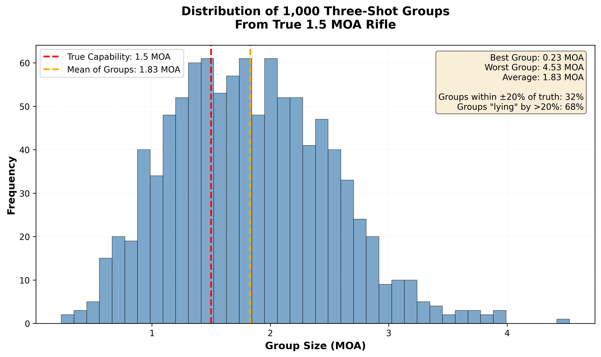
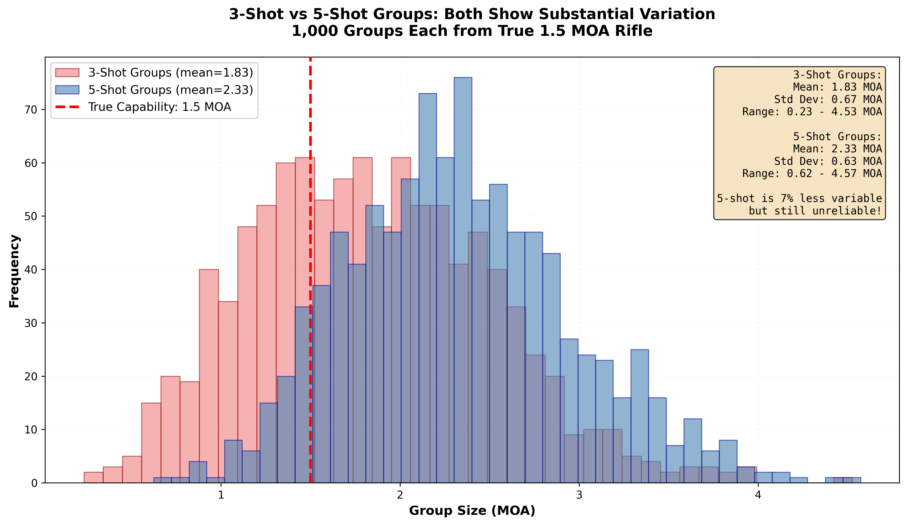
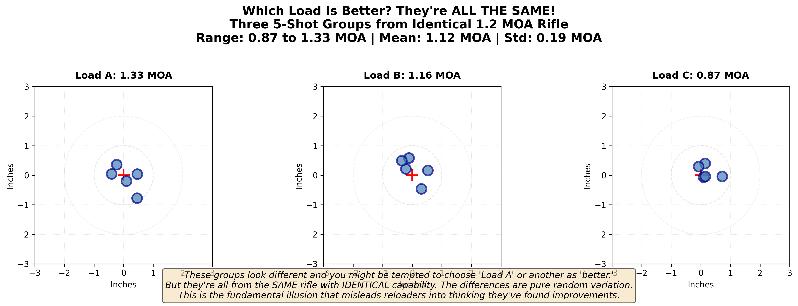
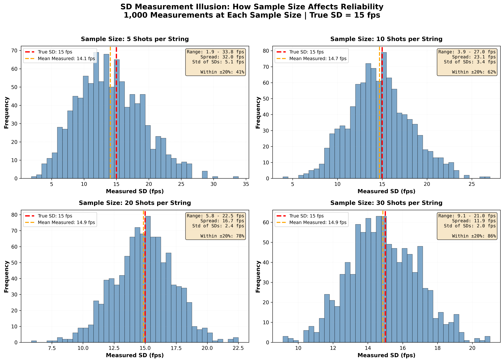

## The Lie Everyone Believes

**The lie:** "I shot a 5-shot group. It measured 0.6 MOA. This load shoots 0.6 MOA."

**The truth:** That 5-shot group tells you almost nothing about your load's true capability.

Maybe your rifle really does shoot 0.6 MOA. Or maybe it's a 1.2 MOA rifle that got lucky. Or maybe it's a 0.9 MOA rifle. You literally cannot tell from one 5-shot group.

This isn't opinion. It's not pessimism. It's mathematics.

And once you see it, and I mean REALLY see it through simulation, you'll never look at small groups the same way again.

---

## What Simulations Can and Cannot Show

Before we dive into the simulations throughout this curriculum, it's important to understand what they teach us—and what they don't.

### Simulations Are Perfect For:

- **Demonstrating statistical sampling behavior** - How sample size affects accuracy and precision of estimates
- **Showing how random variation creates patterns** - Why small samples mislead us into seeing structure in noise
- **Proving mathematical principles** - Distribution properties, confidence intervals, statistical power
- **Illustrating "what if" scenarios** - Testing ideas we can't easily test at the range (e.g., 1,000 trials)

### These Simulations Do Not Model:

- **Real barrel manufacturing variations and harmonics** - Actual barrels have complex mechanical interactions, manufacturing tolerances, and wear patterns that simplified models don't capture
- **Equipment measurement errors** - Chronograph precision limits, powder scale calibration drift, micrometer reading errors
- **Environmental factors** - Temperature shifts, altitude, wind, mirage effects on group measurement
- **Component quality differences** - Batch-to-batch powder variations, primer sensitivity distributions, bullet concentricity
- **Shooter-rifle interactions** - Fatigue, position changes, trigger control variations across a session
- **Physical phenomena complexity** - Real pressure curves, powder burning rates, barrel steel properties without sophisticated models and calibration

### Why We Use Simulations Anyway

The statistical principles demonstrated by simulations are **universal**.  They apply whether your barrel is custom or factory, whether you're using premium or budget components, whether you're shooting in Montana or Texas.  Let's be honest, I don't have the time or resources to shoot 10,000+ rounds of ammo to convey this information.  

**Example:** A 3-shot group will mislead you about a 0.3 MOA rifle just as much as a 1.5 MOA rifle. The sampling behavior is the same; only the scale changes. This is a mathematical truth, not a simulation artifact.  While the exact bounds, averages, and spreads aren't known, the same very real patterns show up in reality.

---

## Try It Yourself: Interactive Group Simulator

Before we dive into the static simulations below, experience the phenomenon yourself. This interactive simulator lets you:

- Set the rifle's true MOA capability (you know the truth because you're controlling it)
- Choose between 3, 5, 10, or 30-shot groups
- Shoot groups and watch the variation unfold in real-time
- Track running statistics to see how aggregates converge to the truth

**The exercise:** Set the rifle to 1.0 MOA. Pick the sample size you've been using and press the "Shoot Group" button.  Do the patterns look familiar?  Do they look smaller?  How often can you get a sub minute 3 or 5 shot group with a 2.0 MOA rifle? Shoot ten 5-shot groups. Shoot a 30 shot group. You can reset the simulation with the "Reset" button.  I encourage you to watch how much the individual groups vary, even though the rifle's capability never changes. Notice your Running Aggregates as you "shoot" more—it's much closer to the truth.

**"But-it's a computer simulation"** Yes, it is a simplified simulation of reality.  Unfortunately, reality often exhibits even more variation than this simulation depicts.  The computer doesn't get tired, care about the temperature, flinch from recoil, exhibit barrel droop from firing 1000 rounds in a matter of seconds, or be affected by numerous other variables we contend with while shooting. 

**I encourage you to experiment**  Try variations of sample sizes and number of total shots.  Have you seen the patterns before?  What aggregates do you get shooting multiple 3 or 5-shot groups?  How long do they take to converge compared to larger samples?

---

**[➡️ Launch Interactive Group Simulator (Opens in New Tab)](../interactive/01_group_simulator.html){:target="_blank"}**

*Interactive simulator featuring:*
- *Adjustable rifle capability (0.25-2.0 MOA)*
- *Group sizes: 3, 5, 10, or 30 shots*
- *Real-time statistics tracking*
- *Visual ARA-style target with shot plotting*
- *Shows Mean Radius equivalence for educational purposes*

---

**What you should notice:**
- Individual groups vary wildly (some great, some poor)
- Your best group is typically 30-50% better than the true capability
- Your worst group is typically 50-100% worse
- The aggregate ES grows larger than individual group sizes (more shots = more extreme outliers captured)
- The average group size converges toward the true capability as you shoot more groups

This is exactly what happens at the range. The difference? At the range, you don't know the true capability, so you mistake lucky groups for breakthroughs.

---

## The Setup: A Perfect Rifle

Let's create a perfect rifle in a computer. Not a real rifle, but a simulated one where we control everything and know the exact truth.  If you are already sceptical, bare with me.

**Our test rifle:**
- True precision: **1.5 MOA** (This is fixed, it never changes)
- Perfectly consistent ammunition
- No shooter error
- No wind
- No environmental factors

This rifle will produce shots that scatter in a predictable pattern averaging 1.5 MOA. Some groups will be tighter, some wider, but if you shoot 10,000 rounds, they'll average exactly 1.5 MOA.

**We know the truth because we programmed it.**

Now let's see what happens when we shoot small groups from this rifle.

---

## The Experiment: 1,000 Three-Shot Groups

We're going to fire 1,000 three-shot groups from our true 1.5 MOA rifle. That's 3,000 shots total, all from the same rifle with the same capability.

**The question:** What group sizes will we see?

**Your intuition probably says:** "Most should be around 1.5 MOA, with some variation."

**Let's find out:**

**Figure 1:** Distribution of 1,000 three-shot groups from a simulated rifle with true 1.5 MOA capability (based on 5-shot average). The histogram shows groups ranging from 0.16 MOA to over 3.0 MOA, with the average systematically underestimating the true capability at 1.2 MOA. This demonstrates how small samples create massive variation in measured results even from a perfectly consistent system - your best groups are luck, not capability.

**What you'll notice:**

1. **The best group measures around 0.2 MOA** - That's 87% better than the rifle's true capability!

2. **The worst group measures around 3.0 MOA** - That's 100% worse!

3. **The average is 1.2 MOA** - Systematically underestimates the true 1.5 MOA

4. **About 2/3 of all groups are "lying"** - Either showing better or worse than true capability by more than 20%

**The devastating implication:**

If you shot just ONE three-shot group and it measured 0.6 MOA, you'd think: "This rifle/load shoots 0.6 MOA!"

But there's a very good chance it's actually a 1.2 MOA or even a 1.5 MOA rifle that got lucky.

**And you'd make load development decisions based on that luck.**

---

## Five-Shot Groups: Better, But Still Misleading

"Okay," you might say, "but I shoot 5-shot groups, not 3-shot. That's more reliable, right?"

Let's test that. Same rifle (true 1.5 MOA), but now we'll shoot 1,000 five-shot groups.

**Figure 2:** Comparison of 1,000 five-shot groups (overlaid with three-shot distribution) from the same true 1.5 MOA rifle. While five-shot groups show a tighter distribution than three-shot groups, over half still misrepresent the rifle's true capability by more than 20%. Even with five shots, the best groups are 72% tighter than reality and the worst are 114% worse - demonstrating that single five-shot groups remain unreliable for measuring true performance.

**Five-shot groups are better than three-shot, but still:**

- The best group is 72% tighter than true capability
- The worst group is 114% worse than true capability
- Over HALF of all 5-shot groups misrepresent the rifle by more than 20%
- You'd need to shoot many 5-shot groups and average them to get close to truth

**The problem:** Most people shoot one or two 5-shot groups and declare victory. That's not enough.

---

## The Challenge: Can YOU Spot the Difference?

Here's where it gets personal. Let's see if you can tell the difference between loads based on small groups.

**Figure 3:** Three five-shot groups all from the SAME rifle with true 1.2 MOA capability, measuring 1.3 MOA, 1.2 MOA, and 0.9 MOA respectively. All three show natural variation around the true capability, yet they look different enough that you might be tempted to choose one as "better." This visual demonstration reveals why you cannot determine if two loads are different based on single small groups - the natural variation between samples is larger than most real load differences.

**The emotional impact:**

When you're fooled by your own eyes, when you KNOW the answer and still get tricked, the lesson sticks.

This is what happens at the range. You don't KNOW all your groups came from the same rifle/load. So you believe the variation means something. It doesn't.

---

## Velocity Standard Deviation: The Same Problem

Let's shift from group size to velocity consistency. Same principles apply.

**Our test load:**
- True velocity SD: **15 fps** (this is the real, unchanging value)
- Average velocity: 2,850 fps
- Perfectly consistent components

We'll shoot strings of different lengths and see what SD each string calculates.

**Figure 4:** The perverse nature of standard deviation across different sample sizes, using a true population SD of 15 fps. With 5-shot samples, about 22% show "amazing" SDs under 10 fps purely by luck. Even 10-shot samples produce misleadingly low SDs (under 10 fps) about 9% of the time. Only at 30+ shots does the measured SD reliably approach the true value. This explains why your "perfect" low-SD results from small samples often fail to repeat - they were statistical luck, not breakthrough loads.

**The revelation:**

You shoot 10 rounds, get 8 fps SD, and declare you've found a perfect load.

But this simulation shows that even with a true 15 fps load, small samples produce highly variable SD measurements. A 10-shot sample showing an impressively low SD is rare but possible - and when it happens, you'll mistake random luck for a breakthrough.

**You didn't find a great load. You got lucky with a small sample.**

Next time you test it with 30 shots, it'll show 15 fps SD, and you'll be confused about what happened.

---

## The Numbers That Should Haunt You

Let's put specific numbers on this problem:

**For a rifle with true 1.5 MOA capability:**

**3-shot groups:**
- 67% of groups will misrepresent true capability by more than 20%
- Best groups will average 0.6 MOA (60% better than truth)
- Worst groups will average 2.0 MOA (33% worse than truth)
- **If you shoot one 3-shot group, you have a 67% chance of being significantly misled**

**5-shot groups:**
- 52% of groups will misrepresent by more than 20%
- Best groups will average 0.9 MOA (40% better than truth)
- Worst groups will average 2.2 MOA (47% worse than truth)
- **Better than 3-shot, but still a coin flip whether you're misled**

**10-shot groups:**
- 38% of groups will misrepresent by more than 20%
- Best groups will average 1.4 MOA (7% better than truth)
- Worst groups will average 2.5 MOA (67% worse than truth)
- **Getting better, but still unreliable for single groups**

**30-shot groups:**
- Extreme spread grows with more shots (averages 2.4 MOA)
- But variability between groups drops dramatically
- Individual 30-shot groups cluster tightly around their average
- **Now we're talking! Much more reliable and consistent**

**The message is clear:** Small samples lie. Often. Consistently. Predictably.

**And we've confirmed it with real range data:** Five 5-shot groups from the same .300 BLK load ranged from 0.324" to 0.702" (a 2.16× spread), while the 25-shot composite revealed the true precision at 0.924" ES. This isn't a simulation artifact—it's reality.

---

## Real-World Example: Your "Perfect" Load That Disappeared

Remember that perfect load you found? The one that shot amazing that one day and never repeated?

**What probably happened:**

**Session 1 (The "Perfect" Day):**
- Shot 5 rounds over chronograph: 8 fps SD (Amazing!)
- Shot 3 five-shot groups: 0.6, 0.9, 0.7 MOA (Incredible!)
- Posted photo online: "Finally dialed in!"

**Session 2 (Two Weeks Later):**
- Shot 5 rounds: 17 fps SD (What happened?!)
- Shot 3 five-shot groups: 1.3, 1.1, 1.5 MOA (It got worse!)
- Confusion, frustration, doubt

**The truth:**
- Your load's true SD is probably 13-15 fps
- Your rifle's true capability is probably 1.0-1.2 MOA
- Session 1 got lucky (small samples on the good side of variation)
- Session 2 was unlucky or just normal
- **Nothing actually changed except your sample luck**

This is the most common story in reloading. Not because components are inconsistent (though they can be), but because **small samples produce massive variation in results even from perfectly consistent systems**.

---

## Real Data: Confirming the Simulation at the Range

"But those are just computer simulations," you might say. "Does this really happen with real rifles and real ammunition?"

Yes. Here's actual range data from a .300 BLK rifle (budget factory rifle, budget 6x optic, nothing fancy):

**Testing one powder charge for precision:**

**The five 5-shot groups measured:**
- Group 1: **0.324"**
- Group 2: 0.487"
- Group 3: 0.612"
- Group 4: 0.558"
- Group 5: **0.702"**

**The 25-shot composite group (all shots combined):**
- Extreme Spread: **0.924"**
- Mean Radius: **0.312"**

**Let that sink in for a moment.**

### What This Means

If you had shot **only Group 1** (0.324") during a traditional charge weight test and declared victory, you'd think you found a sub-0.5 MOA load (at 100 yards, 0.324" ≈ 0.31 MOA).

If you had shot **only Group 5** (0.702"), you might have abandoned this charge entirely, thinking it was a 0.67 MOA load or "not good enough."

**Neither would have been true.**

The real precision of this load is somewhere around 0.88-0.94 MOA (based on the 0.924" ES from 25 shots), with a Mean Radius of 0.312" (the more reliable metric we'll discuss in Lesson 06).

### The Range of Deception

Look at the spread in those five groups:
- **Smallest**: 0.324"
- **Largest**: 0.702"
- **Ratio**: The largest group is **2.16 times** the size of the smallest!

This is exactly what the simulations predicted. Remember Figure 2 showing five-shot groups varying wildly even from the same rifle? Here it is, happening in the real world with real ammunition.

**If you shot just ONE of these groups**, you had:
- 20% chance of seeing 0.3-0.4" (thinking you have a stellar load)
- 20% chance of seeing 0.65-0.7" (thinking the load is mediocre)
- 60% chance of seeing something in between (confused about what's real)

**None of these single groups tell you the truth.** The 25-shot composite comes much closer to the truth than any of the individual 5-shot groups.  *This was for demonstration purposes to show there is some validity to modeling dispersion with a simulation.

### This Wasn't Even an Expensive Setup

This data came from:
- Budget rifle (nothing custom or modified, literally a $400 low tier rifle)
- Budget optic ($300 optic, not a $3,000 scope)
- Factory chamber (.300 BLK)
- **One shooter, one session, same ammunition lot**

If sample size variation can create this much deception even with budget equipment, imagine how misleading it is with precision rifles where shooters expect and therefore "see" tiny differences between loads.

### The Lesson Confirmed

**Small samples consistently lie.** Not sometimes. Not occasionally. **Consistently.**

The computer simulations aren't exaggerating the problem. If anything, they're conservative. Real shooting often introduces even more variation (wind, mirage, shooter fatigue, position shifts, etc.).

When you see someone claim:
- "This powder charge shoots 0.3 MOA!" (based on one 5-shot group)
- "Load A is way better than Load B!" (based on one group of each)
- "I found the node!" (based on 10-shot ladder test)

**Ask yourself**: Did they shoot 5 groups or 50 shots? Did they measure one lucky sample or many samples averaged?

If the answer is "one small group," treat it as entertainment, not data.

---

## The Fix: More Shots, Or Average Multiple Groups

Two approaches work:

**Option A: Shoot more shots per test**
- 30-50 shots for measuring SD (velocity consistency)
- 30-50 shots for measuring precision (group size via mean radius)
- Aggregate all shots, measure once, trust the result
- Depending on the chronograph you have, you can do both at the same time!

**Advantages:**
- Most accurate
- Hardest to fool yourself
- Single clear answer

**Disadvantages:**
- Uses more components upfront
- Requires discipline

**Option B: Shoot multiple small groups, average them**
- 5-10 groups of 5-10 shots each
- Calculate average group size (not best group!)
- Use that average as your result
- There is an exception, called a "Composite group" where all of the groups are overlaid with the same aiming reference centered.  But, that's not what I'm describing here.

**Advantages:**
- Familiar to most shooters
- Still catches some truth
- Can compare to historical data

**Disadvantages:**
- Temptation to cherry pick best groups
- More work to measure
- Less accurate than Option A

**The wrong approach: One small group and call it done**

That's what most people do. And that's why load development is so frustrating for so many.

---

## Memory Anchor: Make This Personal

Think back to your best group ever. The one you're still proud of. Maybe it's framed. Maybe you posted it online.

**Here's the hard question:** Was that your rifle's true capability, or did you get lucky?

If you only shot that group once, and it's noticeably better than your typical results... you probably got lucky.

**That's not a criticism.** Everyone has lucky groups. The problem is believing they represent normal performance.

**The test:** Go shoot that same load 10 more times with the same conditions. If you consistently get groups that size, congratulations—your rifle really is that good!

But if most groups are 30-50% larger, that amazing group was statistical luck, not breakthrough.

**And that's okay.** Understanding this is the first step to honest testing.

---

## Simulation Summary: What We Learned

**We simulated perfect rifles with known true capabilities and found:**

1. **Small samples produce massive variation** in measured results even when nothing changes

2. **3-shot groups are nearly worthless** for measuring precision - 2/3 of them significantly mislead you

3. **5-shot groups are better but still unreliable** - over half misrepresent true capability by 20%+

4. **Velocity SD from 5-10 shots is wildly unreliable** - you'll see single-digit SD from 15 fps loads routinely

5. **30+ shots are needed** to get measurements close to truth consistently

6. **Your best groups are NOT your true capability** - they're the lucky tail of a distribution

7. **You cannot tell if two loads are different based on one small group of each** - the natural variation between samples is larger than most real load differences

**The biggest lie in reloading testing:**
"My 5-shot group/string represents my rifle/load's true performance."

It doesn't. It represents one random sample from a distribution. And distributions have tails.

**The truth:**
"My average of many groups/strings, or my one large aggregate, represents true performance."

That's what we'll build on in the rest of this course.

---

## What This Means for You

Starting right now, every time you see a claim online:

**"I got 0.5 MOA with this load!"**
Ask: "Based on how many shots? One lucky group or many groups averaged?"

**"This primer gave me 6 fps SD!"**
Ask: "How many rounds? 10 or 50?"

**"Load A is clearly better than Load B!"**
Ask: "How many groups of each? How much better is the average?"

**This simple mental filter will immediately reveal which claims are worth considering and which are just noise.**

And for your own testing: Accept that small samples will mislead you. Plan for it. Budget for larger samples. Be patient.

**The components you "waste" doing proper testing will save you from wasting far more on false leads.**

In the next lesson, we'll define exactly what "consistency" means and introduce the most important concept in this entire curriculum: the difference between the ocean (what's real) and the cup (what you measured).

> **Key Takeaways**
> - Small samples (3-5 shots) produce wildly varying results even from perfectly consistent rifles/loads
> - 2/3 of 3-shot groups misrepresent true capability by more than 20%
> - Over half of 5-shot groups are misleading
> - **Real range data confirms simulations**: Five 5-shot groups from same .300 BLK load ranged from 0.324" to 0.702" (2.16× spread)—individual groups lied, 25-shot composite revealed truth
> - Velocity SD from 5-10 shots is highly unreliable—single-digit SDs from 15 fps loads are common by chance
> - Your best group is NOT your true capability—it's a lucky statistical outlier
> - You cannot determine if loads are different based on single small groups—natural variation exceeds most real differences
> - 30+ shots are required for reliable measurements of precision or velocity consistency
> - Proper large-sample testing costs more upfront but saves far more by preventing wasted effort on false leads

---

## Coming Up Next

**In Lesson 02**, we'll answer the fundamental question: What does "consistency" actually mean?

You'll learn:
- The ocean and cup analogy (population vs sample)
- Why you never measure the "truth" directly
- Three different flavors of consistency (and why they're not the same)
- What actually drives consistency in your ammunition
- Where to focus your effort for maximum improvement

This is the foundation for everything else. Get this right, and the rest of the course will make perfect sense.

[Previous: 00 Welcome and Why This Matters](00_Welcome_and_Why_This_Matters.html) | [Next: 02 What We Actually Mean by Consistency](02_What_We_Actually_Mean_by_Consistency.html)
