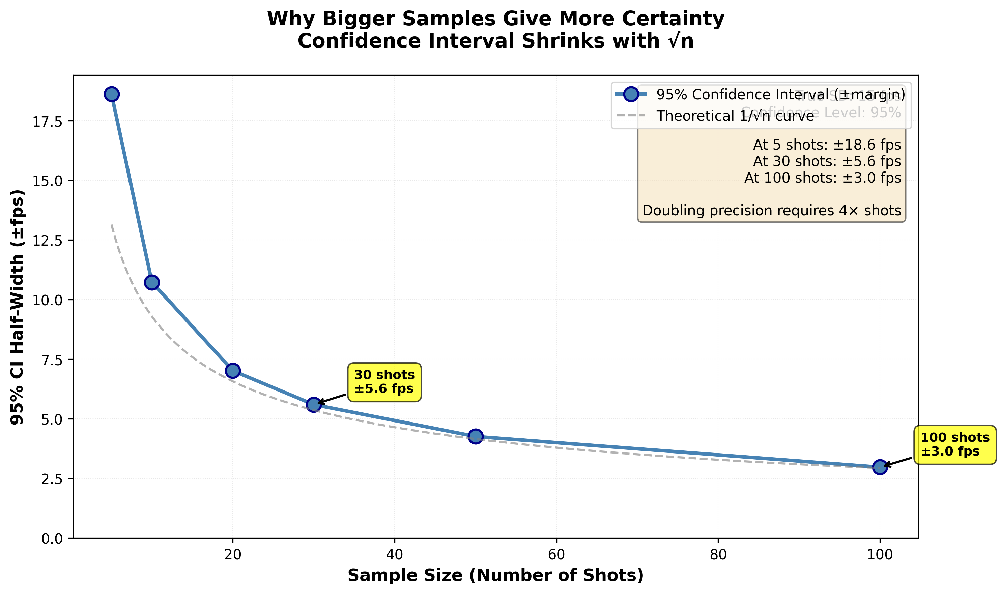
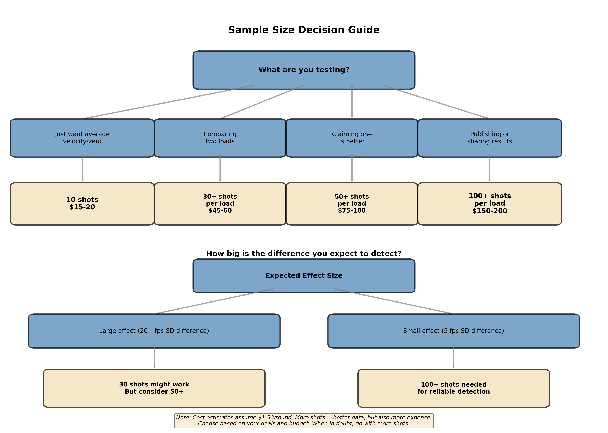
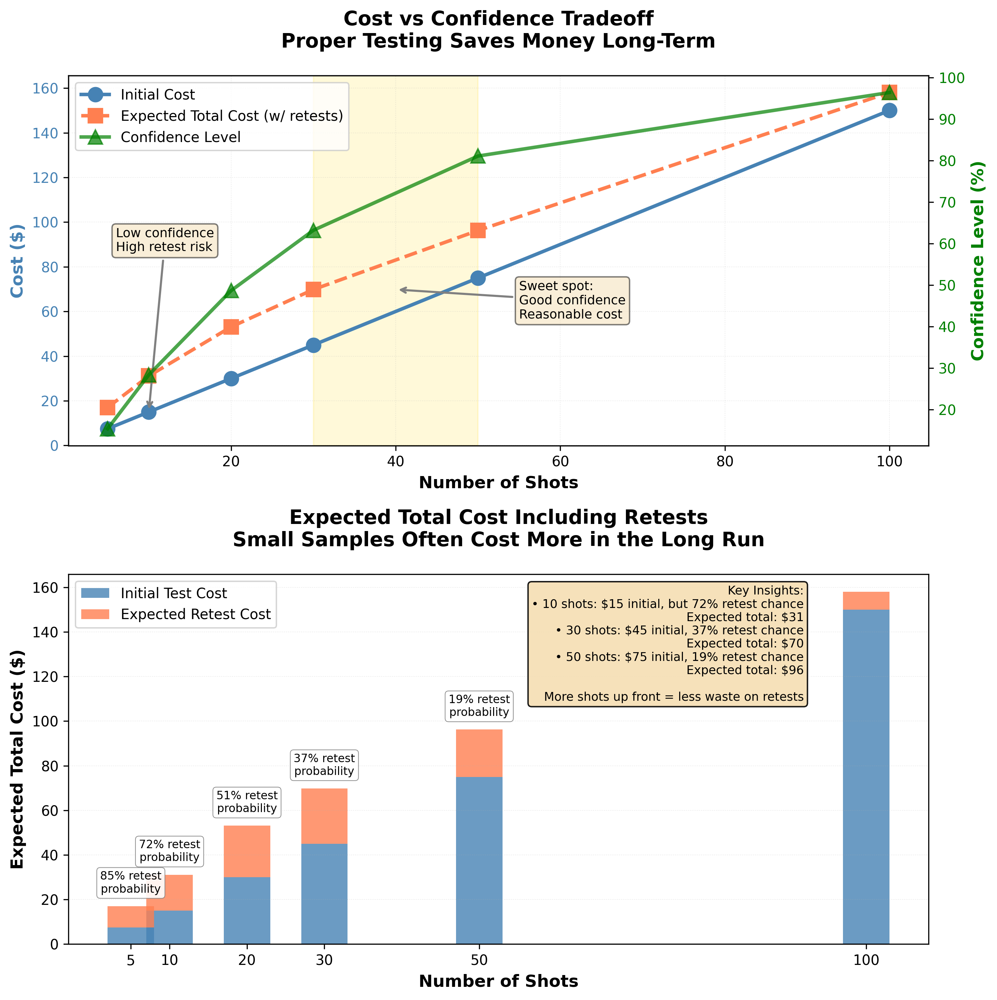

Time to complete: 10-15 minutes

# How Many Shots Do You Really Need?

## The Question Everyone Asks

You've just finished Lesson 02. You understand the ocean and the cup. You know that small samples lie. You get that you're trying to measure a population (all possible rounds with your recipe) by testing a sample (the rounds you actually shoot).

**Now comes the obvious follow-up question:**

"Okay, so how big does my cup need to be? How many shots do I actually need to test?"

This is THE practical question. And the answer isn't simple, because it depends on what you're trying to learn and how confident you need to be.

But here's the good news: by the end of this lesson, you'll have clear, practical guidelines. Not vague "it depends" answers, but actual decision trees you can use this weekend at the range.

**Fair warning:** If you've been shooting for a while, you're not going to like some of these answers. The number of shots required for reliable testing is higher than what you see on forums. But I'll also show you exactly why those numbers matter, and what happens when you shortcut them.

Let's dig in.

---

## The Uncomfortable Truth About Sample Sizes

Here's what you need to accept right up front:

**Testing ammunition properly requires more shots than most people use.**

Not because I say so. Not because of some arbitrary rule. Because of math that's been proven for over a century.

**The typical forum approach:**
- "I shot 3 groups of 3 shots. Found my load!"
- "Ran a 10-shot ladder test. Clear winner at 42.2 grains."
- "Tested two primers with 5 shots each. Federal was better."

**The reality:**
- 3 groups of 3 shots = **9 shots total** - Learns almost nothing reliable
- 10-shot ladder = **1 shot per charge** - Pure randomness
- 5 shots per primer = **10 shots total** - Likely seeing noise, not signal

These methods feel efficient. They're actually wasteful because they lead to wrong conclusions, which means retesting, which means wasted components and time.

**The better approach costs more ammo upfront but saves money long term** because you get real answers the first time.

Let me show you exactly why.

---

## Why Bigger Samples Are More Trustworthy

Remember the ocean and the cup from Lesson 02? Let's extend that analogy.

### The Bigger Cup Principle

Imagine you're trying to measure the temperature of the ocean:

**Small cup (5 cups of water):**
- You might scoop from a warm surface current one time
- Get a cold deep pocket another time
- Your measurements bounce all over
- Hard to know the real average temperature

**Medium cup (30 cups of water):**
- You sample more locations
- Warm and cold areas start to average out
- Your measurement gets closer to the truth
- Still some variability, but much better

**Large cup (100 cups of water):**
- You've sampled enough that weird spots don't dominate
- Your average is very close to the true ocean temperature
- You can trust this number

**The same applies to ammunition:**

**5 shots:**
- Might catch all the fast rounds by luck
- Or all the slow ones
- Spread measurement is wildly unreliable
- Mean is somewhat okay, spread is not

**30 shots:**
- Fast and slow rounds average out
- Spread measurement starts to be trustworthy
- This is the minimum for measuring consistency (SD)
- Good for most practical decisions

**100 shots:**
- Very reliable measurements
- Can detect small differences confidently
- Needed for making big claims or publishing data (in many cases, 100+)

### The Mathematical Reason (Explained Simply)

There's a quirky math fact that's been known for 200+ years:

**Averages stabilize quickly. Spread measurements stabilize slowly.**

What this means in practice:

**For measuring AVERAGE velocity:**
- 10 shots gets you pretty close
- 30 shots gets you very close
- More than 30 doesn't help much

**For measuring SPREAD (standard deviation/SD):**
- 10 shots is terrible (you'll be wrong by 30-50%)
- 20 shots is marginal (still off by 20-30%)
- 30 shots is adequate (off by ~15%)
- 50 shots is good (off by ~10%)
- 100 shots is excellent (off by ~7%)

This is why you see "30 shots minimum" repeated everywhere. It's not arbitrary. It's the point where spread measurements become reasonably reliable.

**Figure 3:** How confidence interval width shrinks with sample size, following the mathematical law of √n. With just 5 shots, your 95% confidence interval is huge (±6 fps), meaning your "measured" SD of 12 fps could easily represent a true SD anywhere from 6 to 18 fps. At 30 shots, the interval shrinks to ±3 fps - much more useful for making decisions. At 100 shots, you're down to ±1.5 fps. This visualizes why larger samples give you more certainty: they narrow the range of plausible values, letting you distinguish real differences from noise.

---

**[➡️ Launch Sample Size Reliability Simulator (Opens in New Tab)](../interactive/03_sample_size_simulator.html){:target="_blank"}**

*Interactive simulator featuring:*
- *Adjustable true SD (5-25 fps) and sample size (5-100 shots)*
- *Monte Carlo simulation with 50, 100, or 500 trials*
- *Real-time histogram showing distribution of sample SD measurements*
- *Statistics showing % of samples within ±5%, ±10%, ±20% of true SD*
- *Watch how larger samples produce tighter, more reliable estimates*

---

> **Critical Insight**
>
> The number 30 isn't magic or arbitrary. It's where measurements of spread become reliable enough for practical decisions. Less than 30 and you're mostly measuring randomness. More than 30 and you're getting diminishing returns for most purposes.

---

## Decision Tree: How Many Shots Do I Need?

Here's the practical guide. Follow the decision tree based on WHAT you're trying to accomplish.

**Figure 1:** Sample size decision tree - a visual flowchart to help you choose the appropriate number of shots based on your testing goal and expected effect size. The tree considers both what you're testing (zeroing vs. comparing loads vs. making claims) and the magnitude of difference you expect to detect. Cost estimates assume $1.50 per round. Use this as your quick reference guide at the range.

### Scenario 1: Zeroing Your Rifle / Getting Average Velocity

**Goal:** Find the average point of impact or average velocity

**Minimum shots:** **10 shots**

**Why:** Averages stabilize quickly. 10 shots gets you within 1-2% of the true average.

**Process:**
1. Shoot 10 rounds
2. Calculate average
3. Adjust scope or record velocity
4. Done

**Warning:** Those 10 shots tell you NOTHING about consistency (SD) or group size. They only tell you the average.

**Example use:**
- Zeroing a new scope
- Recording velocity for ballistic calculator
- Finding average point of impact

---

### Scenario 2: Quick Screening Test

**Goal:** Quickly eliminate obviously bad options

**Minimum shots:** **20-25 shots per option**

**Why:** Enough to get a rough idea of spread and eliminate clearly bad performers. Not definitive, but sufficient for initial screening.

**Process:**
1. Load 20-25 rounds of each option you're screening
2. Shoot them all in same session
3. Calculate mean and SD for each
4. Eliminate options that are clearly worse
5. Re-test finalists with 30+ shots for reliable comparison

**Warning:** Differences need to be LARGE to be reliable with this sample size. If Option A shows SD of 12 fps and Option B shows 10 fps with 20-25 shots each, that difference could easily be random noise.

**Example use:**
- Testing 3-4 primers to eliminate worst performers
- Screening powder types before detailed testing
- Quick check if a component change helped

---

### Scenario 3: Comparing Two Loads for Real

**Goal:** Make a confident decision between two specific loads

**Minimum shots:** **30 shots per load** (60 total)

**Why:** This gives you reliable SD measurements for both loads. You can trust differences you see.

**Process:**
1. Load 30 rounds of Load A and 30 rounds of Load B
2. Shoot them in same session, alternating (to control for barrel heating, environmental conditions, shooter fatigue, etc.)
3. Use Template A from Lesson 08 to analyze
4. Trust the verdict

**What differences are real at this sample size:**
- 5+ fps difference in SD: Probably real
- 10+ fps difference in mean velocity: Real
- Obvious difference in group size (>0.3 MOA): Worth investigating

**Example use:**
- Final comparison between two primers
- Choosing between two powders
- Deciding if bullet upgrade is worth it

---

### Scenario 4: Characterizing a Load Completely

**Goal:** Fully understand a load's performance for competition or publication

**Minimum shots:** **50-100 shots**

**Why:** This gives you high-confidence measurements. Small differences become detectable. You can make strong claims.

**Process:**
1. Load 50-100 rounds
2. Shoot across 2-3 sessions (to test repeatability)
3. Full analysis: velocity, SD, group size, trends
4. Document everything

**What you learn:**
- True SD within ±10%
- Reliable precision measurement
- Whether performance is repeatable across sessions
- Confidence to publish or compete with this load

**Example use:**
- Final validation before competition
- Creating published load data
- Proving a load is as good as you claim

---

### Scenario 5: Proving an Extraordinary Claim

**Goal:** Demonstrate something unusual or controversial

**Minimum shots:** **100-200+ shots**

**Why:** Extraordinary claims require extraordinary evidence. You need bulletproof data.

**Process:**
1. Pre-register your hypothesis and testing plan
2. Shoot large samples across multiple sessions
3. Use rigorous statistical analysis
4. Invite independent verification

**Examples of claims requiring this level:**
- "This method cuts SD in half"
- "I can reliably shoot 0.25 MOA"
- "This component makes a huge difference"
- Anything you'd publish in a journal

---

## The Cost-Benefit Analysis

I know what you're thinking: "30-50 shots per test? That's expensive!"

Let's do the math on what's actually expensive.

**Figure 2:** Cost-benefit analysis showing why proper testing actually saves money. The left panel demonstrates that while initial cost increases with sample size, confidence improves dramatically—the "sweet spot" is 30-50 shots where you get high confidence without excessive cost. The right panel shows expected total cost including retests: small samples often require multiple retesting sessions, making them more expensive overall than doing it right the first time with adequate sample sizes.

### The "Cheap" Approach That Costs More

**Forum Method:** Test with 10 shots per load

**Scenario:** You're testing primers (CCI vs Federal)

**Round 1:** Load 10 rounds of each, shoot them, see 2 fps difference in SD
- Cost: 20 rounds = $40
- Conclusion: "Federal seems better, but I'm not sure..."

**Round 2:** Load another 10 of each to verify
- Cost: 20 rounds = $40
- Conclusion: "Now CCI looks better? What changed?"

**Round 3:** Load 20 of each this time to be more sure
- Cost: 40 rounds = $80
- Conclusion: "They seem basically the same now..."

**Round 4:** You're frustrated. Load 30 of each to finally settle it
- Cost: 60 rounds = $120

**Total:** 140 rounds, $280, 4 range trips, months of confusion

**Final conclusion:** They're the same. Could have known this from the start with proper testing.

### The "Expensive" Approach That Saves Money

**Proper Method:** Test with 30 shots per load from the start

**Scenario:** Same primer test

**Round 1:** Load 30 rounds of each, shoot them, analyze properly
- Cost: 60 rounds = $120
- Conclusion: "No meaningful difference. Use whichever is cheaper."

**Total:** 60 rounds, $120, 1 range trip, definitive answer

**Savings:** $160, 3 range trips, months of frustration avoided

### The Real Cost of Bad Testing

The hidden costs of inadequate sample sizes:

**Components wasted:** Testing the same thing repeatedly because you can't trust small samples

**Time wasted:** Multiple range trips to retest what you thought you knew

**Opportunity cost:** Chasing false leads instead of actually improving

**Mental cost:** Constant second-guessing and uncertainty

**Barrel life:** Burning barrel life on inconclusive tests

**Proper testing costs less.** Not immediately, but absolutely over time.

---

**[➡️ Launch Testing Cost Calculator (Opens in New Tab)](../interactive/03_cost_calculator.html){:target="_blank"}**

*Interactive cost calculator featuring:*
- *Adjustable cost per round ($0.50 - $5.00)*
- *Current testing approach (5-30 shots per test)*
- *Variables to test per year (4-12)*
- *Automatic calculation of retest probability based on sample size*
- *Side-by-side comparison: inadequate vs proper testing*
- *Reveals hidden costs of retests, wasted components, and false leads*
- *Shows 1-year and 5-year savings with proper testing*

---

---

## Special Cases and Exceptions

### Exception 1: Load Development for Hunting (Not Competition)

**Situation:** You're developing a hunting load for deer at 200-300 yards.

**Reality:** Ultra-precision isn't needed for this application.  A 30-shot, 1.5 MOA load is perfectly adequate. You're not shooting tiny targets.

**Recommendation:**
- 20-30 shots to verify load is safe and adequate
- Focus on accuracy at your maximum hunting distance (ensure impacts are centered on your point of aim)
- Don't obsess over single-digit SD (it isn't needed at 300 yards for this application)

### Exception 2: You're Using Factory Ammo

**Situation:** You're shooting factory ammunition, not handloads.

**Reality:** You can't change the recipe. You're just characterizing what you have.

**Recommendation:**
- 20-30 rounds to understand performance
- If it shoots well, buy more from same lot
- If it doesn't, try different factory ammo

### Exception 3: Testing at Distance

**Situation:** You're testing group size at 600+ yards.

**Reality:** Wind, mirage, and shooter error dominate. Ammunition variation is smaller than environmental noise.

**Recommendation:**
- Do velocity testing at 100 yards (30+ shots)
- Do group testing at 100 yards (30+ shots)
- Do limited group testing at distance (understand it's mostly about you and the firing solution, not the ammo)
- Don't assume long-range groups tell you about ammo quality

### Exception 4: Component Availability

**Situation:** You only have 15 rounds of Component X left to test.

**Reality:** 15 shots is better than nothing, but don't over-interpret results.

**The wonderful thing statistics reveal:** With a 15-shot test, the result is **biased toward appearing better than it actually is.** Small samples systematically underestimate SD and show tighter groups than the true capability. This creates a useful asymmetry:

- **If your 15-shot result looks amazing:** Don't trust it yet. It's probably optimistic. You need more shots to verify.
- **If your 15-shot result looks terrible for your standards:** It's more likely than not to actually be that bad (or worse). You can confidently stop wasting components on that option.

This bias means small samples are better at ruling things OUT than ruling them IN. A bad result from limited testing is trustworthy; a good result is not.

**Recommendation:**
- Test with what you have
- Note in your records: "Based on 15 shots - needs validation"
- If it looks promising, get more and test properly (the result is likely optimistic)
- If it looks terrible, you saved yourself buying more (the result is likely accurate or pessimistic)

---

## Practical Guidelines Summary

Here's the quick reference card:

| Goal | Minimum Shots | Confidence Level | Use Case |
|------|---------------|------------------|----------|
| Average velocity / zeroing | 10 | Moderate | Ballistics calculator, scope zero |
| Quick screening | 20-25 | Low-Moderate | Eliminate bad options |
| Reliable comparison | 30 per option | Good | Choose between components |
| Load characterization | 50-100 | High | Competition, documentation |
| Prove big claim | 100-200+ | Very High | Publication, extraordinary claims |

**For group size:**

| Goal | Minimum Shots | Notes |
|------|---------------|-------|
| Rough capability | 20-30 | Adequate for hunting rifles |
| Reliable precision | 50+ | Needed to claim "sub-MOA" |
| Competition validation | 100+ | Know your true capability |

**Rules of thumb:**

- ✓ **For velocity mean:** 10 shots is usually fine
- ✓ **For velocity SD:** 30 shots minimum, 50+ is better
- ✓ **For group size:** More is always better, 30+ minimum
- ✓ **For comparing:** Equal shots for each option, minimum 30 each

❌ **Never:**

- Make SD claims based on < 30 shots
- Declare precision based on single small sample groups
- Assume one good session represents normal performance

---

## Handling the Reality

"But I can't afford to shoot 50-100 rounds every time I test something!"

**You're right. Nobody can.**

Here's the practical approach:

### Tier Your Testing

**Tier 1: Quick screening** (20-25 shots per option)
- Use this to eliminate obvious losers
- Example: Testing 4 primers, shoot 25 each, eliminate worst 2

**Tier 2: Semi-final comparison** (30-40 shots per option)
- Use this for serious decisions
- Example: Final 2 primers, shoot 30-40 each, pick winner

**Tier 3: Full validation** (50-100+ shots)
- Only do this for your final load
- Once per caliber/rifle combo
- This is your "competition load" or "season load"

**Total investment:** Maybe 150-250 rounds to fully develop a load.

Sounds like a lot? Consider:
- A match barrel has 3,000-5,000 round accurate life
- 250 rounds is 5-8% of barrel life
- You'll shoot that barrel for years with the load you develop
- Spending 5% of barrel life to optimize the other 95% is smart
- There's benefit to shooting the same cartridge over time to explore performance

### Sequential Testing

Don't test everything at once. Test one variable at a time (Lesson 04).

**Month 1:** Test primers (60 rounds)
**Month 2:** Test powders (90 rounds)
**Month 3:** Test charge weights (120 rounds)
**Month 4:** Final validation (100 rounds)

**Total: 370 rounds spread over 4 months**

Much more manageable than 370 rounds in one weekend.  I've already provided hints that some components may not be worth comparing depending on your goals.  Other component changes (bullets?) could provide bigger improvements.

### The Engineering Principle: Amplify the Variable

Here's a testing strategy borrowed from engineering that saves both time and components: **if you want to detect whether a variable matters, amplify it.**

**The concept:** If a small change produces an effect, a larger change should produce a more obvious effect. If you can't detect the effect with a large change, you definitely won't detect it with a small one.

**Practical applications:**

**For charge weight testing:**
- Instead of testing 0.1 or 0.2 grain increments, try 0.5 grain steps
- If the difference between 42.0gr and 42.5gr is invisible with 30 shots, the difference between 42.0gr and 42.1gr certainly won't matter
- You can test fewer charge weights with larger gaps and still learn what matters
- **Safety critical:** Always check published load data to ensure larger increments don't exceed maximum pressure. Pressure increases directly with charge weight.

**For seating depth testing:**
- Instead of 0.005" increments, try 0.020" or 0.040" jumps
- If seating depth truly affects precision for your bullet, large jumps should reveal it
- If 0.040" differences show nothing, you can confidently skip testing tiny 0.005" adjustments

**For component testing:**
- Compare significantly different options rather than nearly-identical ones
- Example: Test a match-grade bullet vs your current hunting bullet, not two match bullets with 0.5 grain weight difference

**Why this works:**
1. **Fewer test conditions** = Fewer total rounds needed = Lower cost
2. **Larger signals** = Easier to detect with same sample sizes = Higher confidence
3. **Faster answers** = Less analysis paralysis, more shooting

**Example:**
- **Old approach:** Test 10 charge weights from 41.0gr to 42.0gr in 0.1gr steps. Need 30 shots × 10 charges = 300 rounds
- **New approach:** Test 4 charge weights at 41.0gr, 41.5gr, 42.0gr, 42.5gr. Need 30 shots × 4 charges = 120 rounds
- **Result:** If 0.5gr steps show no meaningful difference, you saved 180 rounds and learned that charge weight doesn't matter much for your system. If they DO show a difference, you can refine within the winning range.

This principle applies throughout your testing. When in doubt, make bigger changes to the variable you're testing. Real effects will show up clearly. Imaginary effects won't appear no matter how much you amplify them. 

---

## The Honesty You Need to Hear

**Most reloading testing done online is almost statistically worthless.**

I don't say that to be mean. I say it because it's true, and you need to know.
Most reloading testing shared online uses sample sizes too small to reliably distinguish real effects from random variation (typically 3-10 shots per condition instead of the 30+ needed for conclusive results). This doesn't mean the shooters are wrong about their conclusions - it means their data can't definitively prove them. Many experienced shooters have developed good loads using these methods, but we can't tell from their test results whether they succeeded because the method worked or because they got lucky and tested properly in other ways.

When someone posts:
- "Tested 3-shot groups, found the best seating depth"
- "Ran an OCW test (10 shots), clear winner"
- "Swapped primers (5 shots each), massive improvement!"

**They didn't learn what they think they learned.** They got lucky (or unlucky) with random variation.

And then they share those results online. And other people copy those methods. And the cycle continues.

**You can break that cycle.**

By using proper sample sizes, you:
- Actually learn what works
- Stop wasting components on ghost hunting
- Can share results that help others
- Build a knowledge base you can trust

Yes, it requires more shots up front.
Yes, it feels slow compared to 3-shot groups.

But it's the only way to actually know instead of guess.

---

## Your Assignment

Think about your next testing session. What are you planning to test?

Now answer these questions:

1. **What's your goal?** (average, screening, comparison, validation)
2. **How many shots does that require?** (use the table above)
3. **Can you afford that many rounds?** (if no, maybe test fewer options)
4. **Will you test properly or just do 10 shots and hope?**

Be honest with yourself. If you're going to shortcut sample size, at least know you're just guessing.

If you commit to proper testing, you'll start building real knowledge. Knowledge that compounds over time. Knowledge that makes you better.

In the next lesson, we'll apply these sample size principles to systematic testing. You'll learn the one-variable-at-a-time method that lets you test efficiently while still being rigorous.

> **Key Takeaways**
> - Averages stabilize quickly (10 shots), spread measurements stabilize slowly (30+ shots)
> - 30 shots is the minimum for reliable SD measurements, not arbitrary
> - Proper testing costs more upfront but less overall (no wasted retesting)
> - Different goals require different sample sizes - use the decision tree
> - Most online testing uses inadequate samples and gets unreliable results
> - Sequential testing (one variable per month) makes large samples manageable
> - 5% of barrel life for load development is smart, not wasteful
> - If you replace the barrel, you can start by testing your last best load.  Establish a performance baseline to build new knowledge!

---

## Coming Up Next

**In Lesson 04: Testing One Thing at a Time**, you'll learn:
- Why changing multiple variables creates unsolvable puzzles
- The systematic one-at-a-time method that actually builds knowledge
- How to organize testing so 30+ shots per test is manageable
- Real example walkthroughs with data templates
- Common mistakes that contaminate your testing

You now know HOW MANY shots you need. Next, you'll learn how to organize those shots into useful, efficient testing protocols.

[Previous: 02 What We Actually Mean by Consistency](02_What_We_Actually_Mean_by_Consistency.html) | [Next: 04 Testing One Thing at a Time](04_Testing_One_Thing_at_a_Time.html)
