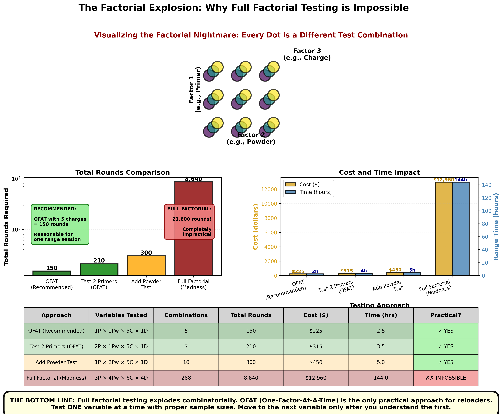

Time to complete: 10-15 minutes

# Testing One Thing at a Time

## The Most Expensive Mistake in Load Development

Picture this scenario. It's a common one:

You're developing a new load. Your current setup shoots okay—about 1.2 MOA with factory ammo—but you know you can do better. You've been reading forums, watching videos, and you have a plan:

**Your New Load:**
- Switch from H4350 to Varget (you heard it's better suited for your component selection)
- Change from CCI BR2 primers to Federal 210M (everyone says they're better)
- Adjust seating depth from 0.020" off the lands to 0.005 off the lands" (you read that works better with VLD bullets)
- Use your new brass instead of once-fired (it's finally ready)

You load up 20 rounds with all these changes. You head to the range. You shoot five 5-shot groups.

**The result: 0.7 MOA average. Amazing!**

You post online: "Found the perfect load! Varget + Federal 210M + 0.040" jump = 0.7 MOA!"

Three people immediately ask: "Which change made the difference? The powder, the primers, or the seating depth?"

**Your answer: "...I have no idea."**

And that's the problem. You just created a puzzle with no solution. You improved something, but you have absolutely no clue what actually helped. Even worse, you don't know if all those changes were necessary, or if maybe ONE of them did all the work and the others were just wasted effort and expense.

**Here's what you should have asked BEFORE making all those changes:**

"If I change four variables at once and see improvement, which variable do I adjust next time? If I run out of Federal primers and have to use CCI, do I need to change the powder too? Or the seating depth? Or both? Or neither?"

You've made your load development MORE complicated, not simpler. And you've learned almost nothing useful.

Let me show you the right way—the way that actually builds knowledge you can use.

---

## The Fundamental Problem: Confounded Variables

When you change multiple things at once, you create what statisticians call **confounded variables**. That's a fancy term for "You can't tell which thing caused the effect."

### The Broken Puzzle

Imagine you're trying to figure out which ingredient makes cookies taste better. You have a recipe, and you're testing changes:

**Test 1:** Original recipe - tastes okay
**Test 2:** Add more sugar + use better chocolate + increase baking time - tastes great!

**Question:** Which change made them better?
**Answer:** Could be any one, could be all three, could be weird interactions between them. You literally cannot know.

If you want to make them again and only have regular chocolate, do you:
- Skip the extra sugar?
- Keep the extra sugar but reduce the baking time?
- Do everything the same and hope?

**You're guessing.** You didn't learn anything reliable.

### The Reloading Version

Same principle with ammunition:

**Current load:** H4350, CCI primers, 0.020" jump - shoots 1.2 MOA
**New load:** Varget, Federal primers, 0.005" jump - shoots 0.7 MOA

**Question:** What actually improved your groups?

* **Possibility 1:** The powder change did everything. Primers and seating depth made no difference.

* **Possibility 2:** The seating depth was the whole story. Powder and primers were irrelevant.

* **Possibility 3:** Federal primers are the magic. The other changes did nothing.

* **Possibility 4:** All three changes were necessary in combination.

* **Possibility 5:** Two of the three mattered, one was useless.

* **Possibility 6:** You just got lucky and shot better groups today (remember Lesson 01?).

**You cannot distinguish between these possibilities without more testing.** And that testing will require you to test the variables separately anyway, so why not start there?

---

**[➡️ Launch Confounding Problem Simulator (Opens in New Tab)](../interactive/04_confounding_problem.html){:target="_blank"}**

*Interactive simulator featuring:*
- *Select 1, 2, or 3 variables to change (powder, primer, seating depth)*
- *Run a simulated test and see the results*
- *Try to identify which variable(s) caused the improvement*
- *Discover why multiple variables create impossible-to-interpret results*
- *Experience the "aha moment" when you realize you can't tell what helped*
- *See the hidden truth revealed after your answer*

---

> **Critical Insight**
>
> Changing multiple variables at once doesn't save time. It wastes it. You end up guessing, second-guessing, and having to retest anyway. Change one thing at a time, and you build real knowledge.

---

## The Factorial Explosion: Why "Test Everything at Once" Doesn't Work

Maybe you're thinking: "Okay, but what if I test ALL the combinations? Then I'll know which works best!"

Let's do the math.

### The Math That Kills This Idea

Say you want to test:
- **2 primer types** (CCI vs Federal)
- **3 powder types** (H4350 vs Varget vs H1000)
- **4 charge weights** (41.0, 41.5, 42.0, 42.5 grains)
- **3 seating depths** (0.020", 0.040", 0.060" off lands)

**Total combinations:** 2 × 3 × 4 × 3 = **72 different loads**

Now, remember from Lesson 03: you need at least 30 shots per load to measure anything reliably.

**Total rounds needed:** 72 × 30 = **2,160 rounds**

**At $2 per round:** $4,320
**At 100 rounds per hour of shooting:** 21.6 hours of range time
**Barrel life consumed:** 2,160 rounds (potentially 20%+ of a barrel's accurate life)

**Reality check:** Nobody is doing this (in the hobby sector). And if you try, you'll spend so long testing that your barrel will have changed, your primers will be from different lots, and your powder moisture content will have changed depending on how it's stored.

### The Smart Alternative: Sequential Testing

Instead, test one variable at a time:

1. **Test primers** (2 types × 30 shots each = 60 rounds)
2. **Keep the winner, test powders** (3 types × 30 shots each = 90 rounds)
3. **Keep the winner, test charge weights** (4 weights × 30 shots each = 120 rounds)
4. **Keep the winner, test seating depths** (3 depths × 30 shots each = 90 rounds)

**Total rounds: 360 rounds**
**Total cost at $2/round: $720**
**Time: 3-4 range sessions**

**You just saved $3,600 and 18 hours** while actually learning which variables matter and which don't.

Plus, you now KNOW:
- Federal primers gave you 5 fps lower spread than CCI (real difference)
- H4350 and Varget performed identically (no difference, so use cheaper one)
- Charge weight 41.5gr was best (0.2 MOA better than others)
- Seating depth made no measurable difference (stop worrying about it)

That's actionable knowledge. The factorial approach gives you 72 loads and no idea why any of them work.

The visualization below shows just how quickly this explodes. Even a simple 3×3×3 full factorial (testing just 3 levels of each of 3 variables) creates **27 combinations**. With our minimum 30 shots per combination, that's **810 rounds** just for this simplified scenario. Scale that up to the realistic 4-variable example above and you're at 21,600 rounds—completely impossible for hobby reloaders.



**Figure 3:** The combinatorial explosion of full factorial testing makes it completely impractical for reloaders. Top: Visual representation of a simple 3×3×3 factorial—27 combinations already. Middle: Comparison showing OFAT (5 charges = 150 rounds, practical for one range session) versus full factorial with 3 primers × 4 powders × 6 charges × 4 seating depths = 21,600 rounds (impossible!). Bottom: Detailed comparison table showing costs and time. The bottom line: Full factorial testing explodes combinatorially. OFAT (One-Factor-At-A-Time) is the only practical approach—test ONE variable at a time with proper sample sizes, then move to the next variable only after you understand the first.

**Three variables:** Complete confusion (extremely difficult to interpret without additional testing or very large sample sizes), multiple variable testing is not strictly impossible.

---

**A Note for Advanced Users:** If you're well-versed in statistical analysis, you may be familiar with Design of Experiments (DOE), Analysis of Variance (ANOVA), and other multi-variable testing methods that can efficiently explore interactions between variables. These are powerful tools when applied correctly. However, this lesson focuses on One-Factor-At-A-Time (OFAT) testing because it's accessible to beginners, requires no statistical software, and provides clear, interpretable results for the vast majority of reloading scenarios. OFAT is the practical choice for hobby reloaders—it works, it's simple, and you'll actually do it.

---

## The Right Way: Systematic One-Variable-at-a-Time Testing

Here's the method that actually works. It's simple, it's logical, and it builds knowledge you can trust.

### The Process

**Step 1: Start with a Known Baseline**

Don't start from zero. Begin with:
- Factory ammo that works okay, OR
- Someone else's published load recipe, OR
- Your current load (even if it's not great)

**Why:** You need a reference point. You're testing "Is this BETTER than what I have?" not "Is this good in absolute terms?"

**Example baseline:** Factory Hornady 140gr ELD-M - 1.2 MOA, SD of 18 fps

---

**Step 2: Choose ONE Variable to Test**

Pick exactly one thing to change. Everything else stays the same.

**Good choices:**
- Primer type (CCI BR2 vs Federal 210M)
- Powder type (H4350 vs Varget)
- Bullet type (Sierra vs Berger)

**Bad choices:**
- "Accuracy" (too vague, not a single variable)
- "Better components" (multiple variables)
- "Match ammo recipe" (changing everything)

**Example:** Let's test primers. CCI BR2 vs Federal 210M. Everything else (powder, charge, bullet, seating depth, brass) stays identical.

---

**Step 3: Test Adequately**

Remember Lesson 03? You need:
- **30 shots minimum** per option for spread (SD) measurements
- **50+ shots** if you want to compare group sizes reliably
- **Multiple sessions** if you want to verify repeatability

**Example:** Load 30 rounds with CCI BR2, load 30 rounds with Federal 210M. Shoot them at the same session (to control for weather, barrel condition, etc.).

---

**Step 4: Measure and Record Everything**

Use a data template (we'll provide this). Record:
- Shot number
- Which variable option (CCI or Federal)
- Velocity (from chronograph)
- Group number (if shooting groups)
- Point of impact (if measuring precision)
- Notes (any weirdness, flyers, conditions)

**Why detailed records matter:** You'll forget. You think you'll remember, but in three months when someone asks "Did you test Federal primers?" you'll want data, not fuzzy memory.

---

**Step 5: Analyze Honestly**

Plot the data. Calculate statistics. Look for real differences.

**Questions to ask:**
- Is the average velocity different by more than measurement error?
- Is the spread (SD) meaningfully lower?
- Do the groups average smaller?
- Is the difference bigger than just sample variation (remember the ocean and cup)?

**Example results:**
- CCI BR2: Average 2,850 fps, SD 15 fps, average group 1.1 MOA
- Federal 210M: Average 2,863 fps, SD 14 fps, average group 1.0 MOA

**Honest interpretation:** Tiny differences. Probably not real. Both primers work fine. Save money, use whichever is cheaper or more available.

---

**Step 6: Make a Decision**

Based on data, choose:
- **Keep the change** if it's clearly better and worth the cost/effort
- **Revert to baseline** if it made no difference or made things worse
- **Do more testing** if results are borderline and you need to be sure

**Example decision:** Primers made no meaningful difference. Stick with CCI (cheaper and easier to find).

---

**Step 7: Document and Move to Next Variable**

Write down what you learned. Update your load recipe notes. Now you have a new baseline:
- **Baseline Load v2:** Factory powder charge, CCI BR2 (tested, works fine), factory bullet, factory seating depth

**Next test:** Maybe try a different powder (H4350 vs RL16). Everything else stays the same, including the CCI primers you just validated.

Repeat this process for each variable you care about. After 4-5 testing cycles, you have a fully optimized load where you KNOW what each component does and why you chose it.

---

## Real Example Walkthrough: Primer Comparison Test

Let's walk through a complete test from start to finish. This is exactly what your testing should look like.

### Test Setup

**Baseline Load:**
- Cartridge: .308 Winchester
- Bullet: 168gr Sierra MatchKing
- Powder: 42.5gr N140
- Brass: Lapua, same lot, 2x fired
- Seating depth: 2.800" COAL (0.050" off lands)
- Current primer: CCI BR2

**Current performance:** ~1.0 MOA, SD around 12 fps

**Question:** Will Federal 210M primers improve anything?

**Test plan:** Load 30 rounds with CCI BR2, load 30 rounds with Federal 210M. Everything else identical. Shoot both sets same day, record all data.

### Data Collection Template

Here's the CSV format you should use (you'll copy this, paste into Excel/Google Sheets, and fill in your data):

```csv
Date,Temp_F,Pressure_InHg,Humidity_Pct,Altitude_Ft,Cartridge,Bullet_Gr,Brass_Mfg,OAL_In,Powder,Charge_Gr,Shot,Primer,Velocity_FPS,Group,POI_X_In,POI_Y_In,Notes
2024-12-30,68,29.92,45,5280,.308 Win,168,Lapua,2.800,N140,42.5,1,CCI BR2,2650,1,0.2,-0.3,
2024-12-30,68,29.92,45,5280,.308 Win,168,Lapua,2.800,N140,42.5,2,CCI BR2,2655,1,0.1,0.4,
2024-12-30,68,29.92,45,5280,.308 Win,168,Lapua,2.800,N140,42.5,3,CCI BR2,2648,1,-0.3,-0.1,
2024-12-30,68,29.92,45,5280,.308 Win,168,Lapua,2.800,N140,42.5,4,CCI BR2,2652,1,0.4,0.2,
2024-12-30,68,29.92,45,5280,.308 Win,168,Lapua,2.800,N140,42.5,5,CCI BR2,2651,1,-0.1,-0.2,
2024-12-30,68,29.92,45,5280,.308 Win,168,Lapua,2.800,N140,42.5,6,Federal 210M,2655,2,0.1,0.3,
2024-12-30,68,29.92,45,5280,.308 Win,168,Lapua,2.800,N140,42.5,7,Federal 210M,2658,2,0.3,-0.2,
2024-12-30,68,29.92,45,5280,.308 Win,168,Lapua,2.800,N140,42.5,8,Federal 210M,2653,2,-0.2,0.1,
...
```

**Columns explained:**

**Environmental Conditions (record at start of session):**
- **Date:** Test date (YYYY-MM-DD format)
- **Temp_F:** Temperature in Fahrenheit
- **Pressure_InHg:** Barometric pressure in inches of mercury
- **Humidity_Pct:** Relative humidity percentage
- **Altitude_Ft:** Elevation in feet above sea level

**Ammunition Specifications (constant for this test):**
- **Cartridge:** Cartridge type (.308 Win, 6.5 CM, etc.)
- **Bullet_Gr:** Bullet weight in grains
- **Brass_Mfg:** Brass manufacturer (Lapua, Starline, etc.)
- **OAL_In:** Overall cartridge length in inches
- **Powder:** Powder type/name
- **Charge_Gr:** Powder charge weight in grains

**Shot Data (varies per shot):**
- **Shot:** Sequential shot number (1, 2, 3, ...)
- **Primer:** Primer type (the variable being tested)
- **Velocity_FPS:** Chronograph reading in feet per second
- **Group:** Group number (1-6 if shooting 5-shot groups)
- **POI_X_In:** Horizontal position in inches from aim point
- **POI_Y_In:** Vertical position in inches from aim point
- **Notes:** Observations (flyer, wind gust, cold bore, etc.)

### Optional: Python Analysis Script

**Note:** You can analyze your data using Excel, Google Sheets, or any spreadsheet software. The Python script below is **not required** - it's simply an alternative for Python users who prefer programmatic analysis.

**[📥 Download Python Analysis Script](../resources/primer_test_analysis.py)**

This script will:
- Load your CSV data
- Calculate mean velocity, SD, and ES for each primer
- Generate visual comparison plots

Requirements: `pandas`, `matplotlib`, `numpy` (install with `pip install pandas matplotlib numpy`)

### Interpreting Results

**Example output** (from analyzing your data with the Python script or spreadsheet formulas):
```
=== CCI BR2 Results ===
Average velocity: 2651.3 fps
SD: 11.8 fps
Extreme spread: 42 fps

=== Federal 210M Results ===
Average velocity: 2654.7 fps
SD: 10.9 fps
Extreme spread: 38 fps
```

**What this tells you:**

1. **Average velocity:** Federal is 3.4 fps faster
   - **Interpretation:** Negligible difference. This won't matter at any practical distance.

2. **SD:** Federal is 0.9 fps lower
   - **Interpretation:** Very small difference. With 30-shot samples, this could easily be random variation. Not enough to matter.

3. **Extreme spread:** Federal is 4 fps tighter
   - **Interpretation:** Extreme spread varies a lot between samples. This difference is not meaningful.

**Conclusion:** Primers performed essentially identically. No reason to switch. Stick with CCI (cheaper, more available).

**Decision:** Keep CCI BR2 as your primer. Move on to testing the next variable (maybe powder type or charge weight).

---

## Common Mistakes and How to Avoid Them

### Mistake 1: "I'll Just Test the Most Important Variable"

**The problem:** You don't know which variable is most important until you test them.

**The fix:** Test in this order:
1. Bullet (usually biggest impact)
2. Powder type (if considering a switch)
3. Primer (usually small impact)
4. Charge weight fine-tuning (once powder is chosen)
5. Seating depth (often makes no measurable difference)

### Mistake 2: "I Changed One Variable But Also Switched Brass"

**The problem:** You didn't actually change one variable. You changed two.

**The fix:** Be strict. ONE variable means one. If you run out of your current brass lot in the middle of testing, STOP. Get more brass or restart the test later. Don't contaminate your data.

### Mistake 3: "I Tested in Different Conditions"

**The problem:** You tested CCI primers on a calm day and Federal primers on a windy day. Now you can't tell if differences are from primers or conditions.

**The fix:** Test both options in the same session, same day, same conditions. Alternate between them (5 shots CCI, 5 shots Federal, 5 shots CCI, etc.) to average out any barrel heating or condition changes.

**Advanced environmental control:**

For more precise testing, especially when developing loads you'll use across varying conditions, consider using proper environmental measurement tools:

**Kestrel weather meters** ([Kestrel Meters](https://kestrelmeters.com/)) provide accurate real-time measurements of:
- Temperature (air and density altitude)
- Barometric pressure
- Humidity
- Wind speed and direction
- Some models include ballistic solvers for immediate firing solutions

While a weather phone app is better than nothing, dedicated meters are far more accurate for serious load development and building accurate DOPE (Data On Previous Engagements) across conditions.

**Laser rangefinders** address distance-to-target uncertainties. If you're testing precision at what you think is "600 yards" but it's actually 580 yards or 620 yards, your ballistic data will be skewed. Accurate ranging ensures your trajectory calculations and load data are referenced to true distances.

**Critical consideration - Propellant temperature acclimation:**

Physicist Denton Bramwell conducted experiments involving thermocouples embedded in cartridge cases to measure propellant temperatures to obtain heating and cooling rates.  **The key finding: SAAMI's practice is to aclimate ammunition for 24 hours prior to testing.  However, for our purposes, the rifle and ammunition should acclimate for at least an hour or two for propellant temperature to approximate ambient conditions.**

**What this means for testing:**

When temperature testing ammunition, you can isolate ammo temperature effects using controlled heating or freezing (heater, freezer, hot car, cooler, etc.) to understand how the ammunition responds. However, for building usable DOPE and understanding how your complete system performs, **you must test the rifle, ammunition, and all components when acclimated to the actual environmental temperature you'll encounter.**

**Practical implications:**

- Don't pull ammunition from your climate-controlled vehicle and immediately shoot for "cold weather" testing—the powder is still warm
- When testing across temperature extremes, allow at least 60+ minutes for ammunition to reach ambient conditions
- If testing in summer heat, ammunition sitting in direct sunlight will be warmer than ambient - increasing pressure!
- "Real world" temperature testing requires the entire system (rifle, ammo, shooter) to acclimate to conditions

**Example of proper temperature testing:**
1. Acclimate firearm and ammunition completely before testing, allowing ample time for them to reach ambient
2. Record actual environmental conditions with Kestrel or similar device
3. Use a non-contact thermometer to track external ammunition and firearm temps
4. Remember, once the cartridge case hits ambient temps, the propellant and primer take more time to acclimate
5. Record actual environmental conditions with Kestrel or similar
6. Reference all data to measured temperature, not assumed temperature

This level of environmental control separates guesswork from genuine understanding of how your loads perform across the conditions you'll actually encounter.

### Mistake 4: "I Know CCI Works, So I'll Test Federal with Less Shots"

**The problem:** Unequal sample sizes bias your comparison. You might see Federal "win" just because you got lucky in a small sample.

**The fix:** Equal shots for each option. If you're shooting 30 rounds of CCI, shoot 30 rounds of Federal. No shortcuts.

### Mistake 5: "The First Group with Federal Was Amazing, So I Stopped Testing"

**The problem:** Remember Lesson 01? One lucky group proves nothing.

**The fix:** Shoot the full planned sample size. Don't stop early because of one good result. That's confirmation bias.

---

## When Can You Change Multiple Variables?

There ARE situations where changing multiple things makes sense:

### Situation 1: You Don't Care Which Variable Helped

If you're just looking for "better" and don't need to understand why, go ahead. Load up a completely different recipe and see if it works. But understand: you won't learn anything to apply next time.

**Example:** You're switching calibers and just want a good load fast. Fine, use someone's published recipe (multiple changes from nothing). If it works, great. If not, you'll need to test variables individually anyway.

### Situation 2: You're Doing Final Validation, Not Diagnosis

Once you've tested variables individually and created your final recipe, you load 100 rounds and verify the complete load works consistently. That's validation, not testing.

### Situation 3: The Variables Are Not Independent

Some variables genuinely interact. Example: Seating depth affects pressure, which may affect charge weight. In this case, you might test "charge weight at 0.020" off" vs "charge weight at 0.040" off" as two separate complete tests.  Critical safety:  Velocity and Pressure are directly related.  If you are exceeding SAAMI pressure, you are shortening the lifespan of the cartridge case at best.  Worst case, you could have a catastrophic event!

**But:** This is advanced. Start with one-at-a-time testing until you understand your system.

---

## The Payoff: Knowledge You Can Use

After six months of one-variable-at-a-time testing, here's what you'll have:

**Your load notebook:**
- "CCI vs Federal primers: No difference. Use CCI (cheaper)."
- "H4350 vs RL16: RL16 gave 5 fps lower SD and is temp stable. Worth switching."
- "Charge weight test: 41.5gr best accuracy at X MOA. 42.0gr faster but groups opened up to Y MOA"
- "Seating depth test: No measurable difference from 0.020" to 0.060" off. Using 0.040" for magazine feed."
- "Sierra 168gr vs Berger 168gr Hybrid: Berger gave 0.15 MOA improvement. Worth the extra cost for competition."

**What this knowledge does:**

**Scenario 1:** You run out of Berger bullets mid-season.
- **You know:** Sierra bullets will cost you ~0.15 MOA. For practice, that's fine. For competition, order more Bergers or adjust expectations.

**Scenario 2:** Someone online claims Federal primers are "way better" than CCI.
- **You know:** In YOUR rifle with YOUR load, you tested this with 60 rounds and found no difference. You can politely disagree with data.

**Scenario 3:** Primers become hard to find. You can only get Winchester.
- **You know:** You need to test Winchester vs CCI with ~30 rounds each. You know the process, you have the templates, you'll get a real answer in one range session.

**This is the power of systematic testing.** You're not guessing. You're not relying on internet folklore. You KNOW your rifle and your loads because you tested properly.

---

## Your Assignment: Plan Your Next Test

Think about your current load. What's the ONE variable you're most uncertain about?

- Primers?
- Powder type?
- Bullet brand?
- Charge weight?

Pick one. Just one. Plan a test:

1. What are you testing? (Be specific: "CCI 450 vs Federal 205M")
2. What's your sample size? (Minimum 30 shots each)
3. What will you measure? (Velocity SD? Group size? Both?)
4. How will you know if there's a real difference?

Write it down. The next lesson will give you the tools to analyze velocity data properly. Then Lesson 06 will handle group size analysis. But the experimental design—testing one thing at a time—starts here.

> **Key Takeaways**
> - Changing multiple variables at once creates unsolvable puzzles
> - You cannot tell which variable caused an effect when they're confounded
> - Factorial testing (all combinations) is prohibitively expensive
> - Sequential one-at-a-time testing is faster, cheaper, and actually teaches you something
> - Start with a baseline, change ONE variable, test adequately, analyze honestly, make a decision
> - Document everything so you build real knowledge over time
> - Equal sample sizes, same conditions, full sample—no shortcuts
> - After systematic testing, you KNOW your rifle instead of guessing

---

## Coming Up Next

**In Lesson 05: Velocity Data**, you'll learn:
- What to measure from your chronograph and why
- Why SD from small samples is misleading (we'll show the math)
- How to spot fake "velocity nodes" and "flat spots" in charge ladders
- Better ways to visualize and analyze velocity data
- When velocity consistency actually matters (and when it doesn't)

You now know HOW to test (one variable at a time). Next, you'll learn how to analyze VELOCITY data properly so you can make good decisions from your testing.

---

[Previous: 03 How Many Shots Do You Really Need](03_How_Many_Shots_Do_You_Really_Need.html) | [Next: 05 Velocity Data - What to Measure and How to Think About It](<05_Velocity_Data_-_What_to_Measure_and_How_to_Think_About_It.html>)
