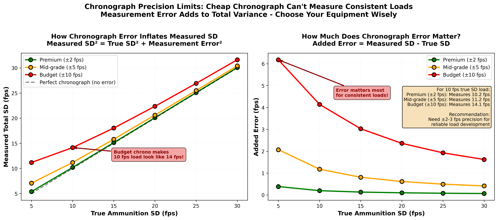
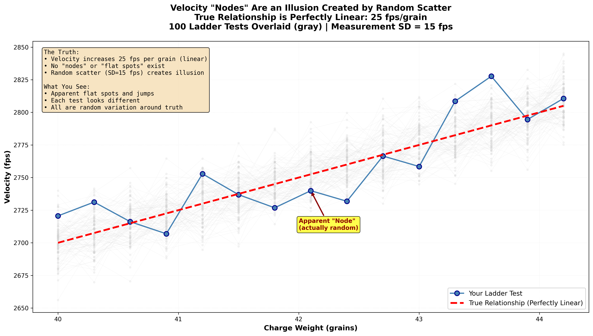

Time to complete: 10-15 minutes

# Velocity Data - What to Measure and How to Think About It

## Chronograph Numbers: What They Tell You and What They Don't

You're standing at the range, chronograph set up, first shot fired. The display shows: **2,847 fps**.

What does that number mean?

You fire nine more shots. Now you've got ten numbers dancing across your chronograph screen. The display helpfully shows you:
- Average velocity: 2,851 fps
- Extreme spread (ES): 23 fps
- Standard deviation (SD): 8 fps

You pack up, head home, post your results online: "Found a great load! 2,851 fps with 8 fps SD!"

Here's the uncomfortable question: **Do you actually know what those numbers mean? And more importantly, do they mean what you think they mean?**

Most reloaders treat chronograph data like magic oracle wisdom. Low SD? That's the holy grail. Tight ES? Load development success. "Flat spot" in a velocity ladder? You've found the mythical node.

The truth is more nuanced, more interesting, and way more useful once you understand it.

In this lesson, you'll learn:
- What average velocity actually tells you (and why it's more reliable than you think)
- Why SD and ES from small samples are misleading (the "perverse nature" Denton Bramwell warned about)
- How to spot when velocity data is trustworthy vs. when it's lying to you
- The great velocity node myth—and why your brain keeps finding patterns in random noise
- When velocity consistency actually matters vs. when it's just bragging rights
- Temperature sensitivity: the variable that matters more than most reloaders realize

By the end, you'll understand not just what your chronograph says, but what it actually means—and how to use that information to make better decisions instead of chasing ghosts.

---

## Average Velocity: The Number You Can Trust

Let's start with good news: **Average velocity is reliable, even with small samples.**

Remember from Lesson 03 how we discussed that averages stabilize faster than spread? This is where that matters most.

### Why Average Velocity Matters

Your bullet's velocity determines:
1. **Trajectory**: How much it drops at distance
2. **Wind drift**: How much crosswind pushes it
3. **Time of flight**: How long it's in the air (and accumulating errors)
4. **Energy on target**: For hunters, this affects terminal performance

If you're shooting at 600 yards, a 50 fps difference in velocity creates about 6 inches of vertical difference. That's significant. So knowing your true average velocity actually matters.  *Trajectory examples are arbitary but relevant examples.  Use a quality external ballistics calculator to check your ammunition.

### The Good News: 10-15 Shots Is Usually Enough

Unlike measuring spread (SD or ES), which requires 30+ shots to be reliable, measuring average velocity is reasonably accurate with just 10-15 shots.

**Why the difference?**

Think about it this way:
- Random variation tends to cancel out when you're averaging (some shots high, some low, they balance)
- But random variation ADDS to your spread measurement (every shot that's different from average increases it)

**Practical example:**

You shoot 10 rounds and get an average of 2,851 fps. The true population average (if you shot 1,000 rounds) is probably between 2,845 and 2,857 fps. That's close enough for practical trajectory calculations.

But that same 10-shot sample might show 8 fps SD when the true SD is actually 15 fps. Big difference.

### Using Average Velocity Properly

**Good uses:**
- Calculating trajectory and drops for your ballistic solver
- Comparing velocity between different powders or charges (with proper sample sizes)
- Verifying you're in a safe pressure range
- Matching factory ammunition ballistics

**Bad uses:**
- Claiming extreme precision ("My average is exactly 2,851.3 fps!")
- Using it as a proxy for consistency (that's what SD measures, not average)
- Comparing single-session averages from different days (environmentals change)

**[➡️ Launch Average Velocity Convergence Simulator (Opens in New Tab)](../interactive/05_velocity_convergence.html){:target="_blank"}**

Fire shots one at a time and watch how the running average quickly stabilizes compared to SD. Adjust the true SD to see how individual shots scatter, but notice how the average converges fast regardless!

> **Key Insight**
>
> Average velocity is the most reliable number your chronograph gives you. With 10-15 shots, you can trust it for trajectory calculations. It's the spread measurements (SD, ES) that require large samples to be trustworthy.

---

## Standard Deviation: The Number Everyone Wants, Nobody Understands

Standard deviation (SD) is the reloading community's obsession. Everyone wants single-digit SD. People post their 6 fps SD strings like trophies. Load development often focuses entirely on minimizing SD.

Here's the problem: **Most of those SD numbers are lies. Not intentional lies—statistical lies.**

### What SD Actually Measures

Standard deviation quantifies how spread out your velocities are around the average. Think of it as the typical distance a shot varies from the mean.

**Simple example:**

Five shots: 2,845, 2,850, 2,852, 2,849, 2,854 fps
- Average: 2,850 fps
- SD: ~3 fps (very tight!)

Five different shots: 2,830, 2,855, 2,845, 2,865, 2,835 fps
- Average: 2,846 fps (similar average)
- SD: ~14 fps (much more spread)

The first string is more consistent. The second varies more shot-to-shot.

**In theory, SD is exactly what we want to measure.** In practice, small samples make it nearly useless.

### The Perverse Nature of Standard Deviation (Bramwell's Warning)

Physicist and statistician Denton Bramwell wrote about the "perverse nature of standard deviation" in small samples. Here's what he meant:

**SD calculated from small samples is biased low.** It systematically underestimates the true population SD.

**The math reason** (skip if you don't care):
When you calculate SD from a sample, you're using the sample mean, which is itself uncertain. This creates a statistical quirk where small samples tend to look tighter than they really are.

**The practical impact:**

If your load's true SD is 15 fps (the real number if you shot 1,000 rounds):
- A 5-shot sample might show: 8 fps (looks amazing!)
- Another 5-shot sample might show: 19 fps (looks terrible!)
- A 10-shot sample might show: 11 fps (still optimistic)
- A 30-shot sample would show: 14-16 fps (now we're getting close to truth)

**This is why people constantly "find" loads with single-digit SDs that don't repeat.** They got lucky with a small sample that happened to be tighter than the true population.

### The Running SD Visualization

Want to see this in action? Track SD as you add shots:

```
After 5 shots:   SD = 7 fps
After 10 shots:  SD = 12 fps
After 15 shots:  SD = 14 fps
After 20 shots:  SD = 15 fps
After 25 shots:  SD = 14 fps
After 30 shots:  SD = 15 fps
```

Notice how SD climbs as sample size increases? That's not your load getting worse—that's the measurement getting more accurate.

**The early numbers are optimistic lies. The later numbers are closer to truth.**


**Figure 1:** Monte Carlo simulation showing distributions of calculated SD values from different sample sizes, with true population SD of 15 fps. With 5-shot samples, calculated SDs range wildly from 5 to 25 fps, mostly underestimating the truth. Even 10-shot samples show substantial variation. Only at 30+ shots does the distribution narrow and center on the true value. This visualization proves why your amazing single-digit SD from a 10-shot string is almost certainly optimistic luck, not real performance.

### Extreme Spread (ES): Even More Misleading

If SD is unreliable with small samples, ES is worse.

**Extreme spread** is just the difference between your fastest and slowest shot:
```
Shots: 2,835, 2,848, 2,851, 2,846, 2,863 fps
ES = 2,863 - 2,835 = 28 fps
```

**The problem:** ES grows forever as you add shots. It can never shrink (unless you get lucky), only stay the same or increase.

**Expected behavior:**

If your true population has 15 fps SD:
- 5 shots: ES probably around 20-25 fps
- 10 shots: ES probably around 30-40 fps
- 30 shots: ES probably around 50-60 fps
- 100 shots: ES could be 70+ fps

Does this mean your load got worse as you tested more? No. It means ES is a bad metric for anything except "what was the range I saw in THIS sample."

**ES tells you about your sample, not your population.** Don't use it to compare loads unless sample sizes are identical.

> **Critical Takeaway**
>
> SD from small samples (under 30 shots) systematically underestimates true consistency. That 6 fps SD from a 10-shot string is almost certainly optimistic. The true SD is probably 10-15 fps. This is why amazing results from small samples don't repeat—they were statistical flukes, not real performance.

### The Hidden Factor: Chronograph Measurement Error

Before we get too excited (or depressed) about our velocity measurements, we need to acknowledge an uncomfortable truth: **your chronograph adds measurement error to your ammunition's true variation.**



**Figure 3:** How chronograph measurement error contributes to total measured SD. A truly consistent load with 10 fps true SD will measure differently depending on your chronograph quality. With a high-end chronograph (±2 fps error), you'll measure close to the true 10 fps. With a budget chronograph (±10 fps error), that same load will measure as 14 fps SD - the measurement noise is larger than the ammunition signal! This is why upgrading from a cheap chronograph can make your "SD drop" - you didn't improve your load, you just reduced measurement error. For serious load development with low-SD goals, you need a chronograph with ±2-3 fps precision.

**The practical lesson:** If you're chasing single-digit SDs, make sure your chronograph is accurate enough to actually measure them. A $100 chronograph with ±10 fps error cannot reliably distinguish between a 10 fps load and a 15 fps load.

### The Hidden Factor #2: Powder Scale Tolerance and Charge Weight Variability

Just as your chronograph adds measurement error, **your powder scale's tolerance adds charge weight variability** that directly contributes to velocity SD. Understanding this relationship helps you know when investing in a better scale actually matters.

**The calculation (with example):**

Let's say you're loading 6.5 Creedmoor with 41.5 grains of powder, and your chronograph shows an average of 2,720 fps over a significant sample (30+ shots).

**Step 1: Calculate velocity per grain of powder**
```
Velocity / Charge weight = fps per grain
2,720 fps / 41.5 gr = 65.5 fps/gr
```

This means each 1.0 grain of powder adds approximately 65.5 fps.

**Step 2: Scale down to your scale's precision**

If your scale is accurate to ±0.1 grain (common for beam scales and lower-end digital scales):
```
65.5 fps/gr × 0.1 gr = ±6.55 fps per 0.1 grain variation
```

**Step 3: Calculate total charge weight contribution to SD**

If your scale can vary by ±0.1 grain, some rounds might be 41.4gr and others 41.6gr. The total range is 0.2 grains, which creates:
```
65.5 fps/gr × 0.2 gr = ~13 fps total velocity spread from charge weight alone
```

**The practical lesson:**

If your powder charge tolerance is ±0.1 grain and you're seeing 13+ fps SD, a significant portion of that SD is coming from inconsistent powder charges. In this example, charge weight variability could account for most or all of your measured SD.

**What this means for scale selection:**

- **±0.1 grain scale** (beam scale, basic digital): Contributes ~10-15 fps to SD for typical rifle cartridges
- **±0.02 grain scale** (quality digital): Contributes ~2-3 fps to SD
- **±0.01 grain scale** (high-end analytical): Contributes ~1 fps to SD

**Decision guide:**

**If your measured SD is 15-20 fps:**
- Upgrading from ±0.1gr to ±0.02gr scale could reduce SD by 8-12 fps
- This is a significant improvement worth considering

**If your measured SD is already 8-10 fps:**
- Your powder charges are probably already very consistent (good scale)
- OR other factors (bullets, primers, brass) dominate your SD
- Upgrading scale further has diminishing returns

**Safety note:** This relationship (charge weight to velocity) also means pressure increases directly with charge weight. Always stay within published safe load data, and be especially careful when using a less precise scale—that ±0.1 grain tolerance could put some rounds over maximum pressure.

**Example for other cartridges:**

The same calculation applies to any cartridge. For a .223 Remington with 23.0 grains producing 2,800 fps:
```
2,800 fps / 23.0 gr = 121.7 fps/gr
±0.1 gr scale tolerance × 121.7 = ±12.2 fps from charge weight alone
```

Smaller capacity cartridges are MORE sensitive to charge weight variations (higher fps/gr ratio), making scale precision even more important.

---

## The Great Velocity Node Myth: Your Brain Playing Tricks

This is the big one. The myth that won't die. The claim that keeps spreading despite being thoroughly debunked.

**The claim:** "If you load incrementally increasing powder charges and shoot them over a chronograph, you'll find 'flat spots' in the velocity curve. These are harmonic nodes where the barrel vibration is minimized, creating superior accuracy."

**The reality:** You're seeing random variation and your pattern-seeking brain is finding structure in noise.

Let's break down why this myth is so persistent and so wrong.

### What You See vs. What's Really Happening

Imagine you load 10 rounds with powder charges from 41.0 to 42.0 grains in 0.1-grain increments. You shoot them over a chronograph and plot velocity:

```
41.0gr → 2,820 fps
41.1gr → 2,825 fps
41.2gr → 2,830 fps ← "Wow, linear so far"
41.3gr → 2,828 fps ← "Whoa, velocity dropped! Flat spot!"
41.4gr → 2,831 fps
41.5gr → 2,835 fps
41.6gr → 2,833 fps ← "Another flat spot!"
41.7gr → 2,840 fps
41.8gr → 2,845 fps
41.9gr → 2,842 fps ← "And another!"
42.0gr → 2,850 fps
```

You circle the "flat spots" at 41.3gr, 41.6gr, and 41.9gr. You've found three nodes! Time to test those for accuracy, right?

**Wrong.**

### What's Actually Happening: Random Variation

Each shot has natural variation around the average for that charge. Even if you loaded ten rounds at exactly 41.3 grains, you'd see variation—from bullet-to-bullet differences, case volume variation, primer differences, barrel fouling, etc.

When you shoot ONE round per charge, that single shot could be:
- High (above the average for that charge)
- Low (below the average)
- Right at the average (lucky!)

**A "flat spot" is just a charge that happened to shoot on the low side, followed by a charge that shot on the high side, creating an illusion of no velocity increase.**

Let me say that again: **It's random scatter, not a real phenomenon.**

**Important methodological note:** The following simulation demonstrates that random variation ALONE can create convincing "flat spots" in velocity progressions, even when no actual nodes exist. This illustrates an important principle: **seeing a flat spot is NOT sufficient evidence that a velocity node exists**, because random chance can create the same pattern.

**The fix:** Large sample sizes average out the noise, revealing the true signal.

### The Evidence: Simulation

Here's the smoking gun. We can simulate a perfectly smooth velocity progression with NO nodes programmed in—just realistic random variation shot-to-shot—and still get "flat spots" consistently.



**Figure 2:** Demonstration of the velocity node myth using a perfectly linear true velocity progression (2 fps per 0.1 grain) with realistic random shot-to-shot variation. Multiple simulated ladder tests show "flat spots" and "nodes" appearing in different locations each time - proving these are artifacts of random scatter, not real phenomena. When 100 ladder tests are overlaid, the cloud of points reveals the true smooth linear progression with no consistent nodes. Your pattern-seeking brain finds structure in noise, leading you to chase ghosts instead of real data.

### Why Your Brain Falls for This

Human brains find patterns. Pattern recognition helps keep us alive. When you see random data, your brain automatically looks for structure, meaning, connections.

**You literally cannot help it.** Your visual system is wired to find patterns even when they don't exist.

**Famous example:** People see faces in clouds, in toast, in random textures. Same mechanism. Your brain completes patterns from incomplete information.

When you look at a velocity ladder with scatter, your brain highlights the "flat spots" and ignores the overall trend. It's not your fault. It's just how we're built.


### What Controlled Studies Show

Researchers who tested this properly:
1. Had shooters do ladder tests and identify "nodes"
2. Then tested those specific charge weights with 30+ shots for accuracy
3. Found that "node" charges performed no better than adjacent charges
4. Concluded nodes are measurement artifacts, not real phenomena

**The mechanism is real** (velocity increases with powder charge). **The nodes are not.**

### Temperature Sensitivity: The Real Variable

Here's something that actually DOES create velocity variation: temperature.

Powder burn rate changes with temperature. Some powders and component combinations are more sensitive than others.  I urge readers to take marketing claims of temperature insensitivity with a grain of salt.  If you want to know your system is effected, you must properly test this interaction.  I wouldn't assume a table of propellant temperature sensitivities for one system applies to yours. even if using the same propellant.

**Typical temperature sensitivity:**
- Temp-stable combinations: ~0.5 fps per degree F
- Less-stable combinations: ~1.5 to 3.0+ fps per degree F


**Practical impact:**

You develop a load on a 70°F day: Average velocity 2,850 fps

Same load on a 28°F winter hunt: Could be 2,810 fps (40 fps slower)

Same load on a 95°F summer day: Could be 2,900 fps (50 fps faster)

I would also caution you to test at least 3 different temperatures with a wide spread and not assume temperature and velocity has a constant relationship (linear).

**That's WAY more velocity variation than "nodes" supposedly control.**

Yet very few reloaders properly test temperature sensitivity. 

### ! SAFETY ALERT !

**Pressure and Velocity: A Critical Warning**

Reloading involves real danger. After reviewing thousands of forum posts and social media load recommendations, I'm alarmed by how many unsafe and overpressure loads are being shared and repeated.

**Critical fact you must understand:** Pressure increases exponentially relative to velocity—not linearly. You cannot judge pressure by traditional "pressure signs" alone. By the time you see traditional overpressure signs (cratered primers, ejector marks, sticky bolt), you're already well past safe limits and risking possible catastrophic failure.

This isn't folklore or "Fudd lore." This is physics, backed by countless documented injuries. I've personally seen the aftermath of some mistakes or neglegence. In some cases, rifles were ruined. In other cases, people were permanently injured. These injuries are 100% preventable.  Many modern components (brass, actions) can take tremendous pressure. If you can only get a handful of reloads out of your brass, I strongly urge you to stop racing the chronograph.

For example:  If manufacturer's published load data shows 2680fps using Varget in a 24" barrel, but you are getting 2680 fps in a 20" - you aren't proving the ballisticians wrong, you are over SAAMI pressure limits.  If there are discrepancies, error on the side of caution.

**Please:** Start low, work up carefully, respect published maximums, and never blindly trust load data from internet strangers. Your safety—and your face—are worth more than an extra 50 fps.

Test smart. Shoot safe.

### What to Do Instead

**For velocity development:**

1. **Start with safe minimum, work up to safe maximum in 0.5 to 1.0 grain increments** (not 0.1-0.2 grain)
2. **Shoot 5 rounds per charge** to see average velocity and very rough SD
3. **Watch for pressure signs and maximum safe velocity**, not "flat spots", compare velocity and barrel length to published load data
   - If you do get traditional pressure signs - STOP!
4. **Pick 2-3 promising charges** based on:
   - "Safe" pressure
   - Desired velocity for your ballistics
   - No obvious issues (erratic SDs, sticky extraction)

5. **Test those charges properly** with 30+ shots each for real SD and precision
6. **Make a decision** based on data, not patterns in noise

**For temperature testing:**

1. Test your chosen load at different temperatures (cold winter day, mild spring day, hot summer day)
2. Record your 10-15 shot average velocity
2. Compare how much velocity shifts between temperatures
3. If it matters for your application, there are tools available to correct for environmental changes in your firing solution

This approach uses the same number of components as a ladder test but gives you actually useful information.

> **Critical Takeaway**
>
> Velocity "nodes" or "flat spots" in charge ladders are random scatter, not real phenomena. Your pattern-seeking brain finds structure in noise. Controlled tests show node charges perform no better than adjacent charges. Don't waste time chasing ghosts—use proper sample sizes and test the variables that actually matter.

---

## When Does Velocity Consistency Actually Matter?

You've heard it a thousand times: "Low SD is the key to accuracy and precision."

Is it though?

**The answer:** It depends entirely on what you're shooting and how far.

### The Physics: How Velocity Affects Hits

Velocity variation creates vertical dispersion at distance because faster bullets drop less and slower bullets drop more on their flight to the target.

**The math (approximate):**

At 100 yards: 15 fps velocity variation ≈ 0.1 inch vertical spread (negligible)

At 300 yards: 15 fps variation ≈ 1.0 inch vertical spread (still small)

At 600 yards: 15 fps variation ≈ 4 inches vertical spread (starting to matter)

At 1,000 yards: 15 fps variation ≈ 12 inches vertical spread (definitely matters)

Notice the pattern? **Velocity SD matters more as distance increases.**

### Practical Decision Guide: When to Care About SD

**Scenario 1: Hunting deer inside 400 yards**

Your load shows 15 fps SD (measured properly with 30 shots).

At 400 yards, this creates about 2 inches of vertical uncertainty. Your deer's vital zone is 8+ inches.

**Does SD matter?** No. You're already more precise than needed. Chasing lower SD is isn't likely worth the time.

**Scenario 2: PRS/NRL competition, targets at 600-800 yards**

Target sizes vary from 8 inches to 20 inches.

15 fps SD at 700 yards creates about 6 inches of vertical uncertainty. On an 8-inch target, that's significant.

**Does SD matter?** Yes, moderately. Getting SD down to 10 fps or less provides a real advantage.

**Scenario 3: ELR (extreme long range) at 1,500+ yards**

Targets at massive distances.

15 fps SD at 1,500 yards creates 20+ inches of vertical uncertainty.  SD and accuracy of the firing solution are primary drivers of hit percentage.

**Does SD matter?** Absolutely. Every fps of SD reduction helps. This is where single-digit SD actually matters.

**Scenario 4: Benchrest at 100-200 yards**

Velocity SD creates minimal vertical at these distances. Precision is limited by other factors (bullet quality, rifle mechanics, wind).

**Does SD matter?** Not really. The reality is, it takes a massive relative velocity shift to create an impact equal to average dispersion characteristics.

### The Honest Assessment

**For most reloaders shooting most applications, velocity SD between 10 and 20 fps is perfectly adequate.**

Going from 15 fps SD to 8 fps SD:
- Sounds impressive
- Feels like an accomplishment
- Makes almost zero practical difference if you're not shooting at targets sufficiently small at sufficiently long distances.

**Where your effort should go:**

1. **Bullet quality**: Bigger impact on precision than SD
2. **Rifle accuracy**: Most low tier factory rifles don't shoot well enough for SD to matter
3. **Fundamentals**: Shooter error dwarfs velocity variation effects
4. **Wind reading**: Misreading wind by 2 mph matters more than 10 fps SD at extended distances

Once you've optimized those, THEN chase lower SD if you're shooting far enough for it to matter.

**Interactive Element Placeholder:**
```python
# Interactive widget: "Does SD Actually Matter for Your Shooting?"
#
# User inputs:
# Slider 1: Typical shooting distance (100 to 1,500 yards)
# Slider 2: Typical target size (4 to 20 inches)
# Slider 3: Your current SD (5 to 25 fps)
#
# Calculations:
# - Vertical dispersion from SD at that distance
# - Hit probability on target given SD-induced spread
# - Compare to improved SD (reduce by 50%)
#
# Display:
# - Visualization: target with velocity-induced vertical spread overlay
# - Current hit probability: XX%
# - With 50% better SD: XX% (difference highlighted)
# - Verdict: "This SD improvement would increase hits by X%"
# - Recommendation: "Negligible - focus elsewhere" or "Moderate benefit" or "Significant - worth pursuing"
#
# Aha moment: "For my 300-yard deer hunting, improving from 15 to 8 fps SD
# increases hit probability by 0.3%. I've been obsessing over nothing!"
```

---

## What to Actually Track: Better Metrics

Instead of obsessing over single-session SD from small samples, here's what to track:

### 1. Average Velocity (Most Important)

Track this across multiple sessions:
```
Session 1: 2,851 fps (10 shots)
Session 2: 2,848 fps (10 shots)
Session 3: 2,853 fps (10 shots)
```

If averages are consistent (within 10 fps across sessions), you've got a stable load. Use the overall average for ballistics.  

### 2. Session-to-Session SD (Tells You About Repeatability)

Don't trust SD from one session. Track it across multiple:
```
Session 1: 14 fps SD (30 shots)
Session 2: 16 fps SD (30 shots)
Session 3: 13 fps SD (30 shots)
```

If SDs are similar across sessions, you've got a genuinely consistent load. If they jump around wildly (8 fps one day, 22 fps another), your load is inconsistent or your sample sizes are too small.

### 3. Velocity Trend Over Time (Spot Problems Early)

Plot velocity in the order you shot it:
```
Shots 1-10: averaging 2,850 fps
Shots 11-20: averaging 2,855 fps
Shots 21-30: averaging 2,865 fps
```

A good load shows no trend—just random scatter around a stable average when accounting for temperature.

### 4. Temperature-Adjusted Velocity

If you test in different conditions, normalize to a standard temperature:

```
Measured: 2,820 fps at 45°F
Temperature coefficient: 0.8 fps per degree (from your temperature testing)
Normalized to 70°F: 2,820 + (25°F × 0.8) = 2,840 fps
```

This lets you compare across sessions without environmental factors confusing the data.

---

## The Foundation for What Comes Next

You now understand:
- Average velocity is reliable with small samples, SD is not
- SD from small samples systematically underestimates true consistency
- Velocity "nodes" are pattern-seeking illusions, not real phenomena
- Whether SD matters depends entirely on your target distance
- Temperature sensitivity affects velocity more than most variables you're testing

**This changes how you approach load development:**

Instead of: "I'll shoot 5 shots per charge and look for the lowest SD"

You'll do: "I'll test charges with adequate samples, measure real consistency across sessions, and focus on SD only if my shooting distances justify it"

Instead of: "I'll find the node by looking for flat spots in velocity"

You'll do: "I'll test promising charges properly and let data drive decisions, not patterns in noise"

In the next lesson, we'll shift from velocity to what happens on target: group size, precision measurement, and how to evaluate accuracy honestly.

Velocity gets you to the target. Precision determines if you hit it. Let's learn to measure both correctly.

> **Key Takeaways**
> - Average velocity is reliable with 10-15 shots; use it confidently for trajectory calculations
> - Standard deviation from small samples (under 30 shots) underestimates true SD—don't trust single-digit SDs from 5-10 shot strings
> - Extreme spread (ES) grows with sample size and is a poor metric for load comparison
> - Velocity "nodes" and "flat spots" are often random variation, not real phenomena—your brain finds patterns in noise
> - Whether SD matters depends on shooting distance: negligible at 300 yards, critical at 1,000+ yards
> - Temperature sensitivity affects velocity more than small charge weight changes
> - Track velocity across multiple sessions to assess true consistency, not single lucky samples

---

## Coming Up Next

**In Lesson 06**, we'll tackle precision on target: group size, accuracy metrics, and how to measure what really matters. You'll learn:
- Why extreme spread (group size) is misleading
- Mean radius: a better way to measure precision
- The "best group bias" and why your smallest groups lie
- How to aggregate data properly for honest assessment
- Precision vs. accuracy: understanding the difference

You understand velocity now. Next, you'll learn what happens when those bullets hit paper.

[Previous: 04 Testing One Thing at a Time](04_Testing_One_Thing_at_a_Time.html) | [Next: 06 Group Size and Accuracy - Beyond the Best Group](<06_Group_Size_and_Accuracy_-_Beyond_the_Best_Group.html>)
