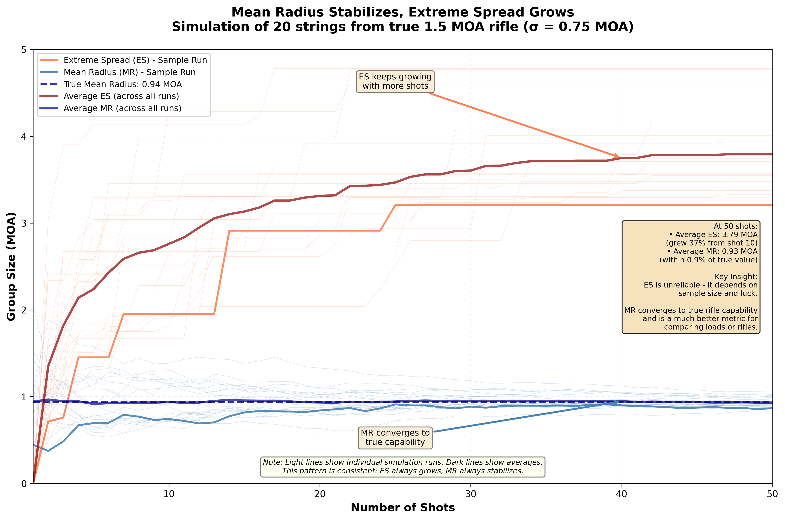
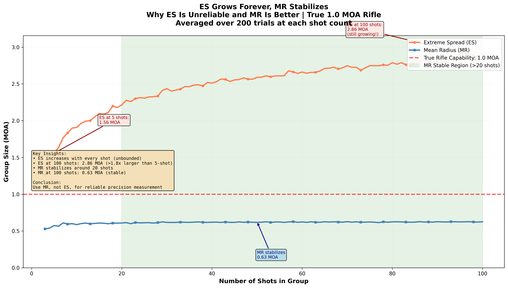
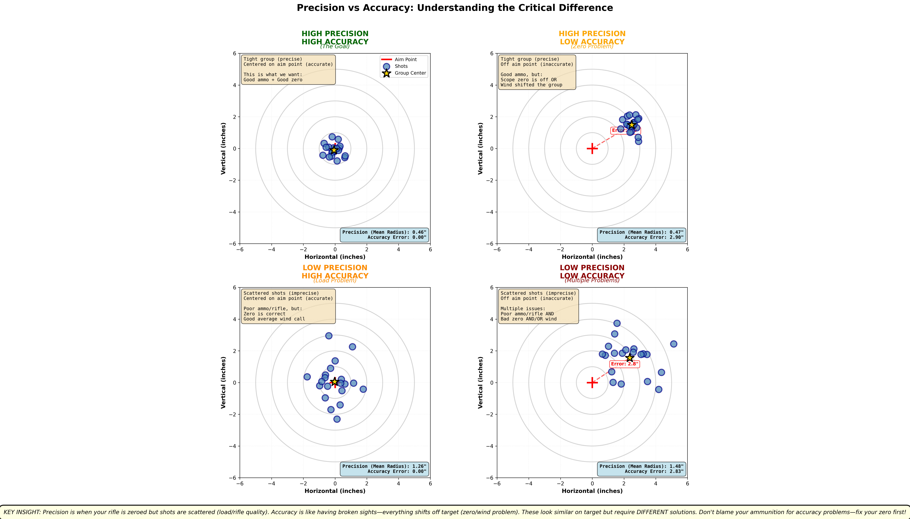

Time to complete: 10-15 minutes

# Group Size and Accuracy - Beyond the Best Group

## Your Best Group Is Lying to You

You've just finished shooting at the range. You're packing up, looking over your targets. One group in particular catches your eye:

**Five shots. All touching. Maybe 0.4 MOA.**

You snap a photo, head home, post it online: "Finally dialed in this load! Consistent 0.4 MOA!"

A week later, you're back at the range. Same rifle, same ammo, same everything. You shoot five more groups. They measure 0.9, 1.1, 0.7, 1.3, 0.8 MOA.

What happened? Did your rifle forget how to shoot? Did the ammo go bad? Did you mess up your fundamentals?

**None of the above. That first 0.4 MOA group was luck. You just didn't know it yet.**

This is the single most common mistake in reloading: judging a load by its best group instead of its average behavior. It feels intuitive. "This load CAN shoot 0.4 MOA—I've seen it!" But that logic is backwards.

In this lesson, you'll learn:
- Why extreme spread (traditional group size) grows forever and misleads you
- Mean radius: a better metric that actually stabilizes
- The "best group bias" and why your smallest groups are 30-40% better than your rifle's true capability
- How to aggregate data honestly for real precision measurement
- The critical difference between precision (tight groups) and accuracy (hitting your aim point)
- Why you should shoot one big 50-round group instead of ten 5-round groups

By the end, you'll understand how to measure on-target performance honestly—and stop being fooled by lucky groups that never repeat.

---

## The Problem With Extreme Spread (Traditional Group Size)

When you measure a group, you're probably measuring **extreme spread (ES)**: the distance between your two farthest-apart shots.

```
Five shots on target:
- Four in the center (tight cluster)
- One "flyer" 2 inches out

Group size: 2 inches (because of that one shot)
```

**Extreme spread has a fundamental problem: it can only stay the same or grow, never shrink.**

### Why Extreme Spread Grows Forever

Think about it:
- Your first two shots set the initial ES
- Shot 3 either lands inside that spread (ES stays same) or outside (ES grows)
- Shot 4 either lands inside or outside
- Shot 5... and so on

**Every new shot has a chance to increase ES but can never decrease it** (unless you get lucky and it lands exactly between your current extremes).

**Practical impact:**

A true 1.0 MOA rifle (that's its real average capability):
- 3-shot group: Probably 0.6-0.8 MOA (looks better than it is!)
- 5-shot group: Probably 0.8-1.0 MOA (getting closer to truth)
- 10-shot group: Probably 1.0-1.3 MOA (now representative)
- 20-shot group: Probably 1.3-1.5 MOA (one unlucky flyer dominates)
- 50-shot group: Probably 1.6-1.9 MOA (extreme shots eventually appear)

**Does this mean the rifle got worse as you shot more?** No. It means extreme spread is a terrible metric for comparing loads unless sample sizes are identical.



**Figure 1:** Demonstration of why mean radius (MR) is superior to extreme spread (ES) for measuring rifle precision. This plot shows 20 simulations of a true 1.5 MOA rifle, tracking both metrics as shots accumulate. While extreme spread continues growing with each shot (unreliable for comparison), mean radius quickly stabilizes around the true capability after 10-15 shots. The dark lines show averages across all simulations, proving this is a consistent pattern, not a fluke. This is why experienced shooters and researchers prefer mean radius - it converges to truth.

### The Flyer Problem

Every shooter has experienced this: Four shots in a tiny cluster, one shot way out. "It's a flyer! I pulled it!"

Maybe you did pull it. Or maybe:
- That's just normal variation (remember the cup and the ocean?)
- Your rifle naturally produces that spread, and four shots happened to cluster
- Random chance gave you four lucky ones and one normal one

**The problem:** We call outliers "flyers" and ignore them because they don't match our expectations. But if you shoot enough groups, EVERY group has outliers. They're not flyers—they're reality.

**The honest approach:** Include all shots. Outliers are data, not mistakes (unless you actually flinched and know it).

> **Key Insight**
>
> Extreme spread (traditional group size) grows as sample size increases. This makes it useless for comparing loads with different sample sizes. A 0.8 MOA 5-shot group and a 1.2 MOA 30-shot group might represent the SAME rifle—the larger sample just caught more of the natural variation.

---

## Mean Radius: The Better Metric

There's a better way to measure precision: **mean radius (MR)**.

Instead of measuring the distance between your two worst shots, mean radius measures **the average distance of each shot from the group center**.

### How to Calculate Mean Radius

**Step 1:** Find the center of your group (average X coordinate, average Y coordinate)

**Step 2:** Measure the distance from each shot to that center

**Step 3:** Average those distances

**Example:**

Five shots with distances from center:
- Shot 1: 0.3 inches
- Shot 2: 0.5 inches
- Shot 3: 0.2 inches
- Shot 4: 0.6 inches
- Shot 5: 0.4 inches

Mean radius = (0.3 + 0.5 + 0.2 + 0.6 + 0.4) / 5 = **0.4 inches**

### Why Mean Radius Is Better

**1. It stabilizes with more shots** (unlike extreme spread, which grows)

| Group Size | MR/ES Ratio | Notes |
|------------|-------------|--------|
| 3 shots | 0.428 | Highly variable; ES strongly influenced by outliers |
| 5 shots | 0.370 | Typical reloading test size; moderate variability |
| 10 shots | 0.315 | Better stability; recommended for velocity testing |
| 20 shots | 0.276 | Good convergence; ES becoming more reliable |
| 30 shots | 0.258 | Curriculum standard; solid statistical foundation |
| 50 shots | 0.241 | High confidence; diminishing returns |
| 100 shots | 0.220 | Near-theoretical limit; minimal additional benefit |

Notice: It converges toward the true value instead of growing forever.

> **Important:** This conversion table is **not a shortcut** for proper testing. Don't use it to estimate MR from small sample extreme spreads and think you've characterized your load. The ratios shown are statistical relationships that help you understand the metrics—not a replacement for actually shooting 30+ rounds. If you're tempted to shoot a 5-shot group, measure ES, multiply by 0.37, and call it your MR, you'll likely be disappointed when reality doesn't match your prediction. It still takes 30 actual shots to reliably characterize load performance. No shortcuts.

**2. It uses all shots equally** (not dominated by one outlier)

Extreme spread: One bad shot ruins the measurement
Mean radius: One bad shot contributes, but doesn't dominate

**3. It's consistent across sample sizes**

You can compare a 10-shot MR to a 30-shot MR meaningfully. You can't do that with extreme spread.

### The Conversion (Rough Approximation)

For typical shooting:
- **Mean Radius ≈ Extreme Spread × 0.3** (for same group)

So a 1.0 MOA group (extreme spread) has a mean radius of about 0.3 MOA.

**Why this matters:** When you report MR, the numbers seem "smaller" but they're more honest and more comparable.



**Figure 2:** Comparison of extreme spread (ES) versus mean radius (MR) as shots are added to a group from a true 1.0 MOA rifle. While extreme spread continues climbing with each additional shot (reaching 1.6+ MOA by 50 shots), mean radius quickly stabilizes around 0.42 MOA after just 10-15 shots and remains consistent. This demonstrates why mean radius is the superior metric - it converges to truth and allows meaningful comparison across different sample sizes, unlike extreme spread which grows forever.

> **Critical Takeaway**
>
> Mean radius is a better precision metric than extreme spread because it stabilizes with more data instead of growing forever. For comparing loads, use mean radius. It's honest, consistent, and actually tells you about your rifle's capability.

### Sample Size for Mean Radius Calculations

Similar to our foundational understanding of statistics throughout this curriculum, **don't shortcut the adequate sample size** when calculating mean radius. Use 30+ shot groups for reliable MR calculations—the same sample sizes we've emphasized for velocity testing and load development.

**Composite Group Analysis:** Some firearms and ammunition combinations achieve such high precision that 10 or less shots create a "ragged hole" where individual bullet impacts overlap completely, making it difficult to discern individual bullet holes. In these cases, consider using composite group analysis methods with specialized software (such as OnTarget TDS or Ballistic-X, mentioned earlier in the Composite Groups section). These tools can analyze multiple smaller groups shot at different aim points and combine the data to calculate an accurate mean radius for your system.

**The indicator:** If your 30-shot groups consistently produce ragged holes where you cannot clearly identify each impact, your rifle-ammunition combination has exceptional precision—and composite analysis software will help you measure it accurately.

---

## The Best Group Bias: Why Your Smallest Groups Lie

Here's a devastating truth that most shooters never realize:

**If you shoot 10 groups and pick the smallest one, it will be approximately 30-40% smaller than your rifle's true capability.**

Not 5% smaller. Not 10% smaller. **30-40% smaller.**

This is pure statistics, and it's wrecking load development decisions across the reloading world.

### The Mechanism

Imagine your rifle's true capability is 1.0 MOA (that's the population average if you shot 1,000 groups).

When you shoot 10 groups, you're taking 10 random samples from that population. Some will be better than 1.0 MOA (lucky random variation), some will be worse.

**The best of those 10 will average around 0.6 MOA.**

The worst will average around 1.4 MOA.

**Neither represents your rifle.** The average of all 10 (about 1.0 MOA) represents your rifle.

### The Evidence From Simulation

Let's simulate a true 1.5 MOA rifle shooting 10 five-shot groups:

```
Group 1: 1.2 MOA
Group 2: 1.6 MOA
Group 3: 0.9 MOA ← "Best group!"
Group 4: 1.8 MOA
Group 5: 1.3 MOA
Group 6: 1.7 MOA
Group 7: 1.1 MOA
Group 8: 1.5 MOA
Group 9: 2.0 MOA ← "Worst group"
Group 10: 1.4 MOA

Average: 1.45 MOA (close to truth)
Best: 0.9 MOA (40% better than truth!)
Worst: 2.0 MOA (33% worse than truth!)
```

If you judge this rifle by its best group, you'd think it's a 0.9 MOA rifle. **You'd be wrong by 60%.**

### Why This Matters for Load Development

**Common mistake:**

Shooter tests three loads:
- Load A: Shoots 5 groups, best is 0.7 MOA → "Amazing!"
- Load B: Shoots 5 groups, best is 0.9 MOA → "Good"
- Load C: Shoots 5 groups, best is 1.1 MOA → "Mediocre"

Conclusion: Load A is clearly superior.

**The problem:** All three might be identical 1.2 MOA loads, and Load A just got lucky. Without looking at ALL groups from each load, you can't tell.

**The fix:**

Look at the **average** of all groups for each load:
- Load A: Average 1.3 MOA (best was 0.7, others were 1.4, 1.5, 1.2, 1.6)
- Load B: Average 1.2 MOA (best was 0.9, others were 1.1, 1.3, 1.2, 1.4)
- Load C: Average 1.1 MOA (best was 1.1, others were 0.9, 1.2, 1.0, 1.3)

**New conclusion:** Load C is actually the best! Load A's amazing 0.7 MOA group was a lucky outlier.


**Figure 3:** Distribution of "best groups" from 100 simulated trials, each shooting 10 five-shot groups from a true 1.5 MOA rifle. The best groups average 1.0 MOA - a systematic 33% underestimate of true capability. This proves that selecting your smallest group from a set of attempts will consistently mislead you by 30-40%. If you judge loads by best groups rather than averages, you're cherry-picking lucky samples and making decisions based on statistical artifacts, not real performance differences.

### Real-World Impact

Browse any reloading forum. Count how many people post their "best group" as evidence their load is dialed in.

**They're all doing it wrong.**

The correct approach:
1. Shoot 5-10 groups with a load
2. Calculate the **average** group size (or better, mean radius)
3. THAT number represents the load
4. Compare averages between loads, not best groups

**Bonus honesty points:** Report both average and best group. "This load averages 1.2 MOA with a best of 0.8 MOA." Now people can evaluate properly.

> **Critical Takeaway**
>
> Your best group from a set is systematically 30-40% smaller than your true capability due to random variation. Judging loads by best groups is cherry-picking lucky samples. Always use average group size or, better yet, aggregate all shots into one large sample.

---

## The String of Fire Concept: One Big Group vs. Many Small Ones

Here's a better way to test: **Stop shooting multiple small groups. Shoot one large group.**

### Traditional Approach

- Shoot 10 five-shot groups
- Measure each group
- Average the group sizes (if you're honest)
- Or pick the best group (if you're fooling yourself)

**Problems:**
- 10 separate aiming processes (introduces variation)
- 10 separate zero confirmations (wind shifts, mirage changes)
- Temptation to cherry-pick
- Time-consuming measurement

### String of Fire Approach

- Shoot 50 rounds at one large target
- Measure the aggregate (one measurement of all 50 shots)
- Calculate mean radius from center

**Advantages:**
- One aiming process (removes that source of variation)
- Shows true dispersion pattern
- No cherry-picking possible
- Faster measurement
- More honest result

### The Data Is Identical (Almost)

Both approaches fire the same 50 rounds. But the aggregated approach:
- Removes target-to-target variables (e.g., different wind for each group)
- Gives you one clear number instead of a distribution you have to interpret
- Is harder to cheat (can't ignore "bad targets")

**Practical implementation:**

Use a large target (24" square or bigger). Mark your aiming point clearly. Fire all shots at the same point. Measure the center (average position of all shots). Calculate mean radius (average distance from that center).

**Interactive Element Placeholder:**
```python
# Interactive widget: "10 Groups vs 1 Aggregate"
#
# Setup: True rifle = 1.2 MOA capability
#
# Simulation:
# - Generate 50 shots from this rifle
#
# Display Option 1: "Traditional approach"
# - Show shots divided into 10 five-shot groups
# - Each group on separate target
# - Measure each group's ES
# - Show list of 10 group sizes
# - Show average
# - User tempted to focus on best group
#
# Display Option 2: "Aggregate approach"
# - Show all 50 shots on one large target
# - Calculate mean radius
# - Show aggregate result
# - Clean, single number
#
# Comparison:
# - Both approaches used same 50 shots
# - Aggregate approach gives cleaner answer
# - Traditional approach invites cherry-picking
#
# Aha moment: "Same data, but aggregating it prevents me from
# fooling myself by focusing on the lucky groups!"
```

---

## Precision vs. Accuracy: Not the Same Thing

This is a critical distinction that gets confused all the time.

**Precision:** How close your shots are to **each other**

**Accuracy:** How close your shots are to your **aim point**

### The Four Scenarios

**Scenario 1: High Precision, High Accuracy**
- Tight group (precise)
- Centered on aim point (accurate)
- **This is the goal**

**Scenario 2: High Precision, Low Accuracy**
- Tight group (precise)
- Off-center from aim point (inaccurate)
- Your zero is off, or wind pushed your group

**Scenario 3: Low Precision, High Accuracy**
- Scattered shots (imprecise)
- Centered on aim point on average (accurate)
- Rifle/ammo has lots of variation, but zero is good

**Scenario 4: Low Precision, Low Accuracy**
- Scattered shots (imprecise)
- Off-center from aim point (inaccurate)
- Multiple problems compounding

### Why This Matters

**Common mistake:** Blaming your ammunition for an accuracy problem when the real issue is an optic, mount, zero, wind call, or other mechanical issue with the rifle.

**Possible Wrong conclusion:** "This load shoots poorly and is **inaccurate**."

**Right conclusion:** "Check all fasteners, check the optic, action screws, use a quantity of known ammo, change shooter, consult a competent gunsmith.  In truth, there have been many times I initially blamed ammunition (thinking it was horrible precision), when the issue was optic mounts loosening (accuracy issue).  Some of these scenarios can be difficult to diagnose.  Isolate and test the system."

### Wind: The Accuracy Killer

Wind doesn't make your groups bigger (precision issue). **Wind shifts your group center** (accuracy issue).

**Simulation scenario:**

Testing at 600 yards

Calm day: 1.0 MOA group centered on target
Windy day: 2.0 MOA group shifting inches from zero with obvious horizontal stringing

The load didn't change. The precision didn't change. Wind moved the center.

**Don't blame your load for wind calls or mechanical issues with the rifle.** Separate precision problems from accuracy problems. Sometimes, it is difficult to discern the difference.



**Figure 4:** The four combinations of precision and accuracy demonstrate that these are independent problems requiring different solutions. High precision with low accuracy (top right) shows tight groups that are off-center—your ammunition is consistent but your zero is wrong or wind shifted the group. Low precision with high accuracy (bottom left) shows scattered shots that average to the aim point—your zero is good but the rifle/ammo has excessive variation. The key insight: precision is like having a rifle that's zeroed but shots scatter (load/rifle quality issue), while accuracy is like having broken sights where everything shifts off target (zero/wind problem). Don't blame your ammunition when the real issue is the sighting system or environmental conditions!

### Testing for Precision vs. Testing for Accuracy

**Precision test:**
- Control variables (bench, bags, calm conditions)
- Shoot many rounds
- Measure spread (MR or ES)
- Goal: Understand ammunition consistency

**Accuracy test:**
- Field conditions
- Multiple sessions, different days
- Track where groups center relative to aim point
- Goal: Verify zero, practice wind calls

Don't confuse the two. A precision test in perfect conditions tells you about your ammo and rifle. It doesn't tell you if your zero is correct or if you can call wind.

---

## How to Honestly Measure Precision

Based on everything we've learned, here's the correct process:

### Option A: Aggregate Approach (Best)

1. **Set up:** Large target, marked aim point, stable position
2. **Shoot:** 30-50 rounds at the same aim point, same session
3. **Measure:** Calculate mean radius from group center
4. **Result:** One clean number representing your load's precision

**Advantages:**
- No cherry-picking possible
- Most honest result
- Fastest to measure

**Disadvantages:**
- Requires large target
- Can't easily compare to traditional group size claims (but that's actually good—stops the comparison trap)

**Practical Variant: Composite Groups**

A smart variation of the aggregate approach is called **"composite groups"** - shooting multiple smaller groups with deliberate aim point offsets, then combining them for analysis with all shots referenced to the same point of aim. This gives you the statistical benefits of large sample aggregation while making data collection easier.

**How it works:**
1. Shoot multiple groups (three 10-shot groups, or six 5-shot groups) on the same target
2. Intentionally dial a known offset for all of the groups (2 MOA up, 2 MOA right, 2 MOA down) to preserve aim point
3. Use software to digitally converge all groups back to the same aiming point
4. Calculate aggregate statistics (mean radius, etc.) from the combined 30+ shots

**Benefits:**
- Bullet holes remain clearly defined (easier to measure accurately)
- Collects large sample data in one range session
- I consider this a more advanced method and it will be obvious when it's needed
- Software tools automate the convergence and statistical analysis:
  - **OnTarget TDS** ([OnTarget Precision Calculator](https://ontargetshooting.com/)) - Comprehensive tool for composite groups, mean radius calculations, and statistical analysis
  - **Ballistic-X** ([Ballistic-X Export](https://ballisticxexport.com/)) - Alternative tool offering digital group measurement, target analysis, and data export capabilities

**Best practice:** See **Preston Moore's testing strategy** ([Preston Moore YouTube](https://www.youtube.com/@PrestonJMoore/videos)) as a practical example - he commonly tests with 3 × 10-shot groups with chronograph data, combining them for statistically valid precision measurement. This approach balances practical data collection with statistical rigor.

### Option B: Multiple Groups, Honestly Averaged (Second Best)

1. **Set up:** Multiple targets or marked aim points
2. **Shoot:** 5-10 groups of 5-10 shots each
3. **Measure:** Each group size (ES or MR)
4. **Calculate:** Average across all groups
5. **Report:** "Average group size: X MOA (best: Y, worst: Z)"

**Advantages:**
- Familiar to traditional shooters
- Gives you distribution information (best/worst/average)
- Can compare to factory claims (they also use small groups)

**Disadvantages:**
- Target-to-target variation adds noise
- More measurement work
- Temptation to cherry-pick
- Discounts error in POI shift from the point-of-aim between groups


### What to Report

**Minimum honest reporting:**
"Average group size: 1.1 MOA (5 groups, 5 shots each)"

**Better reporting:**
"Mean radius: 0.35 MOA (50 shots, aggregated)"

**Best reporting:**
"Mean radius: 0.35 MOA (50 shots), tested across 2 sessions (0.34 and 0.36 MOA)"

The more data and context you provide, the more trustworthy your claim. Single amazing groups mean nothing without context.

---

## The Path to Honest Assessment

You now understand:
- Extreme spread grows forever; mean radius stabilizes (use MR)
- Best groups are 30-40% better than true capability (use averages)
- Aggregating all shots is better than multiple small groups (non-composite groups)
- Precision (group tightness) and accuracy (hitting aim point) are different
- Use a good external ballistics calculator for your system to correlate wind (it's often less than you might think at 100 yards)
- Use wind drift metrics in conjunction with wind flags to learn an additional skill!

**This fundamentally changes how you evaluate ammunition:**

Instead of: "I shot a 0.6 MOA group! This load is amazing!"

You'll say: "I shot 50 rounds. Mean radius 0.38 MOA. Repeatable across sessions. This load is legitimately good."

Instead of: "This load shoots terribly—groups were all over the place!"

You'll ask: "Was that precision (large groups), accuracy (groups off-center), or both? What was the average group size, not just the worst one?"

In the next lesson, we'll apply this honest thinking to real-world examples—dissecting common myths and claims you see online, and learning to spot the red flags of bad testing.

You've learned how to measure velocity honestly (Lesson 05) and precision honestly (this lesson). Now let's use those skills to evaluate claims critically.

> **Key Takeaways**
> - Extreme spread (traditional group size) grows with sample size; mean radius stabilizes—use MR for honest measurement
> - Your best group from a set is 30-40% smaller than true capability due to random variation—always use averages, never cherry-pick
> - Shooting one large aggregate (30-50 shots) is better than many small groups (removes cherry-picking temptation)
> - Precision is group tightness; accuracy is hitting aim point—these are different problems with different solutions
> - Wind shifts group centers without enlarging groups—don't blame ammunition for accuracy issues
> - Report averages across multiple groups or sessions, not single lucky results

---

## Coming Up Next

**In Lesson 07**, we'll dissect real-world examples of common myths and flawed testing methods. You'll learn:
- Specific examples of popular methods that fail under scrutiny
- How to spot red flags in online claims
- Simulations showing why common approaches mislead
- What to do instead of these flawed methods
- How to politely challenge claims in your community

You now have the tools to measure honestly. Next, you'll learn to apply those tools to evaluate what you see online—and separate signal from noise.

[Previous: 05 Velocity Data - What to Measure and How to Think About It](<05_Velocity_Data_-_What_to_Measure_and_How_to_Think_About_It.html>) | [Next: 07 Real Examples - Dissecting Common Myths](<07_Real_Examples_-_Dissecting_Common_Myths.html>)
