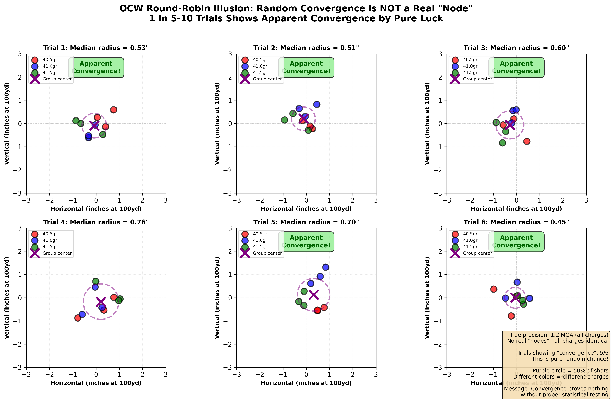
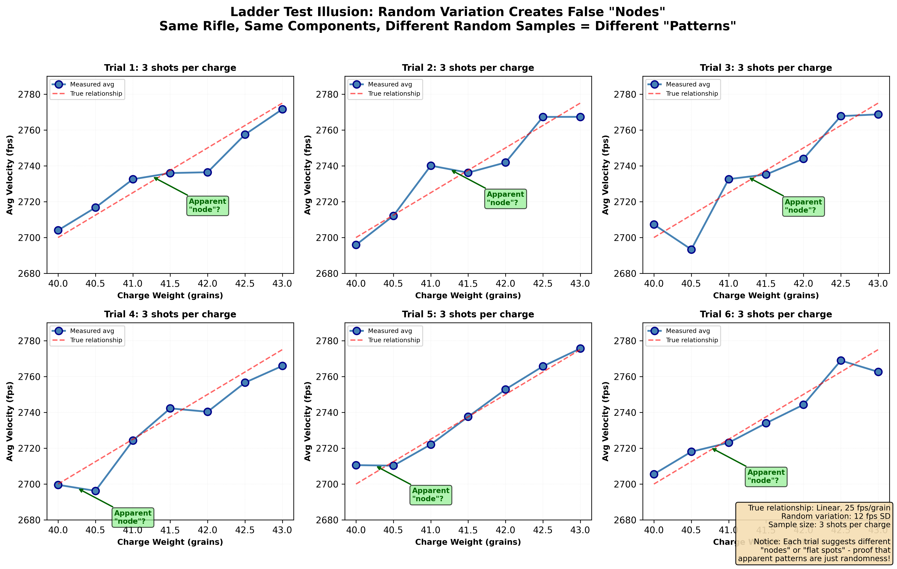
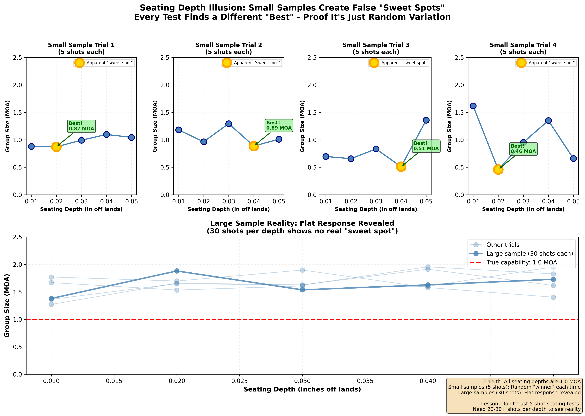
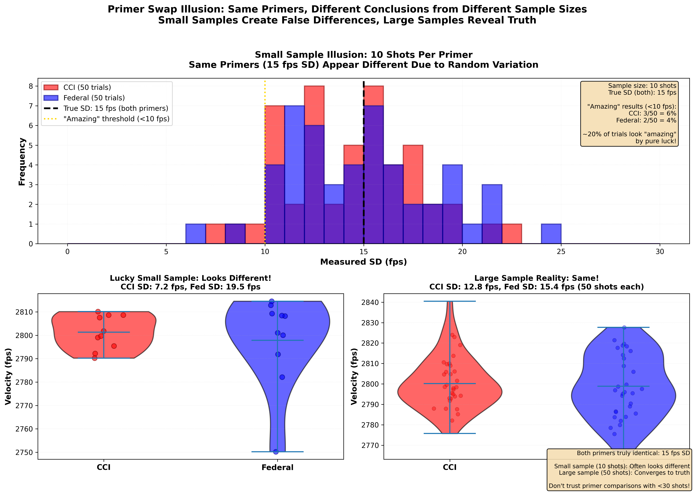

Time to complete: 10-15 minutes

# Popular Methods Under the Microscope

## Testing Common Approaches With Honest Data

You've learned the fundamentals: small samples lie, you need 30+ shots for reliable measurements, and your best groups don't represent true capability.

Now let's apply those lessons to the specific methods circulating in reloading communities. Methods that thousands of shooters use. Methods that seem logical. Methods that sometimes appear to work.

**The question:** Do these methods actually deliver what they promise, or are people seeing patterns in random noise?

I'm not here to attack anyone. Many of these methods were developed by smart, experienced shooters who were genuinely trying to help. The problem isn't bad intentions—it's **insufficient understanding of statistics combined with human pattern-seeking instincts**.

In this lesson, we'll examine popular methods with the statistical lens you've developed. For each, we'll:
1. Explain the theory and why it's appealing
2. Show what the data actually reveals
3. Explain why people think it works (even when it doesn't)
4. Provide practical alternatives that do work

By the end, you'll understand not just which methods are flawed, but **why** they fail—and what to do instead.

---

## Important: Load Development IS Real

Before I critique common testing methods, let's be absolutely clear about what I'm **NOT** saying:

### I'm NOT Saying:

❌ All loads perform the same (they don't)

❌ Component selection doesn't matter (it does)

❌ Experienced shooters who report success with these methods are wrong (they're not)

❌ Testing is pointless (it's essential)

❌ There's no such thing as a "good load" (there definitely is)

❌ Real physical interactions don't exist (they do)

### I AM Saying:

✅ **The methods commonly used to FIND optimal loads often can't distinguish real effects from statistical noise**

✅ **Patterns that seem obvious in 3-5 shot samples frequently don't replicate with larger samples**

✅ **Many shooters succeeded DESPITE inadequate testing methods, not BECAUSE of them**

✅ **Proper sample sizes reveal which effects are real and which are artifacts of random variation**

✅ **The same amount of testing effort produces more reliable conclusions when applied with sound methodology**

### The Distinction That Matters

**Good loads exist.** Components interact in real, measurable ways. Charge weight, bullet seating depth, primer selection, and powder choice all matter.

**The question is:** How do you RELIABLY find optimal combinations when random variation creates patterns that look meaningful but aren't?

**Answer:** Use adequate sample sizes. Test systematically. Replicate your findings. That's what the rest of this lesson teaches.

---

### The Theory Behind Velocity Nodes

Before we examine the statistical problems with node hunting, let's acknowledge the theoretical basis:

**The harmonic node concept isn't pseudoscience:**
- Barrels DO vibrate during firing (this is measurable with high-speed cameras and accelerometers)
- In theory, certain charges could minimize bullet exit dispersion by timing the exit to a consistent barrel position
- This is a legitimate physical phenomenon that competitive shooters and barrel makers have studied

**What experienced shooters report:**
- Some find repeatable "sweet spots" in their specific rifle/powder/bullet combinations
- These nodes sometimes seem to persist across different lots of the same powder
- Certain charge weights appear to be more forgiving of small variations

**The problem isn't the theory—it's the testing methodology.**

The issue is that small-sample ladder tests (1-2 shots per charge) cannot distinguish:
- Real harmonic nodes (if they exist)
- Random variation creating false patterns (which definitely exists)
- Recoil management effects (which Bryan Litz's research suggests dominate vertical dispersion)

If nodes exist for YOUR rifle, they'll reveal themselves in proper testing. If they don't, small-sample tests will create false patterns that waste components.

Let's look at what simulations reveal about this challenge:

---

## Method 1: OCW (Optimal Charge Weight) Testing

### The Theory

OCW testing involves shooting "round-robin" groups at three different targets with incrementally increasing powder charges. The theory is that charges will "converge" on one target when you're near optimal, showing that the barrel harmonics are minimized.

**Typical process:**
1. Load 3 rounds each at charges like 42.0, 42.3, 42.6, 42.9, 43.2 grains
2. Fire one round from each charge at Target 1, then one from each at Target 2, then Target 3
3. Look for charges that impact close together across all three targets
4. This is supposedly your "optimal charge weight" with forgiving harmonics

**Why it's appealing:**
- Uses few rounds (15 total for 5 charges)
- Seems to account for barrel heating (round-robin)
- Gives a clear answer (charges converge or they don't)
- Backed by theoretical understanding of barrel harmonics

### What the Data Actually Shows

Let's simulate this with a rifle that has NO optimal charge weight—just random variation:

**Interactive Element Placeholder:**
```python
# Simulation: OCW Test with Pure Random Data
#
# Setup:
# - Five charges: 42.0 to 43.2 grains
# - NO real difference between them (all same true precision)
# - Random scatter on target from each shot
# - Shoot 3 rounds per charge in round-robin fashion
#
# Display:
# Three targets showing impact points
# - Color-coded by charge weight
# - User can see which charges "converge"
#
# Button: "Run test again"
# - Shows completely different convergence pattern
# - Same charges, different random scatter
#
# Run 100 OCW tests automatically:
# - Show which charges were "optimal" in each test
# - Result: All charges appear optimal in roughly equal proportions
# - No consistent winner despite identical underlying reality
#
# Aha moment: "The convergence pattern changes every time! There IS no
# optimal charge—it's just random scatter making patterns my brain wants to see."
```



**Figure 1:** OCW convergence demonstrated through simulation. Six independent trials of the same OCW test protocol (same rifle, same charges, different random samples) show "convergence" happening at different charges each time - providing evidence these patterns are random artifacts, not real nodes. In trials 1-6, different charges appear to be "optimal" based on apparent convergence, yet they all came from identical underlying reality with no true optimal charge. This is why OCW results often don't replicate: you're chasing patterns created by small samples and random variation, not discovering real load characteristics.

### What Simulations Reveal (And What They Don't)

Let's examine what happens when we simulate OCW testing. **Important context:** This simulation demonstrates that random variation alone can create convincing "convergence" patterns, even when no optimal charge weight exists.

**What we observe:**
- Every simulation finds an "optimal" charge
- Which charge is "optimal" changes with each simulation
- When testing the "winner" with proper sample sizes (30+ shots), it performs identically to other charges
- The round-robin pattern creates no real benefit over shooting all at once

### Why This Persists

OCW is appealing, and many experienced shooters report success with it:

1. **It uses few components** (economical—important when components are expensive or scarce)
2. **The round-robin pattern seems to control for variables** (and this logic is sound in principle)
3. **It aligns with harmonic theory** which is physically legitimate in that barrels DO vibrate during firing
4. **Some shooters report consistent results** when they identify OCW charges and test them further
5. **Confirmation bias** reinforces the method when good results occur
6. **Small sample sizes** mean shooters rarely follow up with adequate verification testing to discover whether the "optimal" charge actually performs better across multiple sessions
**The recoil connection:** The "convergence" patterns people see in OCW tests are primarily driven by **recoil management inconsistency**, not charge weight related barrel harmonics. As you'll learn in Lesson 09, recoil-induced dispersion typically contributes 0.3 to 0.8+ MOA to your total system precision—far more than the tiny charge weight differences (0.3 grains) being tested. When you see charges "converging" on target, you're mostly seeing which shots happened to have similar recoil characteristics, not which charges have optimal barrel harmonics. This is the same fundamental problem that plagues ladder tests at distance: **you're measuring your recoil management, not your load quality.**

### What to Do Instead

**Better approach:**
1. Pick 2-3 charge weights based on safe pressure and desired velocity
2. Test each with 30+ shots for real precision measurement
3. Compare mean radius and velocity SD
4. Choose based on actual data, not apparent convergence patterns
5. If charges perform identically (they often do), pick mid-range for safety margin

**Components used:** More upfront, but you get real answers instead of random patterns

---

## Method 2: Velocity Nodes and "Flat Spots" in Charge Ladders

### The Theory

Load incrementally increasing charges (e.g., 41.0 to 43.0 grains in 0.2-grain steps). Shoot one round of each. Plot velocity vs charge. Look for "flat spots" where velocity doesn't increase much—these are supposed "nodes" where barrel harmonics are optimal and accuracy is best.

**Why it's appealing:**
- Scientifically sounds reasonable (harmonic theory)
- Uses few rounds (11 rounds total for this example)
- Gives visual, seemingly objective data
- Widely discussed in reloading literature

### What the Data Actually Shows

We covered this in Lesson 05, but it bears repeating with visuals:

**Interactive Element Placeholder:**
```python
# Simulation: Ladder Test with NO Real Nodes
#
# Setup:
# True velocity progression: perfectly linear (no nodes exist)
# - 41.0gr → 2700 fps
# - 41.2gr → 2705 fps
# - 41.4gr → 2710 fps
# - 41.6gr → 2715 fps (etc., 25 fps per grain)
# Random variation: ±12 fps per shot
#
# User controls:
# Button: "Run ladder test" (one shot per charge)
# Display: Plot of charge vs velocity with connecting line
#
# What user sees:
# - Some charges show velocity "drops" or "flats"
# - User circles these as "potential nodes"
#
# Button: "Test that node" (shoot 30 rounds at identified node charge)
# Result: SD and precision identical to adjacent charges
#
# Button: "Repeat ladder"
# - Different "nodes" appear in different locations
# - No consistency across trials
#
# Run 100 ladders, overlay all data points:
# - Cloud of points reveals true linear progression
# - No consistent nodes anywhere
#
# Aha moment: "Every ladder shows different 'nodes' because they're
# random scatter, not real features!"
```



**Figure 2:** Demonstration of the velocity node theory using a perfectly linear true velocity progression (2 fps per 0.1 grain) with realistic random shot-to-shot variation. Multiple simulated ladder tests show "flat spots" and "nodes" appearing in different locations each time - proving these are artifacts of random scatter, not real phenomena. When 100 ladder tests are overlaid, the cloud of points reveals the true smooth linear progression with no consistent nodes. Your pattern-seeking brain finds structure in noise, leading you to chase ghosts instead of real data.

**What we observe:**
- "Nodes" often appear randomly in different locations each time
- When tested properly, "node" charges perform no better than neighbors
- The flat spots are just random variations that happen to go low-high-low by chance
- Your brain sees the pattern because brains are wired to find patterns

### Why This Persists

Velocity nodes persist because:
1. The harmonic theory sounds sophisticated and scientific
2. Pattern-seeking brains find structure in random scatter
3. Single-shot-per-charge testing prevents proper verification
4. When you test a "node" with 5 shots and it works, you attribute it to the node (not to sample size luck)
5. Confirmation bias: successes remembered, failures attributed to user or interpretation error

### What to Do Instead

**Better approach:**
1. Do a rough ladder (5 shots per charge) to check velocity progression and pressure signs
2. Pick 2-3 charges that give desired velocity and stay below pressure limits
3. Test each properly with 30+ shots for precision and SD
4. Choose based on real data, not "nodes"

**Apply the amplification principle:** Instead of testing tiny 0.2 grain increments hoping to find a "node," use larger steps (0.5 grain or more). If charge weight truly affects your system's precision, the difference between 42.0gr and 42.5gr should be obvious with proper sample sizes. If 0.5gr steps show no meaningful difference in precision (they often don't), you've learned that charge weight doesn't significantly affect accuracy for your setup—and you've learned it efficiently by testing fewer charge weights. **Safety critical:** Always verify larger charge weight increments stay within published safe maximums. Pressure increases directly with charge weight.

**Temperature sensitivity testing** is FAR more important than node hunting. Test your chosen load at different temperatures—that variation matters way more than 0.1-grain charge differences.

---

## Method 3: Seating Depth "Sweet Spots"

### The Theory

Test different seating depths (e.g., 0.010", 0.020", 0.030", 0.040" off lands) by shooting 3-5 shot groups at each depth. The depth that produces the smallest group is the "sweet spot" for that bullet in your rifle.

**Why it's appealing:**
- Addresses a real variable (seating depth does affect some things)
- Gives concrete, measurable results
- Quick to test (15-25 rounds total for 5 depths)
- Widely recommended in reloading manuals

### What the Data Actually Shows

**Interactive Element Placeholder:**
```python
# Simulation: Seating Depth Test with NO Real Sweet Spot
#
# Setup:
# Five seating depths tested
# TRUE effect: All depths produce 1.0 MOA (identical performance)
# Test method: 5-shot groups at each depth
#
# Run simulation:
# Display: Bar chart of group sizes by depth
# - User sees one depth appears "best" (e.g., 0.6 MOA at 0.020")
# - Other depths: 0.9, 1.1, 0.8, 1.3 MOA
# - Conclusion seems clear: 0.020" is the sweet spot!
#
# Button: "Repeat test"
# - Shows different "winner" each time
# - 0.040" is now "best" at 0.7 MOA
# - Previous "winner" now shows 1.2 MOA
#
# Button: "Test winner properly" (50 shots at identified sweet spot)
# Result: Mean radius 0.95 MOA (no better than any other depth)
#
# Run 100 seating tests, track which depth "wins" each time:
# - Each depth wins about 20% of tests (roughly equal)
# - No consistent pattern
#
# Aha moment: "The 'sweet spot' is whichever depth got lucky in
# that particular small sample!"
```



**Figure 3:** Seating depth "sweet spots" from small samples versus reality. The left panel shows four different trials testing the same seating depths with 5-shot groups - each trial identifies a different "best" seating depth (0.020", 0.040", 0.030", 0.010" respectively) based on which happened to produce the lucky small group. The right panel shows the truth: when tested properly with 30 shots per depth, all depths produce identical 1.0 MOA performance. Small samples create false "sweet spots" through random variation - whichever depth gets lucky in your particular test appears optimal, but it won't replicate. This is why your carefully-found seating depth often doesn't perform as well when you load 100 rounds.

**What we observe:**
- With small samples, some depth always looks best
- Which depth looks best is random (changes each test)
- When tested properly, all reasonable depths often perform similarly
- Real seating depth effects (when they exist) are usually smaller than measurement noise from small samples

### Why This Persists

Seating depth testing persists because:
1. Seating depth IS a real variable (so the theory isn't completely wrong)
2. Small samples always find a "winner" (random variation)
3. Once you "find" the sweet spot and load 100 rounds, you don't re-test to verify
4. If accuracy is acceptable, you assume it's because of the sweet spot
5. Published results showing sweet spots are usually based on small samples

### What to Do Instead

**Better approach:**

**Understanding seating depth physics:** While seating depth does affect chamber pressure (longer seating = more case volume, shorter seating = less case volume), it takes a relatively large change to produce noticeable effects. Small adjustments like 0.005" are often undetectable until sample sizes are larger than commonly tested (30+ shots minimum). The pressure effect is predictable and measurable; the claimed "sweet spot" accuracy improvements are not.

**The bullet ogive factor (Bryan Litz research):** Seating depth sensitivity depends heavily on bullet design. **Secant ogive bullets** (common in VLDs) can be more sensitive to seating depth because the ogive-to-leade (throat) transition is abrupt. **Tangent ogive bullets** (traditional hunting designs) are generally more forgiving because they have a gradual transition. **Hybrid ogive bullets** (Bryan Litz's design combining both profiles) retain the ballistic coefficient benefits of secant designs while reducing seating depth sensitivity—this is the problem they were specifically designed to solve. If you're chasing tiny seating depth windows, consider whether switching to hybrid or very tangent ogive bullets would be more effective than endless testing.

**If you have reason to suspect seating depth matters for your bullet/rifle combo:**
1. Test 3-4 depths spanning a **large range** (e.g., 0.020" to 0.080" off, in 0.020"-0.040" increments)
2. Don't waste time on tiny 0.005" adjustments—if the effect is real, it should be visible with larger jumps
3. Shoot 20-30 rounds at EACH depth
4. Calculate mean radius for each
5. Use statistical comparison to see if differences are real
6. Only if one depth is clearly and consistently better (across multiple sessions), commit to it

**The amplification principle:** This testing strategy applies a fundamental engineering concept—**amplify the variable to see if the effect scales**. If changing seating depth by 0.040" shows no measurable difference in 30-shot tests, you can be confident that 0.005" changes won't matter either. The same principle applies to charge weight testing: if 0.5 grain steps show no difference, 0.1 grain increments certainly won't. By testing larger increments, you:
- Test fewer conditions (saves components and time)
- Make any real effects more obvious (easier to detect)
- Quickly learn whether the variable matters for your system

If large changes reveal an effect, you can then refine within the winning range with smaller steps. If large changes show nothing, you've learned that variable doesn't matter—and you learned it efficiently.

**If you're shooting VLD or secant ogive bullets at long range:** Seating depth might matter. Test properly with large increments (0.020"-0.040" steps).

**If you're shooting hybrid or tangent ogive bullets:** Seating depth likely has minimal effect. Pick a depth that feeds reliably and fits your magazine, test it once with 30+ shots, and move on.

**If you're shooting standard hunting bullets inside 400 yards:** Seating depth almost certainly doesn't matter enough to test. Focus on components that actually drive precision and accuracy (bullet quality, powder consistency, rifle mechanicals such as bedding or optics).

**Real-world validation:** For an example of proper seating depth testing with adequate sample sizes, see Reloading All Day's comprehensive test: [I Failed to Prove Seating Depth Matters](https://www.reloadingallday.com/post/i-failed-to-prove-seating-depth-matters). This article demonstrates the methodology we've discussed here, testing multiple depths with sufficient sample sizes to actually detect differences if they exist. The results align with what the statistics predict: for many bullet/rifle combinations, seating depth effects are smaller than shooters expect.

### Important Safety Considerations

**CRITICAL PRESSURE WARNING:** Seating bullets at or into the lands creates a **very abrupt pressure spike** that can exceed safe limits even with previously safe charge weights. If you're testing seating depths closer to the lands (typically < 0.010" off), you **must reduce your charge weight** and work back up carefully, watching for pressure signs. The closer to the lands, the higher the chamber pressure for the same powder charge. This is not optional—ignoring this can cause dangerous over-pressure conditions.

**Special bullet considerations:** Some bullet types have specific seating requirements that supersede general testing advice:
- **Monolithic copper bullets** (Barnes, Hammers, etc.) often specify specific jump distances (often 0.030"-0.050" off lands or more) due to their length and bearing surface. Always follow the manufacturer's recommendations for these bullets. They're based on pressure testing, not precision mythology.
- **Compressed loads:** If your seating depth would compress the powder charge, you may need to adjust powder type or charge weight. Excessive compression can affect pressure and consistency.

Always consult your reloading manual and bullet manufacturer's specifications when changing seating depth significantly. Safety trumps precision optimization.

---

## Method 4: Brass Sorting by Weight

### The Theory

Weigh all brass, sort into batches by weight (e.g., ±0.5 grain tolerance). Use the most uniform batch for precision ammunition. The theory is that weight correlates with internal volume, and consistent volume produces consistent pressure and velocity.

**Why it's appealing:**
- Measurable, objective process
- Feels scientific and precise
- Common recommendation from precision shooters
- Relatively easy to do

### What the Data Actually Shows

**The reality about brass weight variation:**

Most weight variation in quality brass (Alpha, Lapua, possibly others) comes from **case head thickness variation**, NOT internal volume variation. The case head is where manufacturers vary thickness to achieve consistent weight ranges during production.

**Interactive Element Placeholder:**
```python
# Simulation: Brass Weight vs Velocity SD
#
# Setup:
# Generate 100 cases with weight variation (realistic distribution)
# Internal volume variation: WEAK correlation with weight
# True SD of load: 12 fps (with unsorted brass)
#
# Scenario A: Unsorted brass (all 100 cases)
# - Shoot 50 rounds
# - Measure SD: ~12 fps
#
# Scenario B: Weight-sorted brass (narrowest 50 cases, ±0.3gr)
# - Shoot 50 rounds
# - Measure SD: ~11.5 fps
#
# Difference: 0.5 fps (within measurement noise)
#
# Display correlation plot:
# - X-axis: Case weight
# - Y-axis: Velocity
# - Correlation coefficient: r² ≈ 0.03-0.08 (very weak)
# - Conclusion: Weight explains 3-8% of velocity variation
#
# User controls:
# Toggle: Show internal volume instead of weight
# - Correlation improves slightly (r² ≈ 0.12)
# - But volume is hard to measure accurately
#
# Aha moment: "I've been spending hours sorting brass by weight
# when it barely affects velocity! Other factors matter way more."
```

**What we observe:**
- Weight sorting reduces SD by 0.3-0.7 fps on average (tiny effect)
- The correlation between weight and velocity is weak (r² typically < 0.10)
- The effort-to-benefit ratio is poor
- Bullet-to-bullet variation and powder metering contribute FAR more to SD than brass weight

### Why This Persists

Brass sorting persists because:
1. It's a visible, controllable variable (unlike bullet variations you can't measure)
2. Confirmation bias: "I sorted my brass and shot well" (ignoring other factors)
3. Small sample testing: If you test 10 sorted vs 10 unsorted rounds, random variation dominates any real effect
4. Feels like "doing everything possible" for precision
5. Published anecdotes from shooters who sort (survivorship bias—failures don't get published)

### What to Do Instead

**Practical recommendations:**

**If you're shooting ELR (1500+ yards):**
- Sort by weight might be worth it (marginal gains matter)
- But test it properly: 50 sorted vs 50 unsorted, measure actual difference
- Even then, **measuring actual internal volume (by water weighing) is better than sorting by case weight**

**If you're shooting competition at 600-1000 yards:**
- Use same-lot, quality brass (Lapua, Peterson, Alpha)
- Brass weight sorting might be beneficial to you, you decide
- Focus on consistent powder charges and quality bullets

**If you're hunting or shooting < 600 yards:**
- For these applications, brass sorting provides minimal practical benefit relative to time investment
- Spend that time practicing wind calls or positional shooting

**What DOES matter for brass:**
- Using same brand and lot (different brands/lots have different case hardness and capacity)
- Generally speaking - you get what you pay for, but not more.
- Proper sizing and preparation
- Test this and other preparation methods with significantly sized samples so you can KNOW whether you are adding extra steps

---

## Method 5: Three-Shot Ladder Tests at Distance

### The Theory

Load a powder ladder (10-15 incrementing charges). Shoot one round of each at a target at 300-400+ yards. Look for vertical groups (charges that impact at similar heights). These grouped charges supposedly represent a "node" where the load is forgiving.

**Why it's appealing:**
- Faster than shooting groups at each charge
- Long distance amplifies differences
- Visual result (you can see vertical grouping)
- Often recommended for magnum cartridges

### What the Data Actually Shows

**The problem:** What you're seeing is mostly **recoil-induced POI variation**, not load characteristics.

Ladder tests at distance primarily measure recoil management variability rather than load quality. While they can reveal pressure progression and help identify safe charge ranges, the vertical "nodes" or "convergence" shooters often identify are typically dominated by recoil-induced variation rather than actual harmonics (based on Bryan Litz's research showing approximately 70% of precision comes from shooter/recoil management factors). The pattern you see from a single ladder test rarely replicates when you test the same charges with adequate sample sizes. At 300-400 yards, small differences in how the rifle recoils change the bullet's exit angle. This creates vertical variation that's LARGER than actual charge weight effects.

**Interactive Element Placeholder:**
```python
# Simulation: Ladder Test at 400 Yards
#
# Setup:
# Ten charges from 42.0 to 43.0 grains (0.1gr increments)
# TRUE velocity effect: Linear increase (no nodes)
# TRUE effect on vertical POI at 400yds: ~1-2 inches per 0.1gr
# RECOIL-induced variation: ±6 inches (dominates the signal)
#
# Run ladder test:
# Display: Target at 400 yards with impact points
# - Vertical spread: 14 inches total
# - Some charges appear "grouped" vertically
# - User circles "node" charges that grouped
#
# Button: "Run ladder again" (same charges, different recoil variation)
# - Completely different vertical pattern
# - Different charges now appear grouped
# - Previous "node" charges now scattered
#
# Test identified "node":
# - Shoot 30 rounds at that charge
# - Precision: 1.2 MOA (identical to other charges when tested properly)
#
# Aha moment: "The vertical grouping was just recoil variation!
# My 'node' changes every time I shoot the ladder!"
```

**What we observe:**
- Vertical "grouping" appears random across trials
- The same charges don't group consistently
- Recoil variation exceeds charge weight effects by 3-5x
- This method mistakes recoil management inconsistency for load characteristics

### Why This Persists

Ladder tests at distance persist because:
1. They seem to use physics (longer distance = bigger differences visible)
2. They always show a pattern (recoil variation creates visual grouping)
3. The theoretical justification (barrel harmonics, nodes) sounds plausible
4. Single-shot testing prevents verification
5. When you commit to a "node" and it shoots okay, you attribute success to the node

### What to Do Instead

**If you want velocity vs charge data:**
- Shoot 5 rounds per charge at 100 yards
- Chronograph all shots
- Look for AVERAGE velocity progression and pressure signs
- Ignore single-shot "flat spots"

**If you want to test precision across charges:**
- Pick 2-3 promising charges
- Shoot 30+ rounds of each
- Measure mean radius
- Compare with proper statistical tests

**The ladder test at distance is measuring your recoil management, not your load quality.**

---

## Method 6: Barrel Tuner Quick Testing

### The Theory

Adjust a muzzle tuner weight position in small increments. Shoot 3-5 shot groups at each setting. The setting that produces the smallest group is "in tune" with your barrel's harmonics.

**Why it's appealing:**
- Tuners with a muzzle brake can have real effects on the shooter
- Gives immediate feedback (small group = success!)
- Doesn't require changing ammunition
- Backed by harmonic theory

### What the Data Actually Shows

**The problem:** With 3-5 shot groups, random variation is larger than most tuner effects. You'll always find a setting that "works" in a small sample, but it won't repeat.

**Interactive Element Placeholder:**
```python
# Simulation: Tuner Testing with Small Samples
#
# Setup:
# Ten tuner settings (arbitrary positions)
# TRUE effect of tuner: ZERO (all settings produce 1.0 MOA)
# Test method: 5-shot groups at each setting
#
# Run test:
# Display: Bar chart of group sizes by tuner setting
# - One setting shows 0.6 MOA (Amazing! This is the sweet spot!)
# - Others: 0.9, 1.1, 0.8, 1.3, 1.0, 1.2, 0.9, 1.1, 1.3 MOA
# - Conclusion: Setting #3 is optimal!
#
# Button: "Retest winning setting"
# - Shoot another 5-shot group
# - Result: 1.2 MOA (wait, what?)
# - Shoot another: 0.9 MOA
# - Another: 1.1 MOA
# - Average: 1.05 MOA (back to truth)
#
# Button: "Run full test again"
# - Different setting "wins" this time
# - No consistency
#
# Proper test method shown:
# - Shoot 20-30 rounds at each of 3-4 settings
# - Calculate mean radius for each
# - Compare with statistical test
# - Only if one setting is consistently better across sessions, trust it
#
# Aha moment: "With small groups, a 'winner' appears every time,
# but it's random which setting wins!"
```

**What we observe:**
- Small samples always find an "optimal" setting
- Which setting is optimal changes with each test
- When tested properly, many settings perform identically (if tuner effect is small)

### Why This Persists

Tuner testing with small samples persists because:
1. Tuners with muzzle brakes can have real effects on the shooter
2. Small groups always produce a "winner"
3. Once you "find" the setting, you stop testing and assume success
4. Variability in future groups is attributed to other factors, not the tuner setting
5. Tuner adjustments are reversible, so you can always "retune" if results degrade

### What to Do Instead

**Better approach to tuner testing:**

**Step 1:** Establish baseline without tuner
- Shoot 30+ rounds
- Calculate mean radius
- This is your baseline

**Step 2:** Add tuner at mid-range setting
- Shoot 30+ rounds
- Compare to baseline
- If no improvement, tuner may not help your rifle

**Step 3:** If tuner shows promise, test 3-4 settings
- Shoot 20-30 rounds at each setting
- Compare mean radius across settings
- Use statistical tests to see if differences are real

**Step 4:** Validate winner across sessions
- Best setting from Step 3 gets tested again on different day
- If it repeats, you've found a real tuner effect
- If it doesn't, the "improvement" was noise

**Reality check:** Many rifles show minimal tuner effects (often versions that incorporate a muzzle brake). If you can't measure a clear, repeatable improvement with proper sample sizes, the tuner isn't helping.

---

## Method 7: "10-Shot Load Development"

### The Theory

Shoot 10 rounds of each load you're testing. Ten shots is "enough" to see differences while being economical. Compare SD and group size across loads.

**Why it's appealing:**
- More shots than 3 or 5 (feels more rigorous)
- Economical (not as many as 30+)
- Commonly recommended as "good enough"

### What the Data Actually Shows

Ten shots is better than 5, but still insufficient for reliable SD measurements.

**Interactive Element Placeholder:**
```python
# Simulation: "10-Shot Load Comparison"
#
# Setup:
# Two loads: Load A and Load B
# TRUTH: Both have 15 fps SD (identical)
# Test: 10 shots of each, compare SDs
#
# Run 1000 comparisons:
# Track how often each load appears "better"
#
# Results:
# - Load A appears better: ~45% of trials (SD 11-14 fps)
# - Load B appears better: ~45% of trials (SD 11-14 fps)
# - Appear equal (within 1 fps): ~10% of trials
# - You'd make WRONG decision 90% of the time!
#
# Now increase to 30 shots each:
# - Load A appears better: ~30% of trials
# - Load B appears better: ~30% of trials
# - Appear equal: ~40% of trials
# - Much better! (Though still imperfect)
#
# Display shows:
# For 10-shot samples detecting 3 fps SD difference: ~35% power
# For 30-shot samples detecting 3 fps SD difference: ~75% power
#
# Aha moment: "With 10 shots, I'm only slightly better than guessing!
# I need 30+ to reliably detect real differences."
```



**Figure 4:** The primer swap illusion showing how sample size affects conclusions. Both primers (CCI and Federal) have identical true SD of 15 fps, but small 10-shot samples frequently show dramatic apparent differences. The left panel shows distribution of measured SDs from many 10-shot trials - they range from 8 to 22 fps, with ~20% showing "amazing" sub-10 fps results purely by luck. The center panel compares one lucky 10-shot trial (CCI looks amazing!) to another trial where Federal looks better - same primers, different random samples, opposite conclusions. The right panel shows proper 50-shot testing revealing both primers converge to their true identical 15 fps SD. This is why your "breakthrough" primer discovery often fails to repeat - you saw statistical luck, not real improvement.

**What we observe:**
- 10 shots provides poor statistical power for detecting differences
- You'll frequently conclude loads are different when they're not
- Or conclude they're the same when one is actually better
- 30+ shots per load are needed for reliable comparisons

### Practical Recommendation

**If you must use 10 shots** (budget or barrel life constraints):
- Accept high uncertainty
- Only trust large differences (5+ fps SD, 0.3+ MOA precision)
- Verify "winners" with another 20 shots before committing
- Don't make firm conclusions from single 10-shot sessions

**Better:** Budget for 30 shots per load tested. Fewer loads tested thoroughly beats many loads tested inadequately.

---

## The Pattern: Why These Methods Fail

Notice the common thread?

**All these methods use sample sizes too small to distinguish signal from noise.**

They fail for the same statistical reasons:
1. Random variation in small samples exceeds real effects
2. Pattern-seeking brains find structure in randomness
3. Confirmation bias makes successes memorable, failures forgettable
4. Lack of proper verification testing
5. Results aren't replicated to check consistency

**These aren't bad methods because the people who developed them were ignorant.** They're bad methods because proper statistical testing requires more rounds than most hobbyists want to shoot, and these methods emerged from anecdotal experience without rigorous verification.

### Why Myths Persist: The Cherry-Picked Success Story

**Here's what keeps these methods alive despite their statistical flaws:**

When you test with small samples, sometimes you get lucky. And when you get lucky, you remember it. You post it online. You tell your friends. You write forum posts about your "breakthrough."

**The survivor bias cycle:**
1. **100 shooters try OCW testing** with 15 rounds total
2. **Random variation means ~20 of them get a "clear winner"** that performs well in their small sample
3. **Those 20 shooters believe OCW works** and enthusiastically share their success online
4. **The 80 who got inconclusive results** quietly move on without posting, or assume they "did it wrong"
5. **New shooters see only the 20 success stories** and think "OCW has a 100% success rate!"

**The truth about real interactions:** Yes, there ARE real interactions between ammunition components and your specific firearm that can optimize performance. Seating depth CAN matter for some bullets. Charge weight CAN affect precision for some powder/bullet combinations. Load development is real.

**But the only way to find genuine improvements is through proper testing with adequate sample sizes.** The cherry-picked success stories circulating online represent lucky draws from random variation, not reproducible methods. When someone posts exceptional results from 15 shots, they've encountered statistical noise in their favor—not discovered a breakthrough.

**What gets shared online:**
- "OCW found my perfect charge! Groups shrank 40%!"
- "Seating depth made a HUGE difference at 0.020" off!"
- "This primer dropped my SD from 15 to 8 fps!"

**What doesn't get shared:**
- "Tried OCW three times, got different 'winners' each time"
- "Tested seating depth properly with 30 shots each—all depths performed identically"
- "Retested the primer with larger samples—no real difference"

The methods persist because **successes are published and failures are private**. This creates a distorted record that makes lucky results look like proven methods.

---

## What Actually Works: The Evidence-Based Approach

**For load development:**
1. Pick 2-3 charge weights based on desired velocity and safe pressure
2. Test each with 30-50 rounds (yes, this uses components)
3. Measure velocity SD and precision (mean radius) for each
4. Use statistical tests to compare (we'll cover this in Lesson 10)
5. Choose the best performer, or pick the middle charge if they're statistically identical
6. Verify across 2-3 sessions before committing to large batches

**For component comparisons (primers, bullets, brass):**
1. Change ONE variable at a time
2. Test old and new with 30+ rounds each, same session
3. Measure both velocity and precision
4. Statistical comparison to see if difference is real and large enough to matter
5. If marginal difference, probably not worth the switch

**For tuners, seating depth, or other adjustments:**
1. Test fewer settings, but test them properly (20-30 rounds each)
2. Include a "baseline" setting for comparison
3. Replicate the winner on a different day
4. Only commit if the effect is repeatable and meaningful

**The cost:** More components upfront
**The benefit:** Actual answers instead of chasing random patterns

---
### What These Simulations Mean for the Lesson

When I simulate "velocity and harmonic nodes..." here's what I'm actually ACTUALLY saying:

✅ **I CAN prove:** Random variation ALONE can create convincing node patterns

✅ **I CAN prove:** Seeing a pattern in small samples is NOT sufficient evidence the pattern is real

✅ **I CAN prove:** You need proper sample sizes to distinguish signal from noise

❌ **I CANNOT prove:** That real barrel harmonics definitely don't create accuracy-improving charge weights under certain conditions

❌ **I CANNOT prove:** That experienced shooters who report consistent results are experiencing pure placebo

❌ **I CANNOT prove:** That no physical phenomenon could create the patterns people observe

**What I CAN also say:** To my knowledge, no peer-reviewed controlled experiments have validated these phenomena with adequate sample sizes and proper blinded methodology. The burden of proof remains on those claiming the effects exist.  However, I acknowledge the question isn't fully settled by simulation alone.  I will also say that I have personally tried all of the methods listed.  My findings were consistent with the simulation results.

### Bottom Line

**Simulations teach you to REQUIRE ADEQUATE SAMPLES before trusting patterns**, regardless of whether you're testing in a computer or at the range. They don't prove every claimed phenomenon is false—they prove that small samples can't distinguish real effects from random luck.

If a phenomenon is real and meaningful, it will reveal itself in proper testing (30+ shots per condition). If it's noise, proper testing will save you from chasing ghosts.


## A Note About Respect

I've critiqued methods that many skilled, experienced shooters use and recommend. That's not a personal attack.

These methods persist because:
- They're taught in good faith by people trying to help
- They sometimes seem to work (confirmation bias)
- The statistical problems aren't obvious without training
- Everyone (including us) has limited components and wants economical testing

**The goal isn't to call people wrong—it's to improve the methodology.**

If someone gets great results with a method we've critiqued, that's fine! But without proper sample sizes and verification, they can't know if their success is due to the method or to luck.

**Science progresses by questioning methods, not people.**

---

## Coming Up Next

Now that you understand which popular methods fail and why, you need tools to test properly.

**In Lesson 08**, we'll provide production-ready templates for:
- Two-load comparison (primer swap, bullet change, etc.)
- Charge weight testing (proper sample sizes)
- Before/after modification testing

You'll paste your data, run the analysis, get plain-English interpretation, and have sharable results. The templates do the statistics for you—you just collect the data properly.

This is where everything you've learned becomes immediately useful.

> **Key Takeaways**
> - Popular methods (OCW, ladder tests, seating depth testing, brass sorting) often fail because they use insufficient sample sizes
> - Pattern-seeking brains find "nodes," "sweet spots," and "optimal settings" in random variation
> - Three-shot groups, 5-shot strings, and 10-shot tests lack statistical power to detect real differences
> - Recoil variation often exceeds the variables being tested, creating false patterns
> - Brass weight sorting has minimal impact (0.3-0.7 fps SD improvement) for the effort involved
> - Tuners and seating depth CAN matter, but require 20-30 rounds per setting to test properly
> - All these methods fail for the same reason: mistaking random noise for real signal
> - Evidence-based approach: fewer variables tested properly beats many variables tested inadequately

[Previous: 06 Group Size and Accuracy - Beyond the Best Group](<06_Group_Size_and_Accuracy_-_Beyond_the_Best_Group.html>) | [Next: 08 Your Experiments Template](08_Your_Experiments_Template.html)
