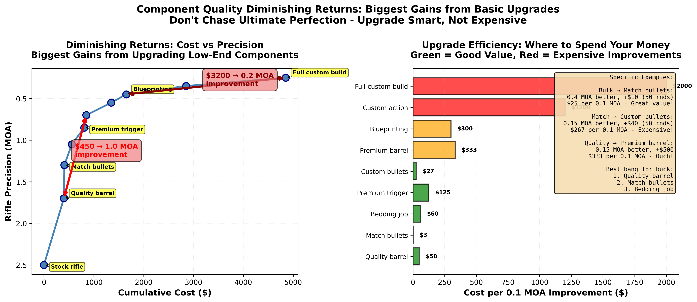
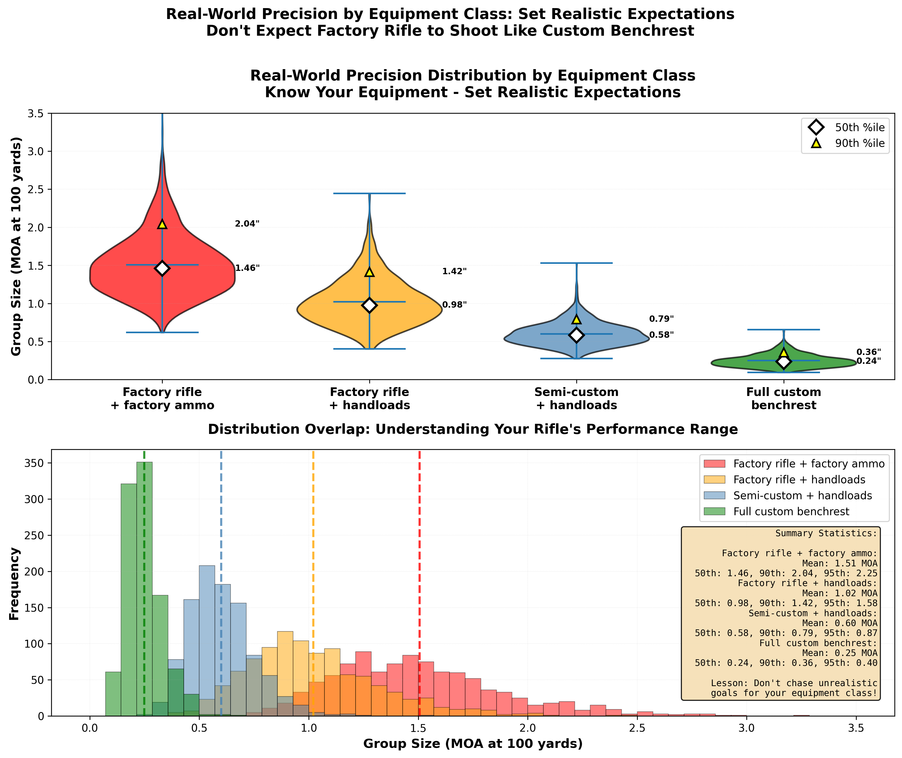

Time to complete: 10-15 minutes

# Reasonable Expectations - What Real Precision Looks Like

## Stop Chasing What Your System Can't Deliver

You've learned how to test properly. You understand sample sizes, controlled experiments, and statistical thinking. You've got the templates to analyze your data honestly.

Here's the question that stops people cold: "I did everything right—50 shots, proper testing, good statistics. My groups average 0.9 MOA. But I keep seeing people online claim 0.3 MOA with similar equipment. What am I doing wrong?"

Usually? Nothing.

The hard truth is this: **Your equipment, ammunition, and shooting ability combine to create a fundamental precision limit.** No amount of perfect testing will make a 0.8 MOA system shoot 0.3 MOA groups. The laws of physics don't care how carefully you measured your powder charges.

This might sound discouraging. It's not. It's liberating.

Once you understand what your system can actually deliver, you stop chasing ghosts. You stop wasting money on miracle fixes. You stop feeling inadequate because your groups don't match internet claims. You focus your effort where it actually matters.

By the end of this lesson, you'll understand:
- The three factors that combine to create your system's precision limit
- Realistic benchmarks for different equipment levels
- Why recoil is probably your biggest problem (and what to do about it)
- How to calculate whether improvements actually matter for your goals
- Why those magical "ladder tests" are mostly measuring your recoil management, not your load

Let's figure out what your system can really do—and whether that's good enough for what you're trying to accomplish.

---

## The Dispersion Budget: Three Contributors to Every Shot

Every single shot you fire lands where it does because of the combined influence of three separate factors. Think of it like a budget—you've got a total amount of dispersion to work with, and it's divided among these categories:

### 1. Rifle + Ammunition: Mechanical Consistency

This is the precision your rifle and ammunition can deliver when everything else is perfect. Imagine clamping your rifle in a massive vise and firing it remotely—what you'd get is the mechanical limit.

**What drives it:**
- Barrel quality (straightness, chamber concentricity, throat uniformity, crown)
- Ammunition consistency (bullet quality, powder metering, brass uniformity)
- Optic and optic mount quality (generally speaking, accuracy of sighting system)
- Action rigidity and bedding (action doesn't shift in the stock under recoil, or have stress points when bolted in)


**Realistic ranges based on equipment:**
- Custom match rifle + exceptional handloads: **0.3 to 0.5 MOA**
- Quality factory rifle + good handloads: **0.5 to 0.8 MOA**
- Average factory rifle + good handloads: **0.8 to 1.2 MOA**
- Factory rifle + factory ammunition: **1.0 to 2.0 MOA**

Notice these aren't single numbers—they're ranges. Even the best equipment has variation. A true 0.5 MOA rifle won't shoot 0.5 MOA groups every time. It'll average around that over many groups.

### 2. Shooter Fundamentals: Your Technique

Even with the rifle in a rest, you're still holding it, pressing the trigger, managing the stock, and calling the shot. Each of these adds dispersion.

**What drives it:**
- Trigger control (smooth press vs. jerking)
- Position consistency (same cheek weld, same shoulder pressure)
- Natural point of aim vs. forcing the crosshairs
- Breathing control
- Follow-through

**Realistic ranges based on technique:**
- Competition benchrest technique (front rest, rear bag, perfect setup): **+0.1 MOA**
- Good prone position with bipod and rear bag: **+0.2 to 0.4 MOA**
- Field prone position without ideal support: **+0.5 to 0.7 MOA**
- Sitting or kneeling field positions: **+0.8 to 1.5 MOA**

Here's the tough pill to swallow: **If your fundamentals are adding 0.8 MOA of dispersion, improving your ammunition from 0.7 to 0.5 MOA is almost meaningless.** The math doesn't work that way (I'll get to that in a moment).  The above examples are generalizations to illustrate their impact on precision, not hard numbers to follow.  I encourage you to test and find out YOUR precision capabilities obtained from each technique.

### 3. Recoil Management: The Biggest Disruptor

This deserves its own section because it's both the largest contributor for most shooters AND the most misunderstood.

**Here's what happens during recoil:**

Your bullet is still in the barrel for 1 to 2 milliseconds after the firing pin strikes. During that time:
- The rifle starts moving backward
- The muzzle starts rising (shoulder interaction combined with the center of gravity for the rifle)
- Your body and the bags/bipod interact
- Any inconsistency in how you're holding the rifle creates variation in muzzle position

The bullet exits the barrel while all this is happening. Small differences in how the rifle recoils create significant differences in where the bullet goes.

**Realistic recoil-induced dispersion:**
- Light-recoiling cartridge (223 Rem, 6mm BR) with good technique: **+0.1 to 0.2 MOA**
- Medium cartridge (308 Win, 6.5 Creedmoor) with good technique: **+0.3 to 0.5 MOA**
- Magnum cartridge (300 Win Mag, 7mm Rem Mag) with good technique: **+0.5 to 0.8 MOA**
- Any cartridge with poor recoil management: **+1.0 to 2.0 MOA** or much, much worse!

**Why most people underestimate recoil:**

You can "cheat" recoil for a few shots. Muscle through it. Hold extra tight. Perfect your form for those three critical shots everyone's watching.

But over 30 or 50 shots? Your muscles fatigue. Your form degrades. Your concentration wavers. The recoil-induced variation shows up in the data.

This is why 3-shot groups lie so effectively about precision. You can minimize recoil effects for three shots. You can't for thirty.

### The Research: Bryan Litz's TOP Gun Theory

**The data backs up what we've been saying:** Bryan Litz's research (TOP Gun methodology and testing) suggests that approximately **70% of your rifle system's precision capability is determined by recoil management and rifle mass**, with the remaining ~30% coming from rifle + ammunition mechanical consistency, and shooter fundamentals as an additional contributor.

**Let that sink in for a moment.** The vast majority of your precision potential isn't your powder choice, primer brand, seating depth, or brass preparation. It's how your rifle behaves during the milliseconds while the bullet is still in the barrel.

**The breakdown (approximate and assumes near perfect rifle mechanicals and expert shooter):**
- **~70%: Recoil/mass interaction** - How the mass of the rifle interacts with the shooter in relation to cartridge recoil
- **~30%: ammunition + ammunition** -  Ammunition optimization
- **Additional: Shooter fundamentals** - Position, trigger control, technique, the shooter subtracts precision from the rifle + ammo

Intuitively, this makes sense.  A 22lb .223Rem bolt action is much easier to shoot than a sporter weight (~8lb) .300WM.

**Why this matters for small sample testing:**

When you shoot a 3-5 shot group, you're seeing the **combined** effect of all three factors, but you're getting a sample that's:
1. Too small to reliably measure the rifle+ammunition contribution (~30% of the total)
2. Dominated by recoil variation that you can temporarily minimize through concentration and fresh muscles
3. Extremely susceptible to luck (one good recoil or one bad recoil can swing the group dramatically)

This is why your amazing 0.5 MOA three-shot group doesn't predict your 30-shot performance. Over 30 shots, the **70% recoil component** reveals itself through muscle fatigue, position shifts, and the statistical reality that you can't "cheat" recoil management for that many rounds.

**The practical insight:** If recoil dominates precision (70%), then improving ammunition consistency (part of the 30%) has limited impact **unless you first control recoil**. This is why muzzle brakes, suppressors, and added rifle mass often produce bigger precision improvements than endless load development.

**Perspective check:** The confidence interval on a 3-shot SD measurement is enormous (as we learned in earlier lessons). Similarly, the confidence interval on a 3-5 shot group is huge because recoil variation dominates. You're trying to measure a 30% contributor (rifle+ammo) while ignoring the 70% contributor (recoil) and using a sample size that can't separate them. This is why proper testing requires 30+ shots - you need enough data to average out the recoil variation and actually see the ammunition signal.

### The Combined Effect: Root Sum Square (RSS)

Here's the critical part: these three contributors **don't add directly**. They combine using something called root sum square.

**The math (don't panic):**

If your rifle contributes 0.5 MOA, your technique adds 0.3 MOA, and recoil adds 0.4 MOA, your total system precision isn't:

```
0.5 + 0.3 + 0.4 = 1.2 MOA (WRONG!)
```

It's:

```
√(0.5² + 0.3² + 0.4²) = √(0.25 + 0.09 + 0.16) = √0.50 = 0.71 MOA (CORRECT)
```

**Why this matters:**

The RSS calculation means **the largest contributor dominates your total dispersion.** If one factor is much larger than the others, improving the small factors barely helps.

**Example 1: When ammunition improvements matter**
- Rifle + ammo: 0.5 MOA
- Shooter: 0.3 MOA
- Recoil: 0.3 MOA
- **Total: 0.66 MOA**

Improve ammunition from 0.5 to 0.3 MOA:
- New total: √(0.3² + 0.3² + 0.3²) = **0.52 MOA**
- Improvement: **0.14 MOA** (meaningful!)

**Example 2: When ammunition improvements are wasted**
- Rifle + ammo: 0.5 MOA
- Shooter: 0.8 MOA
- Recoil: 0.6 MOA
- **Total: 1.13 MOA**

Improve ammunition from 0.5 to 0.3 MOA:
- New total: √(0.3² + 0.8² + 0.6²) = **1.07 MOA**
- Improvement: **0.06 MOA** (barely noticeable!)

The message: **Fix your biggest problem first.** If recoil or technique is your limiting factor, obsessing over ammunition consistency is a waste of time and money.



**Figure 2:** The Pareto Principle (80/20 rule) applied to precision equipment investment. The top panel shows the classic diminishing returns curve: achieving the first 80% of your system's maximum capability requires roughly 20% of maximum investment (green zone), while chasing the final 20% of capability requires the remaining 80% of investment (red zone). The bottom panel quantifies investment efficiency at each upgrade step—early upgrades (like replacing a budget optic with quality glass) show excellent returns ($10-25 per 1% capability gain), while later upgrades show poor efficiency ($70-180 per 1% gain). The upgrade path demonstrates that premium ammunition tooling ($2,700 for annealers, lab-grade scales, custom dies) follows the same diminishing returns pattern as rifle upgrades, with the final custom build ($10,200 total) representing a massive investment for marginal capability gains.

### Applying the Pareto Principle: Your System, Your Data

The 80/20 rule is powerful, but here's what matters: **shooter + rifle + ammunition = SYSTEM**. There's no universal "best" upgrade path because every system is different.

**The $3,000 Rifle with $500 Optic Problem:**

Many shooters invest heavily in the rifle while skimping on the optic and mount. If your aiming system is the weak link, no amount of rifle upgrades will help. Consider that the textbook definition of accuracy heavily relies on your optic and mount for repeatability, zeroing, and consistency. Test your current system first—does your data show the rifle is limiting you, or is it the optic?

**The Ammunition Tooling Trap:**

The same testing methodology from this curriculum applies to equipment decisions. Before buying premium reloading tools (annealer $800+, lab-grade scale $600+, custom dies $400+), ask yourself: **Does YOUR data show the specific problem that tool solves?**

- Large ES/SD in your current loads? Start with match-quality components (bullets, brass, powder) before buying premium tooling.
- Still seeing issues with match components? Identify which specific factor: Is it powder metering consistency? Brass prep? Neck tension variation?
- Don't blindly copy what the pros use—they're solving problems you might not have yet.  You may be spending more on upgrades than nessecary to meet your goals.

**Test to Find YOUR Limiting Factor:**

1. **Shoot 30-50 rounds** to measure your current system capability
2. **Identify the weakest component** (recoil management, optic, ammunition consistency, technique)
3. **Upgrade that component ONLY**
4. **Re-test to quantify the improvement**
5. **Repeat** with the next weakest component

**Fix Your Biggest Problem First:**

The RSS calculation from earlier means the largest contributor dominates. Based on your testing data:

- Budget optic on great rifle? → Upgrade the optic first
- Great optic on budget rifle with poor groups? → Work on the rifle or ammunition
- Large ES/SD in velocity data? → Match ammunition components before premium tools
- Match ammo still shows ES/SD issues? → Identify the specific component causing variation
- Good rifle and ammo but inconsistent groups? → Focus on recoil management and technique

**The Bottom Line:**

Equipment choice isn't this curriculum's scope—we teach you to test properly, not which brand to buy. But you should understand **WHY you need something BEFORE spending money on it**.

Testing reveals where YOUR money matters most. Not internet posts. Not professional setups. Not the latest gadget review. YOUR data from YOUR system.

Work with a competent gunsmith to:
- Diagnose actual limiting factors based on test data
- Make evidence-based improvements
- Verify results with proper sample sizes

Don't chase internet claims—chase YOUR data.

### The Pareto Principle Applied to Skill: Why Top Competitors Work So Hard

If you've ever doubted the dedication of top-level competitors in any sport, consider this perspective: In a match with 30+ shooters, placing 6th (top 20%) means you've achieved the accessible 80% of performance gains—the "low-hanging fruit" that comes from good fundamentals, decent equipment, and consistent practice.

Think about how much time, effort, and resources you invested to reach that level. Now consider that moving from 6th place to the podium (top 10%) requires *exponentially more* of everything. That final 20% improvement in performance demands the remaining 80% of total effort—more trigger time, more expensive equipment, refinements, more coaching, more travel to competitions, more physical conditioning, more mental preparation, more recovery between sessions.

This is why professional athletes train full-time. The difference between "very good" and "world-class" isn't just talent—it's the willingness to invest massive resources for incremental gains that most people can't justify.

The lesson for reloaders: **Know which part of the curve you're on.** Getting from 1.5 MOA to 0.9 MOA might take $500 and 40 hours of work. Getting from 0.9 MOA to 0.5 MOA might take $3,000 and 200 hours. Going from 0.5 MOA to 0.3 MOA? That's where you start questioning your life choices.

Choose your target performance level based on what you actually need, not what impresses people on the internet.

**[➡️ Launch Your Dispersion Budget Calculator (Opens in New Tab)](../interactive/09_dispersion_calculator.html){:target="_blank"}**

Adjust the three sliders to match YOUR system. See how rifle/ammunition, shooter technique, and recoil combine using RSS. Discover which factor is limiting you most and where improvements will have the biggest impact. Test 50% improvements on each component to see diminishing returns in action!

> **Key Insight**
>
> Your system precision is determined by RSS combination of rifle, shooter, and recoil. The largest contributor dominates. Improving a minor contributor while ignoring the major one wastes effort. Always fix your biggest problem first.

---

## Reality Check: Benchmarks for Your Equipment Level

Let's get brutally honest about what different equipment levels can actually deliver. These numbers come from extensive testing with proper sample sizes (50+ shot aggregates), not cherry-picked best groups.

**These are AVERAGE capabilities—what you should expect most of the time with good technique.**



**Figure 1:** Distribution of real-world rifle precision across different equipment classes, based on aggregated data from proper 50+ shot testing (not cherry-picked best groups). Factory rifles with factory ammo average 1.5 MOA with most falling between 1.0-2.5 MOA. Factory rifles with quality handloads improve to ~1.0 MOA (0.6-1.5 MOA range). Semi-custom setups with premium components average 0.6 MOA (0.4-1.0 MOA range). Full custom benchrest rifles achieve 0.25 MOA average (0.15-0.4 MOA range). Notice the distributions overlap - a good factory rifle can occasionally match a poor custom rifle, but averages matter. Know your equipment class and set realistic expectations accordingly.

### Entry-Level Factory Rifle + Factory Ammunition

**Equipment:**
- Mass-produced factory rifle ($500 to $1,000)
- Factory hunting or match ammunition
- Basic optic with reasonable quality

**Realistic precision: 1.5 to 2.0 MOA**

At 100 yards, this is 1.5 to 2.0 inch groups (aggregated, not best-of-five).

**A note on "Sub-MOA Guarantees":** By now, your eyebrows should raise concerning factory claims of sub-MOA guarantees with no qualifiers. Statistically, if you shoot enough 3-5 shot groups, you'll eventually get one that's sub-MOA—even from a rifle that averages 1.5-2.0 MOA. This practice has created unrealistic expectations across the industry. When manufacturers say "sub-MOA guarantee," they typically mean "we'll shoot groups until we get one sub-MOA" or "3-shot groups with match ammo under ideal conditions." This isn't dishonest per se, but it's not the same as "this rifle averages sub-MOA with 30+ shot aggregates using hunting ammunition." Understanding sample size bias makes you immune to this marketing strategy.

**What limits you:**
- Factory barrel quality (standard chamber, less uniformity than custom)
- Mixed ammunition lots
- Basic stock and bedding (functional but not optimal) 
- Critical tolerances that affect precision vary rifle to rifle
- Trigger usually acceptable but not great

**Is this good enough?**
- Deer-sized game to 300 yards: Absolutely
- Steel targets at 600 yards: Yes, with good fundamentals
- Precision competition: Competitive in **some** divisions
- 1,000 yard targets: Challenging but occasionally doable

### Quality Factory Rifle + Good Handloads

**Equipment:**
- Better factory rifle ($1,200 to $2,000) or upgraded barrel
- Improved stock and bedding
- Tolerance stacking for critical parts are better
- Carefully developed handloads with quality components
- Better optic properly mounted
- Trigger is "better"

**Realistic precision: 0.8 to 1.2 MOA**

At 100 yards, this is 0.8 to 1.2 inch groups (aggregated).

**What limits you:**
- Factory barrel still the limiting factor for many
- SAAMI chamber dimensions (some slop built in)
- Stock bedding and action rigidity
- Your ability to load consistently

**Is this good enough?**
- All hunting traditional applications: More than enough
- PRS/NRL competition: Competitive in more divisions
- F-Class at 600 yards: Entry level, good enough to work on shooter fundamentals
- 1,000+ yard precision: Capable with expert skill

**This is where most serious shooters live.** If this describes your equipment, chasing 0.5 MOA is probably fighting your barrel, chamber, and functional optimizations - not your loading technique.

### Custom Match Rifle + Exceptional Handloads

**Equipment:**
- Custom or semi-custom action ($1,500+)
- Premium match barrel, chamber cut for your specific bullets ($800+)
- Quality stock with proper bedding ($1300+)
- Match trigger ($200+)
- High-end optic and mounts ($2,500+)
- Lot-tested bullets, sorted components, meticulous loading

**Realistic precision: 0.5 to 0.8 MOA**

At 100 yards, this is 0.5 to 0.8 inch groups (aggregated).

**What limits you:**
- Ammunition component variation (yes, even premium bullets vary)
- Environmental conditions (wind, mirage)
- Your fundamentals and recoil management
- Various cumulative errors from the system (rifle, ammo, shooter, environment)

**Is this good enough?**
- F-Class competition: Competitive
- Benchrest: Entry level (those guys are in another category entirely)
- ELR (extreme long range): Good foundation
- Anything closer than 1,000 yards: Overkill for most applications


**Interactive Element Placeholder:**
```python
# Interactive widget: "Equipment Level Reality Check"
#
# Dropdown menu: Select your equipment level
# - Entry Factory
# - Quality Factory + Handloads
# - Custom Match Setup
# - Benchrest Competition
#
# Input: Your recent group sizes (paste list of numbers)
#
# Analysis displays:
# - Your average vs. expected average for that equipment level
# - Distribution plot: your groups vs. expected range
# - Verdict: "Your results are typical / better than expected / below expected"
# - If below expected: "Check fundamentals / Check ammunition consistency / Check bedding and mechanics"
# - If better than expected: "You're either at the high end of normal variation,
#   or you need more sample size to trust this."
#
# Aha moment: "My 1.1 MOA with factory rifle + handloads is actually GOOD,
# not a failure. Those 0.5 MOA claims I keep seeing are either lies, different
# equipment, or small-sample illusions."
```

**Important:** These are statistical generalizations. Your specific rifle may perform better or worse depending on numerous factors (barrel quality, bedding, scope mounting, ammunition consistency, shooter skill). The only way to know YOUR system's true capability is to test it properly with 30+ shot aggregates and consistent shooting conditions.

Modern factory rifles from quality manufacturers (Tikka, Bergara, Seekins, etc.) increasingly deliver performance that overlaps with entry-level custom rifles, especially in hunting-weight configurations. Don't assume your rifle's capability based on price—test it.

### The Uncomfortable Question: "But What About Those 0.3 MOA Claims?"

You've seen them. Forums, YouTube, social media. People with the same rifle as you, claiming 0.3 MOA groups.

**Four possibilities:**

1. **They're measuring incorrectly**: Measuring best groups instead of aggregates, using 3-shot groups, excluding "flyers"
2. **They got lucky**: Small sample size gave them one amazing result that won't repeat
3. **They have better equipment than they're admitting**: "Factory rifle" that's been re-barreled, bedded, and blueprinted
4. **They're actually that good**: It happens. Top 1% of shooters with top 1% of equipment doing everything right

**Your job isn't to match every internet claim.** Your job is to understand what YOUR system can deliver and whether that's good enough for YOUR goals.

Which brings us to the most important question...

---

## WEZ: Does Your Precision Actually Matter?

WEZ stands for **Weapon Employment Zone**—a military concept that's incredibly useful for reloaders. It answers a simple question:

**"What's the probability I'll hit my target given my system's precision?"**

This is where we separate precision that matters from precision that's just bragging rights.

### The Hit Probability Calculator

Let's use real numbers. You're shooting at an 8-inch vital zone (typical deer vitals) at 300 yards.

**Scenario A: 0.8 MOA System**
- At 300 yards, 0.8 MOA = 2.4 inches
- Your shots land in a ~2.4 inch radius (roughly)
- Hit probability on 8-inch vital zone: **~99.2%**

**Scenario B: 0.5 MOA System**
- At 300 yards, 0.5 MOA = 1.5 inches
- Your shots land in a ~1.5 inch radius
- Hit probability on 8-inch vital zone: **~99.8%**

**The improvement from 0.8 to 0.5 MOA: 0.6 percentage points.**

That's not a typo. Going from a good hunting rifle to a custom match rifle improves your probability of hitting deer vitals at 300 yards by **less than 1%**.

### Now Try a Harder Target

Same systems, but now you're shooting a 10-inch steel plate at 800 yards.

**Scenario A: 0.8 MOA System**
- At 800 yards, 0.8 MOA = 6.4 inches
- Hit probability on 10-inch plate: **~85%**

**Scenario B: 0.5 MOA System**
- At 800 yards, 0.5 MOA = 4.0 inches
- Hit probability on 10-inch plate: **~96%**

**The improvement: 11 percentage points.**

Now we're talking! At longer ranges on smaller targets, precision actually matters.

### Calculate Your Own Hit Probabilities

Want to run these calculations for your specific setup? The **[OpenWEZ calculator](https://reevesjustin.github.io/OpenWEZ/)** lets you input your rifle's precision, target size, and distance to see your actual hit probability. It's a practical tool for answering the question: "Is my current system good enough for what I'm trying to do?"

You can compare different scenarios:
- Your current rifle vs. a potential upgrade
- Different target sizes at the same distance
- Same target at different distances
- The real-world impact of improving from 1.0 MOA to 0.7 MOA for YOUR specific application

Now that you understand how standard deviation and mean radius characterize your rifle's performance, use this calculator to experiment with different scenarios. If you've completed 30+ shot tests with your rifle system and calculated mean radius, you now have a reliable measure of your system's true capability—plug that number into the calculator for accurate hit probability predictions. Then figure out where your time, money, and effort will have the biggest impact—measured in dollars spent per percentage point of hit probability gained. This is how you make evidence-based decisions about equipment upgrades instead of chasing internet claims.

### The Message

**Chase precision where it matters. Accept limits where it doesn't.**

If you're shooting deer-sized game inside 400 yards, a 1.0 MOA system is more than adequate. Spending hundreds or thousands of dollars and dozens of hours trying to get from 1.0 to 0.6 MOA improves your hit probability by maybe 2%.

If you're competing at 1,000 yards on small tagets, every 0.1 MOA improvement is worth fighting for.

**Know your goals. Build to those goals. Stop when you're good enough.**

**Interactive Element Placeholder:**
```python
# Interactive widget: "Hit Probability Calculator"
#
# Inputs:
# Slider 1: System precision (0.3 to 2.0 MOA)
# Slider 2: Target size (4 to 20 inches)
# Slider 3: Distance (100 to 1200 yards)
#
# Display:
# - Visualization: target circle with shot dispersion overlay
# - Hit probability percentage (large, bold)
# - Comparison: "vs. 0.5 MOA better system: +X% hit probability"
# - Verdict: "This improvement is negligible / moderate / significant"
#
# User can adjust sliders and watch hit probability change
# See that small targets at long range are sensitive to precision
# See that large targets at close range are very forgiving
#
# Additional feature:
# - "What precision do I need for 95% hits?" calculator
# - User inputs target and distance
# - Returns required system precision
#
# Aha moment: "I need 0.7 MOA for my goals. I have 0.9 MOA.
# Getting to 0.7 requires $2,000 in upgrades. Is 3% more hits worth $2,000?"
```

> **Critical Takeaway**
>
> Precision requirements depend entirely on your target size and distance. A 1.2 MOA system is plenty for big game at 300 yards but inadequate for competition at 1,000 yards. Before chasing smaller groups, calculate whether the improvement actually matters for what you're trying to hit.

---

## Recoil: The Variable Everyone Ignores

Let's talk about the elephant in the room. You've done everything right with your load development. Your rifle is solid. Your technique is good. But your groups are still bigger than you think they should be.

**The problem is probably recoil, and here's why almost nobody recognizes it:**

### Recoil Creates Vertical Stringing (Mostly)

When you shoot a group, look at the shape. Is it:
- Roughly circular: "Normal" Ammunition and rifle mechanical variation
- Vertical elongation: Recoil management issues
- Horizontal elongation: Natural Point of Aim, Wind, or bedding problems

Most groups show some vertical elongation. That's recoil.  REMEMBER - I'm talking about 30+ shot groups, not small samples.

**Be Honest With Yourself:**
Use an external ballistics calculator to check assumptions.  How much wind does it take to move your bullet's impact 1" to the left (for a right handed shooter) at 100 yards?  Do you really think that wide left shot was actually the 5 MPH wind gust during the string of fire?


**What's happening:**

Shot 1: You're fresh, well-positioned, properly relaxed. Perfect form.
Shot 5: Your shoulder is getting sore, you're anticipating recoil slightly, your position has shifted.
Shot 15: You're definitely feeling it. Your form is degraded.
Shot 30: You're working to maintain form through muscle fatigue.

Each shot recoils slightly differently because your body and setup aren't perfectly consistent. The rifle muzzle is in a slightly different position when each bullet exits.


### Muzzle Brakes and Suppressors

This is where these devices earn their money—not just in reducing felt recoil for comfort, but in **reducing shooter-induced dispersion**.

**Unbraked 300 Win Mag:**
- Recoil impulse: ~25 ft-lbs
- Typical recoil-induced dispersion: +0.6 to 0.9 MOA

**Same rifle with effective muzzle brake:**
- Recoil impulse: ~8 ft-lbs (70% reduction)
- Typical recoil-induced dispersion: +0.3 to 0.4 MOA

**The improvement: 0.3 to 0.5 MOA tighter groups**, with the same ammunition, just by managing recoil better - your shooting stamina instantly increases.

That's bigger than most load development gains. AND it costs $150 and a gunsmith trip, not endless testing.  The tradeoff is increased concussion and the people around you will hate them.

**CONTEXT:**  
Recall that the bullet spends an average of 1-2ms in the barrel.  The majority of recoil reducing effects arrive AFTER the bullet exits the muzzle.  The example above is intended to illustrate the effects of recoil on **shooter-induced dispersion**.  Finally, not all muzzle brakes and suppressors are created equally.  There are VERY REAL observable effects from poorly designed muzzle devices and associated barrel machining.  DO NOT ASSUME all muzzle devices will improve precision, please test them by establishing properly sampled baselines before and after.

### The Practical Test: Are You Fighting Recoil?

Here's how to tell if recoil is limiting your precision:

**Test 1: Compare cartridges**
If possible, shoot both a light-recoiling cartridge (223 Rem, 6mm BR) and your normal hunting cartridge from similar quality rifles. If you shoot noticeably better with the light cartridge, recoil is your limiting factor.

**Test 2: Add weight**
Strap an extra 3-4 pounds to your rifle (sandbags, bolt-on weights, whatever). Recoil impulse drops significantly. If your groups shrink, you've confirmed recoil is the problem.

**Test 3: Muzzle device**
If you have a threaded barrel, test with and without a brake or suppressor. The difference will tell you exactly how much recoil is costing you.

**Test 4: Check group shape**
If your groups are consistently vertically elongated by 1.5x to 2x (taller than wide), recoil management is your issue.

**What to do about it:**

1. **Consider a muzzle brake or suppressor** - Single biggest improvement for magnum cartridges
2. **Seek instruction from an expert for recoil control technique** - Minimize muscle tension, let rifle recoil naturally in rest, verify NPA
3. **Add weight to rifle** - Heavier rifles recoil less (physics), literally - Bolt or rigidly attach weights to the rifle.
4. **Reduce charge weight** - Yes, you'll lose velocity, but if you're not using it, why pay the recoil cost?
5. **Switch cartridges** - Sometimes the honest answer is "this cartridge recoils too much for me to shoot well"

None of these are load development. None of them involve changing powder or primers or seating depth. They're all about managing the rifle's behavior during the shot.


**For many shooters, fixing recoil management is worth 0.3 to 0.5 MOA of improvement—more than they'll ever get from perfect load development.**

---

## Ladder Tests and Audette Tests: What They Actually Measure

You've probably seen or tried a ladder test or Audette test:
- Load 10 rounds with incrementally increasing powder charges
- Shoot them at a target at long range (300-400+ yards)
- Look for vertical "nodes" where multiple charges impact at the same height
- The theory: "flat spots" in the velocity curve create less vertical dispersion

**Here's what's actually happening: You're mostly measuring your recoil management, not your load.**

### The Mechanism

Remember: the bullet is in the barrel for 1-2 milliseconds while the rifle is already recoiling. During that time, the muzzle is rising (recoil vector on shooter + rifle's center of gravity)

**Small differences in powder charge do three things:**

1. **Change velocity** (yes, this is real)
2. **Change barrel time** (time from ignition to bullet exit)
3. **Change recoil impulse timing** (when and how hard the rifle pushes back)

At close range (100 yards), the barrel time and recoil timing effects are small. Velocity is what matters.

At long range (400+ yards), the recoil-induced muzzle angle change starts dominating the vertical dispersion pattern.

**The "nodes" you see in a ladder test are the charges where the recoil timing happened to minimize vertical dispersion for YOUR specific shooting position and technique on that specific day.**

Change your position, change the bags, shoot on a different day, and the "node" moves or disappears.

### The Evidence: Simulations Show Random Patterns

When you run simulations of ladder tests—with realistic random variation but NO actual "nodes" programmed in—you still see patterns that look like nodes.  The effect of pure velocity driven vertical spread is completely linear.

Your brain finds structure in noise. Always has, always will.

**The controlled studies:** Shooters who did ladder tests, found a "node," and then tested that charge weight properly (30+ shots) found that it performed no better than adjacent charges. The node was an artifact of recoil variation, not a real flat spot.  The impacts on target are random combination of natural dispersion, velocity change, and the shooter's recoil control.

### What Ladder Tests DO Show

**They're not useless.** They show you:

1. **Pressure progression**: You can see where velocity stops increasing linearly (pressure limit approaching)
2. **Recoil sensitivity**: Which charges make your rifle hardest to shoot consistently
3. **Rough velocity progression**: What velocity you're getting at each charge

**What they DON'T show:**

1. **Magical accuracy nodes**: These don't exist in the way people claim
2. **The "best" load**: You need proper sample sizes for that
3. **Consistency information**: You need 30+ shots at the same charge to measure that

### The Better Approach

Instead of ladder tests:

1. **Do a simple velocity ladder** at 100 yards (~5 charges, 5 shots each, starting low) to find safe max and see velocity progression
2. **Pick 2-3 promising charge weights** based on velocity goals and pressure signs
3. **Test each properly** with 30+ shots to measure real precision and consistency
4. **Make a decision** based on actual data, not patterns in noise

This test uses the fewest components to establish a reliable and crucially safe baseline.  Upon finishing this test, you'll gain valuable insights rather than biased assumptions.

**REMEMBER:** The velocity ladder provides an approximate estimate of average velocity velocity per propellant grain.  A 5-shot average offers sufficient confidence for a safe range of charges in future tests.  Continuously verify your velocities against published load data; There are no shortcuts!  **We are not analyzing groups.** 

---

## The Freedom of Realistic Expectations

Here's where we bring it all together.

You now understand:
- Your system has a precision limit based on rifle, shooter, and recoil
- That limit is probably higher (worse) than you thought
- Different equipment levels have different realistic capabilities
- Whether precision matters depends entirely on your target size and distance
- Recoil is probably limiting you more than your loading bench technique or method
- Ladder tests mostly measure recoil management, not load quality

**This is liberating.**

Stop feeling inadequate because your groups don't match internet claims. Stop chasing 0.5 MOA with a factory rifle and good handloads—**you're already at or near the limit of what that system can deliver.**  On the other hand, if you're not at the level the system can deliver, you have the knowledge to make real changes to your setup.

Stop wasting money on diminishing returns. If you've got a 0.9 MOA system and you're hunting deer inside 400 yards, **you're done**. Your hit probability is 99%+. Spending $1,000 to get to 0.6 MOA improves that by maybe 0.5%. That's not worth it.

Instead:

1. **Shoot more**: Practice fundamentals, build skills, learn to read wind
2. **Fix recoil**: Add a brake, improve your position, add weight to the rifle
3. **Test honestly**: Use proper sample sizes, track multiple sessions, trust the data
4. **Accept your system**: Know what it can do, be confident in that, stop comparing to others

The goal isn't the smallest groups. The goal is **confidence in your system's capabilities and trust in your data.**

You've learned how to test properly. You've learned what results to expect. You know how to spot claims that don't pass the smell test.

**You're now equipped to work within reality instead of chasing fantasies.**

And that will save you more time, money, and frustration than any miracle load could.

> **Key Takeaways**
> - Your system precision combines rifle/ammo (mechanical), shooter (technique), and recoil (management) via RSS
> - The largest contributor dominates—fix your biggest problem first, not your smallest
> - Realistic expectations: Factory + handloads = 0.8-1.2 MOA, Custom = 0.5-0.8 MOA, Benchrest = 0.2-0.3 MOA
> - Hit probability (WEZ) depends on target size and distance—chase precision only where it matters
> - Recoil-induced dispersion is often larger than ammunition variation and easier to fix
> - Ladder/Audette tests mostly measure recoil management, not magical accuracy nodes
> - Know your system's limits, trust proper testing, stop comparing to internet claims

---

## Coming Up Next

**In Lesson 10**, we'll tackle the critical question: When is a result real vs. just random noise? You'll learn:
- How to distinguish signal from statistical noise
- The concept of "false alarms" (thinking you found something when it's just luck)
- "Missed opportunities" (real differences hidden by variation)
- Practical significance vs. statistical significance
- How to calculate confidence in your conclusions

You now know what your system can deliver. Next, you'll learn to tell when you've actually improved it vs. when you just got lucky.

[Previous: 08 Your Experiments Template](08_Your_Experiments_Template.html) | [Next: 10 When Is A Result Real](10_When_Is_A_Result_Real.html)
