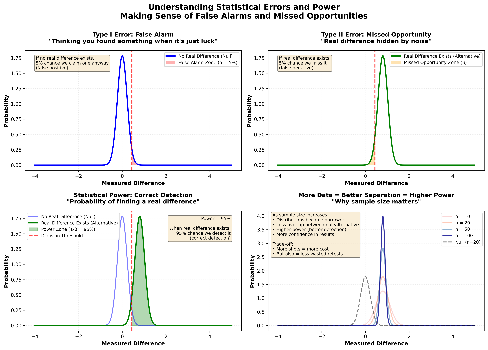
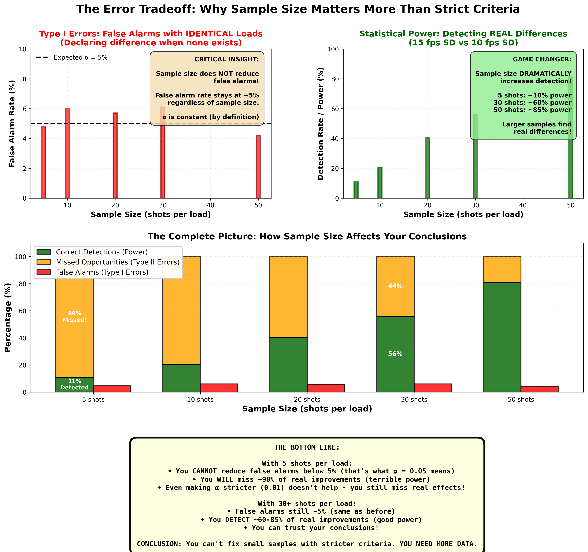
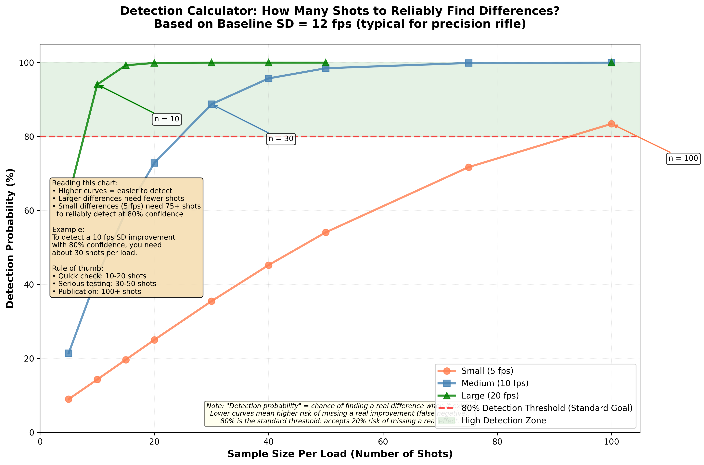

Time to complete: 10-15 minutes

# When IS a Result Real?

## The $500 Bet: Would You Risk It?

You've finished testing two loads. Load A averaged 12 fps SD over 30 shots. Load B averaged 9 fps SD over 30 shots.

**Here's the test:** Would you bet $500 that if you shoot another 30 rounds of each next week, Load B will still show lower SD?

If your gut answer is "No, that's too risky," **you're demonstrating good statistical intuition.** A 3 fps difference from a single session might be noise, not signal.

If your answer is "Yes, absolutely," either you're very confident in your result (good sample size, large difference, consistent across sessions) or you're overconfident.

This lesson teaches you to tell the difference. By the end, you'll know:
- When results are reliably real vs probably noise
- The two types of mistakes you can make (and why both matter)
- How to calculate if your testing had enough power to detect real differences
- The critical difference between "statistically significant" and "actually matters"
- A simple heuristic to evaluate any reloading claim

Let's learn to separate signal from noise.

---

## Two Types of Mistakes (And You Can't Avoid Both)

Every time you make a conclusion from data, you risk two types of errors:

### Type I Error: False Alarm (Seeing Something That Isn't There)

**Example:**
You test two primers. Your data shows Primer A gives 5 fps less SD than Primer B (13 fps vs 18 fps). You conclude Primer A is better and switch.

But in reality, both primers have the same true SD (15 fps). You just got unlucky random samples. Primer A happened to shoot tighter that day by chance.

**You declared a winner when there was no real difference. That's a false alarm.**

**Consequences:**
- Wasted money switching primers
- Wasted time testing something that doesn't matter
- False confidence in your "improvement"

**How often does this happen?**
That depends on your significance level (α). If you use p < 0.05 as your threshold, you'll have false alarms about 5% of the time when testing things that are actually identical.

### Type II Error: Missed Opportunity (Missing Something That's Real)

**Example:**
You test two bullets. Your data shows Bullet A gave 1.2 MOA precision, Bullet B gave 1.0 MOA. You conclude "no significant difference" and stick with Bullet A (it's cheaper).

But in reality, Bullet B truly is 0.2 MOA better. Your sample size was too small to detect this difference reliably. You missed it.

**You failed to detect a real improvement. That's a missed opportunity.**

**Consequences:**
- Continued use of inferior component
- Missed potential improvement
- Money wasted on future mediocre results

**How often does this happen?**
That depends on your statistical power (1 - β). With small samples, power is low—you miss real effects frequently. With large samples, power is high—you catch real effects most of the time.

### The Tradeoff

**You cannot eliminate both types of errors.**

- Make it harder to declare a difference (lower α, like p < 0.01) → Fewer false alarms, but more missed opportunities
- Make it easier to declare a difference (higher α, like p < 0.10) → Catch more real effects, but more false alarms

**The solution:** Use adequate sample sizes. Large samples give you high power (catch real effects) without increasing false alarms.



**Figure 1:** Visual demonstration of statistical errors using accessible language. The four panels show: (1) False alarms - when you think you found a difference but it's just luck (Type I error, controlled by alpha at 5%), (2) Missed opportunities - when a real difference is hidden by noise (Type II error, depends on sample size), (3) Statistical power - your ability to correctly detect real differences (1-beta, increases with sample size), and (4) How increasing sample size reduces overlap between distributions, making real differences easier to detect. Understanding these concepts helps you design tests that reliably find real effects without being fooled by noise.


**The most concise way to remember Type I and Type II errors.** This humorous visualization makes the distinction crystal clear: Type I error is convicting an innocent person (false positive - you said there's a difference when there isn't), while Type II error is letting a guilty person go free (false negative - you failed to detect a real difference). In reloading terms: Type I is thinking your new primer improved SD when it didn't (false alarm), Type II is missing that your new bullet actually does shoot better (missed opportunity).



**Figure 2:** The relationship between sample size, false alarms (Type I errors), and detection power (ability to find real differences) explains why proper sample sizes are essential. Top left: False alarm rates stay constant at ~5% regardless of sample size—that's what α = 0.05 means. Top right: Detection rate (statistical power) increases dramatically with sample size, from ~10% with 5 shots to ~85% with 50 shots when testing loads that differ 15 fps SD vs 10 fps SD. Bottom: Combined view shows the complete picture—with 5 shots you miss 90% of real improvements while still getting 5% false alarms. The critical insight: You can't fix small samples with stricter criteria (like α = 0.01). You need more data. Small samples have terrible power AND normal false alarm rates. Proper sample sizes (30+) give you the power to detect real differences while maintaining acceptable false alarm rates.

> **Key Insight**
>
> False alarms (Type I errors) are controlled by your significance level (α) and don't depend much on sample size. Missed opportunities (Type II errors) depend heavily on sample size—small samples miss real effects frequently. The solution is adequate sample sizes, not stricter significance levels.

---

## Statistical Significance vs Practical Significance

This is where most reloaders go wrong. They confuse two completely different questions:

**Statistical significance:** "Is this difference reliably real, or could it be random chance?"

**Practical significance:** "Does this difference actually matter for what I'm trying to do?"

These are NOT the same question.

### Example 1: Statistically Significant But Meaningless

You test two powders over 4 sessions with 100 shots each. Large sample (400 shots each powder), very precise measurements.

**Results:**
- Powder A: 2,854 fps average, 13.2 fps SD
- Powder B: 2,853 fps average, 13.8 fps SD

**Statistical test:** p < 0.02 (statistically significant!)

You've detected a real difference. With this sample size, the difference is unlikely to be chance.

**But ask yourself:** Does 1 fps average velocity and 0.6 fps SD difference actually matter?

At 600 yards, 1 fps changes your point of impact by about 0.1 inches. The 0.6 fps SD difference creates about 0.5 inches more vertical spread.

**Is this worth switching powders, re-developing a load, and buying new components?** Probably not.

**Statistically significant: Yes**
**Practically significant: No**

### Example 2: Meaningful But Not Statistically Significant

You test two bullets with 15 shots each. Small sample, noisy measurements.

**Results:**
- Bullet A: 1.3 MOA precision
- Bullet B: 0.9 MOA precision

**Statistical test:** p = 0.12 (not statistically significant)

With this sample size, you can't confidently say the difference is real. It might be random variation.

**But ask yourself:** If Bullet B really is 0.4 MOA better, does that matter?

At 800 yards on a 10-inch plate, that could be the difference between 85% hits and 95% hits. That's significant for competition.

**Statistically significant: No** (you didn't prove it)
**Practically significant: Yes** (if it's real, it matters)

**What to do:** Test again with more shots (30+ per bullet) to get enough power to detect this difference if it's real.

### The Right Approach

**Always ask both questions:**

1. **Is it statistically real?** (Proper sample size, statistical test, adequate power)
2. **Does it actually matter?** (Effect size large enough to impact your shooting goals)

Only pursue improvements that are both statistically real AND practically meaningful.

**Interactive Element Placeholder:**
```python
# Interactive: "Significance vs Importance"
#
# Present 4 scenarios:
#
# Scenario 1:
# Primer swap: 15 fps SD → 14 fps SD
# Sample size: 50 shots each
# p-value: 0.03 (statistically significant)
# At 600 yards: 1.5 inches less vertical spread
# Cost: $20 per 1000 primers more
# User rates: Practically important? (Yes/No/Depends)
#
# Scenario 2:
# Bullet change: 1.2 MOA → 0.8 MOA
# Sample size: 20 shots each
# p-value: 0.08 (not statistically significant)
# At 800 yards: ~6 inches less spread
# Cost: $0.15 per bullet more
# User rates: Worth testing more? (Yes/No)
#
# Scenario 3:
# Brass sorting: 15 fps SD → 14.5 fps SD
# Sample size: 100 shots each
# p-value: 0.001 (highly statistically significant!)
# At 1000 yards: 1 inch less vertical spread
# Cost: 4 hours sorting 500 cases
# User rates: Worth the effort? (Yes/No)
#
# Scenario 4:
# Seating depth: 1.1 MOA → 0.9 MOA
# Sample size: 10 shots each
# p-value: 0.15 (not statistically significant)
# User rates: Test more or move on? (Test/Move on)
#
# After ratings, show expert analysis:
# - Statistical significance explained
# - Practical significance evaluated
# - Recommendation: Pursue / Ignore / Need more data
#
# Aha moment: "Statistical significance doesn't mean important,
# and lack of significance doesn't mean the effect doesn't matter.
# I need to think about both!"
```

---

## Statistical Power: Can Your Test Actually Detect Differences?

Statistical power is **the probability that your test will detect a real effect if it exists.**

Low power = You'll miss real differences frequently
High power = You'll catch real differences most of the time

**Target: 80% power or higher**

### What Affects Power?

**1. Sample size (most important)**
- Larger samples → higher power
- Small samples → low power (you'll miss real effects)

**2. Effect size**
- Large real differences → easier to detect
- Small real differences → harder to detect

**3. Variability**
- Low inherent variation → easier to detect differences
- High inherent variation → harder to detect differences

**4. Significance level (α)**
- Stricter (p < 0.01) → lower power
- More lenient (p < 0.10) → higher power
- But don't mess with this—stick with p < 0.05

### Power Calculations Before Testing

**Before you test**, calculate how many shots you need for adequate power.

**Example: Primer comparison**

You want to detect a 5 fps SD difference if it exists.
- Estimated SD: 15 fps
- Effect size: 5 / 15 = 0.33 (medium effect)
- Desired power: 80%
- Significance level: 0.05

**Required sample size:** ~45 shots per primer

If you only shoot 10 shots per primer, your power is about 20%—you'll miss the real difference 80% of the time!



**Figure 2:** Detection calculator showing sample size requirements for different effect sizes. Three curves represent detecting small (5 fps), medium (10 fps), and large (20 fps) SD differences from a baseline of 12 fps. The horizontal line at 80% power represents the standard goal - you want at least 80% probability of detecting a real difference if it exists. Notice that detecting small effects requires dramatically larger sample sizes (100+ shots per load), while large effects can be detected reliably with 30-40 shots. This explains why tests with 10-15 shots frequently "find no difference" - they lack the power to detect anything but huge effects.

**Interactive Element Placeholder:**
```python
# Interactive: "Power Calculator"
#
# User inputs:
# - Type of comparison: (Two loads / Two groups / One load vs target)
# - Expected difference: ___ (e.g., 5 fps SD, 0.3 MOA)
# - Expected variation: ___ (e.g., 15 fps SD, 1.0 MOA)
# - Desired power: ___ % (slider, default 80%)
# - Significance level: ___ (dropdown: 0.01, 0.05, 0.10)
#
# Calculation:
# Effect size = difference / variation
# Required sample size calculated
#
# Display:
# "To detect a X fps/MOA difference with Y% power, you need:"
# "Z shots per load"
# "Total shots required: W"
#
# Also show reverse:
# "If you only shoot A shots per load, your power is: B%"
# "This means you'll miss the real difference C% of the time!"
#
# Additional feature:
# "At your current power, you need this big of a difference to detect it reliably: ___"
#
# Aha moment: "I've been testing with 10-shot samples when I need
# 40+ for adequate power! No wonder my results don't repeat—I'm
# mostly detecting noise!"
```

### Post-Test: Did You Have Enough Power?

**After testing**, check whether your test had adequate power to detect the difference you're looking for.

If you found "no significant difference" but your power was only 40%, you can't conclude the loads are the same. You might have just missed a real difference.

**Example:**

Tested two bullets: 20 shots each
Result: No significant difference (p = 0.25)
True difference (unknown to you): 0.3 MOA
Your power to detect 0.3 MOA difference: 35%

**Conclusion:** You had low power. The bullets might actually be different, but your test couldn't reliably detect it.

**What to do:** Either accept uncertainty, or test again with 40+ shots per bullet for ~80% power.

> **Critical Takeaway**
>
> Before testing, calculate required sample size for adequate power (80%+). After testing, if you found "no difference," check your power. Low power means you might have missed a real effect. "Not statistically significant" doesn't mean "no difference"—it might just mean "insufficient data."

---

## Confidence Intervals: Quantifying Your Uncertainty

A confidence interval gives you a range where the true value probably lies.

**Example:**
You shoot 30 rounds, measure 14.5 fps SD.
Your 95% confidence interval is: 12.8 to 16.2 fps

**Interpretation:** "I'm 95% confident the true SD of this load is somewhere between 12.8 and 16.2 fps."

### Why Confidence Intervals Are Better Than Point Estimates

**Bad:** "This load has 14.5 fps SD."
- Implies precision you don't have
- Ignores uncertainty
- Based on one sample

**Good:** "This load has 14.5 fps SD, with 95% CI of 12.8 to 16.2 fps."
- Acknowledges uncertainty
- Shows range of plausible values
- Honest about what you know

### Sample Size and Confidence Interval Width

**Key insight:** Larger samples give narrower intervals (more precision).

**Interactive Element Placeholder:**
```python
# Interactive: "Confidence Interval Explorer"
#
# Setup: True load SD = 15 fps (hidden from user)
#
# User controls:
# Slider: Sample size (5, 10, 20, 30, 50 shots)
# Button: "Take a sample"
#
# Display:
# - Sample SD calculated
# - 95% CI calculated and displayed
# - True value (15 fps) shown as vertical line
# - CI shown as horizontal bar
# - Does CI contain true value? (Yes/No)
#
# Button: "Take 100 samples"
# - Run 100 trials
# - Show all 100 CIs as horizontal lines
# - Count how many contain true value (~95%)
# - Show how interval width decreases with larger samples
#
# At 5 shots:
# - CI might be 8-22 fps (very wide!)
# - ~95% of intervals contain 15 fps
#
# At 30 shots:
# - CI might be 12.8-17.2 fps (much tighter)
# - ~95% of intervals contain 15 fps
#
# Aha moment: "Small samples give huge confidence intervals!
# My 'precise' measurement of 12 fps SD from 5 shots could easily
# be a true 18 fps load!"
```

### Using CIs to Compare Loads

**If confidence intervals overlap significantly,** the loads might not be meaningfully different.

**Example:**

Load A: 14 fps SD, 95% CI [12, 16]
Load B: 15 fps SD, 95% CI [13, 17]

**CIs overlap completely.** These loads are probably not different. The apparent 1 fps difference is likely noise.

**Example 2:**

Load A: 12 fps SD, 95% CI [10.5, 13.5]
Load B: 18 fps SD, 95% CI [16, 20]

**CIs don't overlap.** These loads are clearly different. Load A is more consistent.

---

## The $500 Bet Heuristic (Practical Decision Making)

Statistics can get complicated. Here's a simple heuristic for evaluating any claim:

**"Would you bet $500 that this result will repeat next time?"**

**If yes:** The result is probably real. You have:
- Large sample size
- Clear difference
- Good consistency across measurements
- High confidence in repeatability

**If no:** The result is probably noise. You have:
- Small sample size
- Small difference
- High variability
- Low confidence in repeatability

**Use this mentally every time you see a claim:**

**"I switched primers and SD dropped from 15 to 8 fps!"**
→ "Based on how many shots?"
→ "Ten."
→ "Would you bet $500 it'll still be 8 fps next session?"
→ "Uh... no."
→ **Probably noise.**

**"I tested 50 shots per primer. Primer A averaged 13.2 fps SD, Primer B averaged 13.8 fps SD. The difference was statistically significant but I'm sticking with Primer A because it's cheaper."**
→ "Would you bet $500 Primer A is actually better?"
→ "Yes, it repeated across three sessions."
→ **Probably real, but difference is small—reasonable decision.**

**This heuristic combines:**
- Sample size (affects confidence)
- Effect size (larger differences are more obvious)
- Repeatability (if it's real, it should repeat)
- Practical significance (worth betting money on?)

When in doubt, ask yourself the $500 bet question. Your gut will usually give you the right answer.

---

## How Much Evidence Do You Need?

The standard in science is p < 0.05 (5% false alarm rate). But should reloading use the same standard?

**Arguments for stricter standards** (p < 0.01):
- Reloading tests often look at many variables (more chances for false alarms)
- Components and time are expensive (false alarms costly)
- We want to be very sure before declaring "improvement"

**Arguments for lenient standards** (p < 0.10):
- We're not publishing in journals, just making personal decisions
- Missing a real improvement (Type II error) also costs money
- Practical significance matters more than statistical significance anyway

**Practical recommendation:**

Use **p < 0.05** as a starting guideline, but:

1. **If the difference is large and practically meaningful**, be more willing to trust it even with p = 0.06-0.08
2. **If the difference is tiny**, demand stricter evidence (p < 0.01) or just ignore it
3. **Always check power**—"not significant" with low power means nothing
4. **Always check effect size**—significant but tiny differences don't matter
5. **Always try to replicate** across multiple sessions

**The $500 bet test usually gives better intuition than rigid p-value cutoffs.**

---

## Putting It All Together: A Decision Framework

When evaluating whether a result is real:

**Step 1: Check sample size**
- Under 20 shots per condition: Very uncertain, probably noise
- 20-30 shots: Moderate certainty, might be real
- 30+ shots: Good certainty, likely reliable

**Step 2: Check effect size**
- Tiny difference (< 2 fps SD, < 0.2 MOA): Even if statistically significant, probably doesn't matter
- Moderate difference (3-8 fps SD, 0.2-0.5 MOA): Worth investigating if statistically significant
- Large difference (> 8 fps SD, > 0.5 MOA): Probably real and meaningful

**Step 3: Check statistical significance**
- p < 0.05: Likely real (assuming adequate sample size)
- p = 0.05-0.10: Borderline, consider effect size and practical importance
- p > 0.10: Probably noise (or insufficient power)

**Step 4: Check power (if non-significant)**
- Power < 50%: Can't conclude anything, need more data
- Power 50-80%: Moderate confidence no effect exists
- Power > 80%: High confidence no meaningful effect exists

**Step 5: Consider practical significance**
- Does this difference actually matter for your shooting goals?
- Is it worth the cost/effort to pursue?

**Step 6: The $500 bet**
- Would you bet $500 this will repeat?
- If no → treat as preliminary, verify with more data
- If yes → probably safe to act on

---

## Real-World Examples

### Example 1: Primer Comparison (Real Effect)

**Test:** Federal 210M vs CCI BR-2, 40 shots each
**Results:**
- Fed 210M: 13.2 fps SD, 95% CI [11.8, 14.6]
- CCI BR-2: 16.8 fps SD, 95% CI [15.2, 18.4]
- p-value: 0.003 (highly significant)
- Power: 92%

**Evaluation:**
- Large sample: ✓
- Clear difference: 3.6 fps SD
- Statistical significance: ✓
- Good power: ✓
- CIs don't overlap: ✓

**Practical significance:**
- At 800 yards: ~5 inches less vertical spread
- For competition: This matters
- Cost difference: Minimal

**Conclusion:** Real effect, practically meaningful for long range. Switch to Fed 210M.

**$500 bet:** Yes, confident this will repeat.

### Example 2: Seating Depth Test (Probably Noise)

**Test:** 0.020" vs 0.040" off lands, 15 shots each
**Results:**
- 0.020": 1.0 MOA, 95% CI [0.7, 1.3]
- 0.040": 1.3 MOA, 95% CI [1.0, 1.6]
- p-value: 0.12 (not significant)
- Power: 42%

**Evaluation:**
- Small sample: ✗
- Moderate difference: 0.3 MOA
- Not statistically significant: ✗
- Low power: ✗
- CIs overlap heavily: ✗

**Conclusion:** Insufficient evidence. Could be real, could be noise. Need 30+ shots each to know.

**$500 bet:** No, too risky.

**Action:** Either test properly with more shots, or pick based on magazine fit and feeding reliability.

### Example 3: Brass Sorting (Real But Meaningless)

**Test:** Sorted vs unsorted brass, 60 shots each
**Results:**
- Sorted: 14.2 fps SD, 95% CI [13.1, 15.3]
- Unsorted: 14.9 fps SD, 95% CI [13.8, 16.0]
- p-value: 0.04 (significant)
- Power: 78%

**Evaluation:**
- Large sample: ✓
- Tiny difference: 0.7 fps SD
- Statistical significance: ✓
- Good power: ✓

**Practical significance:**
- At 1000 yards: ~1.5 inches less vertical spread
- Effort: 6 hours sorting 500 cases
- Benefit/cost ratio: Terrible

**Conclusion:** Real effect, but not worth the effort for this tiny improvement.

**$500 bet:** Yes on statistical reality, no on practical importance.

**Action:** Don't waste time sorting brass. Focus on better bullets or powder metering.

---

## Summary: When to Trust a Result

**Trust it (high confidence it's real):**
- 30+ shots per condition
- p < 0.05
- Power > 80%
- Effect size practically meaningful
- You'd bet $500 it repeats

**Maybe real, needs verification:**
- 20-30 shots per condition
- p = 0.05-0.10
- Moderate effect size
- Replicate in another session to confirm

**Probably noise, don't trust:**
- < 20 shots per condition
- p > 0.10
- Tiny effect size
- You wouldn't bet $50 it repeats

**Remember:** "Not statistically significant" doesn't mean "no difference." It might mean "not enough data." Check your power.

> **Key Takeaways**
> - Two types of errors: False alarms (declaring a difference that isn't real) and missed opportunities (failing to detect a real difference)
> - Statistical significance (p < 0.05) means unlikely due to chance; practical significance means large enough to matter
> - Statistical power (target 80%+) is the probability of detecting a real effect if it exists—small samples have low power
> - Confidence intervals quantify uncertainty—small samples give wide intervals, large samples give narrow intervals
> - The $500 bet heuristic: Would you bet money this result will repeat? If no, it's probably noise
> - Always ask: Is it statistically real? Does it practically matter? Do I have enough power to detect it?

---

## Coming Up Next

You now know how to tell when results are real. But there's one more critical skill: **auditing your own work for bias and errors.**

**In Lesson 11**, you'll learn to peer-review your own data:
- 10-question checklist to catch common mistakes
- Red flag gallery (signs you're fooling yourself)
- Pre-registration: committing to your analysis plan before seeing data
- How to build scientific integrity into your testing

Think of it as your internal quality control system. Because the hardest person to be objective with is yourself.

[Previous: 09 Reasonable Expectations - What Real Precision Looks Like](<09_Reasonable_Expectations_-_What_Real_Precision_Looks_Like.html>) | [Next: 11 Peer Review Your Own Data](11_Peer_Review_Your_Own_Data.html)
