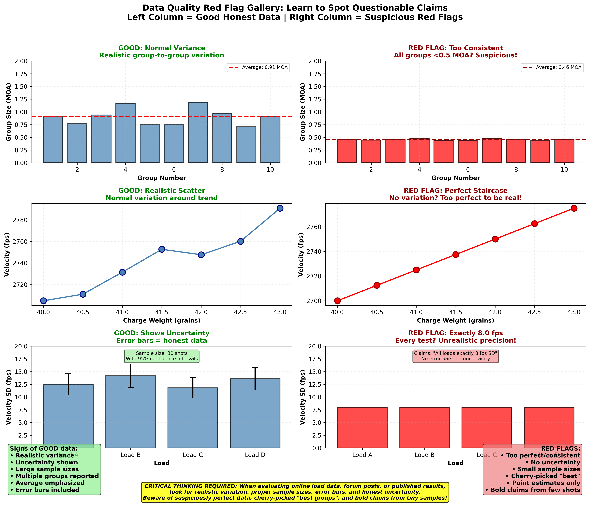

Time to complete: 10-15 minutes

# Peer Review Your Own Data

## The Hardest Person to Be Honest With Is Yourself

You've just completed a major test. Three different seating depths, 30 shots each. Hours at the range, hundreds of dollars in components. The data is in front of you.

And there it is—one seating depth clearly shot better. The groups were tighter, the velocity more consistent. You've found it. The sweet spot.

**Here's the question:** Before you post your results online or load 200 rounds at that seating depth, are you confident enough in this result to bet $500 it will repeat next week?

If your immediate reaction is **"Well... maybe I should test it one more time just to be sure,"** congratulations. You have good scientific instincts.

If your reaction is **"Absolutely! The data clearly shows it!"** you might be falling into the most dangerous trap in data analysis: **seeing what you want to see instead of what's actually there.**

This lesson is your defense against yourself. By the end, you'll have:
- A 10-question checklist to audit any reloading result
- A gallery of red flags that indicate self-deception
- A pre-registration template to prevent p-hacking
- Real examples of claims that failed peer review (and why)
- Tools to spot when you're fooling yourself

The hardest critiques to hear are the ones you give yourself. Let's build that skill.

---

## Why Self-Review Is Necessary

**Confirmation bias is powerful and universal.** Everyone has it. You can't eliminate it, but you can audit for it.

### Example: The Primer Test That Wasn't

Real story (anonymized):

Shooter tested two primers. Wanted to prove Primer A was better than the cheap Primer B he'd been using.

**Results:**
- Primer A: 5 five-shot groups averaging 0.8 MOA
- Primer B: 5 five-shot groups averaging 1.1 MOA

He posted online: "Primer A is clearly superior! Worth every penny."

**Someone asked:** "What were the individual group sizes?"

**His data:**
- Primer A groups: 0.6, 1.2, 0.7, 0.9, 0.6 MOA
- Primer B groups: 1.0, 1.4, 0.8, 1.2, 1.1 MOA

**The problem:** The "best" Primer A groups (0.6, 0.6 MOA) are the same as the best Primer B group (0.8 MOA). The worst Primer A group (1.2 MOA) overlaps with Primer B's middle groups.

**Statistical analysis:** With this sample size and variation, the difference is not statistically significant (p = 0.18). He got lucky with Primer A.

**He'd already loaded 500 rounds with expensive Primer A.** When retested properly, both primers performed identically.

**The cost of not self-reviewing:** $80 in primers, 500 rounds loaded, confirmation bias reinforced.

**What self-review would have caught:** "The groups overlap too much. I need more data before committing."

---

## The 10-Question Self-Audit Checklist

Before claiming success, run through this checklist. Be ruthlessly honest with each answer.

### 1. Did I Change Only ONE Variable at a Time?

**The question:** Between the two conditions I'm comparing, how many things changed?

**Common failures:**
- "I switched from Primer A + Powder A to Primer B + Powder B. Primer B is clearly better!" (You changed two variables)
- "I rebarreled and switched bullets. Groups shrank from 1.5 to 0.8 MOA!" (You changed two variables)
- "I tried a new load recipe from a forum. It shoots great!" (You changed everything)

**The problem:** You cannot isolate cause when multiple variables change.

**Pass criteria:**
- ONE variable changed between conditions
- Everything else held constant
- If multiple variables changed, you acknowledge you don't know which one mattered

**Example of proper isolation:**
```
Test: Federal 210M vs CCI BR-2 primers
Same: Powder, charge weight, bullet, brass, seating depth, rifle, shooter, conditions
Different: Primer only
Conclusion valid: Yes
```

### 2. Is My Sample Size Adequate for the Effect I'm Claiming?

**The question:** Did I shoot enough rounds per condition for the difference to be reliable?

**Rule of thumb:**
- **Comparing velocity SD:** 30+ shots per condition minimum
- **Comparing precision:** 30+ shots per condition minimum
- **Detecting small differences:** 50+ shots per condition
- **Testing "no difference"** (equivalence test): 40+ shots per condition

**Common failures:**
- "After 10 shots each, Primer A showed 8 fps SD, Primer B showed 12 fps. A wins!" (Inadequate sample)
- "I shot 3 groups of each bullet. Bullet A averaged 0.9 MOA, Bullet B averaged 1.2 MOA. A wins!" (Way too small)

**Pass criteria:**
- 30+ shots per condition for velocity measurements
- 30+ shots per condition for precision measurements
- More if claiming small differences

**Self-audit question:** "If I ran this test again tomorrow with the same setup, how confident am I (0-100%) the result would be similar?"
- <70%: Sample size inadequate
- 70-90%: Borderline, consider more data
- >90%: Probably adequate

### 3. Did I Account for Environmental Variables?

**The question:** Could something other than my variable explain the difference?

**Environmental factors that matter:**
- **Temperature:** Affects velocity and pressure
- **Wind:** Affects group centers and can enlarge groups
- **Mirage:** Affects shooter's ability to hold consistently
- **Time of day:** Affects shooter fatigue, optical effects from different sun position
- **Fouling:** Precision could change from shot 1-10 vs shot 10-50 (clean vs fouled bore)
- **Chronograph issues:** Battery dying, sensor alignment changes, inherent chronograph error

**Common failures:**
- Testing Load A in morning (cool, calm), Load B in afternoon (hot, windy)
- Testing before cleaning vs after cleaning
- Testing with fresh shooter vs fatigued shooter
- Barrel condition, is there a "carbon ring" in the throat/freebore?

**Pass criteria:**
- Tested conditions alternated (ABBAABBA pattern, not AAAABBBB)
- Environmental factors recorded and similar
- Or, acknowledged as limitation: "Tested sequentially, so can't rule out barrel heating effect"
- Keep track of barrel temperature during your shooting session over many sessions.  You may discover some suprising information that may change with each rifle!

**Red flag:** "I tested my new load and it shot way better than my old load did six months ago!" (Too many variables changed)

### 4. Am I Cherry-Picking Results?

**The question:** Am I reporting all data, or just the data that supports my conclusion?

**Common forms of cherry-picking:**
- Reporting best group instead of average
- Excluding "flyers" without clear criteria
- Stopping testing when you get a good result
- Ignoring sessions that didn't support your hypothesis

**The flyer problem:**

"I shot 30 rounds. 29 landed in 0.8 MOA, but one was 2 inches out. That's clearly a flyer—I must have pulled it. Without that flyer, this load is 0.8 MOA!"

**Reality check:** Did you KNOW you pulled it at the time? Or did you decide it was a flyer after seeing where it landed?

If you shoot enough 30-round groups from the same load, some will have "flyers." They're not flyers—they're the natural tail of the distribution.

**Pass criteria:**
- Report all groups, not just best
- Report average, best, and worst
- Outlier removal has pre-defined criteria ("I'll exclude shots with velocity >3SD from mean, which indicates chronograph error")
- Acknowledged when you excluded data and why

**Self-audit question:** "If someone asked to see ALL my data from this test, including the groups I didn't like, would I be comfortable sharing it?"

### 5. Would I Bet $500 This Result Will Repeat?

**The question:** How confident am I this isn't random luck?

We covered this in Lesson 10, but it's worth repeating here as a self-audit tool.

**The test:**
If someone offered you a bet—"I'll give you $500 if you can repeat this result next week within 20%, you pay me $500 if you can't"—would you take it?

**Pass criteria:**
- Yes, absolutely: Result is probably real
- Maybe, depends on the odds: Result is borderline
- No way: Result is probably noise

**This test combines:**
- Sample size (affects confidence)
- Effect size (big differences are more obvious)
- Your gut feeling about data quality

When in doubt, your gut usually knows.

### 6. Did I Inspect for Obvious Outliers or Errors?

**The question:** Does any data point look suspicious or impossible?

**Things to check:**
- Chronograph readings that seem unrealistic (2,650 fps then 2,850 fps then 2,670 fps)
- Groups where one shot is dramatically different from others
- Velocity strings with sudden jumps or drops
- Measurements that violate physics (SD larger than mean, negative values)

**Pass criteria:**
- Plotted data visually to spot anomalies
- Investigated any suspicious values
- Either confirmed they're real or excluded with documented reason
- Didn't just delete points because they didn't fit your expectation

**Example of proper outlier handling:**

```
Shot velocities: 2845, 2851, 2848, 2247, 2849, 2852
Notice: One reading (2247) is 600 fps below others

Investigation: Chronograph battery was dying, sensor misread
Action: Exclude 2247 fps with documented reason
Proper: Yes
```

**Example of improper handling:**

```
Shot velocities: 2835, 2851, 2848, 2867, 2849, 2852
Notice: One reading (2867) is high
Thought: "This ruins my low SD. It's probably a flyer."
Action: Delete 2867 fps
Proper: No (this is likely real variation, not error)
```

### 7. Did I Test Multiple Groups/Sessions Per Condition?

**The question:** Have I replicated this result, or is it from a single session?

**Why replication matters:**

Session-to-session variation includes:
- Different environmental conditions
- Different shooter form/fatigue
- Different ammunition from different places in the box
- Rifle fouling state
- Your mental state and focus

**Single session:** You only measured that ONE combination of all those factors.

**Multiple sessions:** You averaged across different conditions, getting closer to true performance.

**Pass criteria:**
- Tested each condition in 2-3 separate sessions
- Or, acknowledged limitation: "Single session results, needs replication to confirm"

**Common excuse:** "I don't have time/money for multiple sessions."

**Response:** Then you don't have time/money for confident conclusions. Either accept high uncertainty or invest in proper testing.

### 8. Is the Difference Larger Than My Measurement Precision?

**The question:** Is the improvement big enough to trust, or is it within noise?

**Measurement precision sources:**
- Chronograph: ±3-5 fps typical error
- Caliper for groups: ±0.02 inches
- Scale for powder: ±0.02 grains (or ±0.1 grains for cheaper scales)

**Rule of thumb:** If your claimed difference is smaller than 2x your measurement error, be skeptical.

**Examples:**

**Too small to trust:**
- "Load A gave 12.5 fps SD, Load B gave 11.8 fps SD. A wins!" (Difference: 0.7 fps, likely measurement noise)
- "Seating at 2.250" shot 0.92 MOA, seating at 2.260" shot 0.88 MOA. The second is better!" (Difference: 0.04 MOA, likely measurement noise)

**Large enough to trust (with adequate samples):**
- "Load A gave 18 fps SD, Load B gave 11 fps SD." (Difference: 7 fps, well above noise)
- "Bullet A shot 1.3 MOA, Bullet B shot 0.9 MOA." (Difference: 0.4 MOA, meaningful)

**Pass criteria:**
- Effect size > 2x measurement precision
- Or, if smaller, used very large samples to overcome noise
- Or, acknowledged: "Difference is small, might not be practically meaningful"

### 9. Have I Replicated This Result At Least Once?

**The question:** Did I shoot this load on multiple occasions with similar results?

**Replication standard:**
- Test once: Preliminary finding, high uncertainty
- Test twice: Moderate confidence if results agree
- Test three times: High confidence if all three are consistent

**Pass criteria:**
- Results replicated in 2-3 separate sessions
- Results show consistency (not identical, but similar pattern)
- Or, labeled as "preliminary, needs replication"

**Example of good replication:**

```
Session 1: Load A = 13.2 fps SD, Load B = 17.1 fps SD
Session 2: Load A = 14.1 fps SD, Load B = 16.8 fps SD
Session 3: Load A = 12.8 fps SD, Load B = 17.5 fps SD

Pattern: Load A consistently 3-4 fps tighter
Conclusion: Replicated, trustworthy
```

**Example of failed replication:**

```
Session 1: Load A = 9.5 fps SD, Load B = 15.2 fps SD ("A is way better!")
Session 2: Load A = 14.8 fps SD, Load B = 13.9 fps SD ("Wait, now B is better?")
Session 3: Load A = 12.1 fps SD, Load B = 14.6 fps SD ("Back to A?")

Pattern: No consistency
Conclusion: No reliable difference, loads are probably similar
```

### 10. Am I Letting the Data Speak, or Forcing It to Say What I Want?

**The question:** Am I being objective, or do I have an agenda?

**Warning signs of confirmation bias:**
- You wanted a specific result before testing
- You're defending the result against skeptics
- You're making excuses for data that doesn't fit
- You're adding post-hoc analyses to "fix" non-significant results

**The honest test:**

"If this data showed the OPPOSITE of what I wanted, would I accept it?"

**If yes:** You're being objective.

**If no:** You have confirmation bias.

**Pass criteria:**
- Approached test with genuine curiosity
- Would accept either outcome
- Not emotionally invested in one answer
- Willing to say "I was wrong" if data contradicts expectation

**The toughest self-audit:** This requires painful honesty. Most people can't do it without external accountability.

---

## The Red Flag Gallery

Here are patterns in data that should trigger skepticism:



**Figure 1:** Side-by-side comparison of trustworthy data presentations versus red flags that should trigger skepticism. The left column shows good scientific practice: realistic variance in groups, scatter in ladder tests, reasonable SD measurements with sample sizes, average groups reported with ranges, proper sample sizes declared, and error bars showing uncertainty. The right column shows red flags: suspiciously perfect sub-0.5 MOA groups every time, perfectly linear charge ladders with no scatter, too-good-to-be-true single-digit SDs from small samples, "best group" posted as capability, bold claims from inadequate 5-shot tests, and point estimates without uncertainty. Learning to recognize these patterns helps you spot questionable claims online and audit your own data for honest reporting.

### Red Flag #1: Too-Good-To-Be-True Standard Deviations

**The claim:** "After 10 shots, I got 4 fps SD!"

**Why it's suspicious:** With 10-shot samples from a load with true 12 fps SD, you'll see 4 fps SD about 2% of the time by pure luck.

**What to do:** Need 30+ shots to confirm this isn't random luck. If it doesn't repeat, the true SD is higher.

### Red Flag #2: Perfect Linearity in Charge Ladders

**The claim:** "Every 0.1 grain of powder increased velocity exactly 2 fps!" 
Note: I'm not talking about linear relationship of charge weight to velocity.

**Why it's suspicious:** Real data has noise. Perfect patterns usually indicate:
- Fabricated data (intentional or unintentional fudging)
- Measurement artifact
- Cherry-picked samples

**What to expect:** Real charge ladders show general trends with scatter around the line.

### Red Flag #3: No Variation Across Groups

**The claim:** "All five 5-shot groups measured exactly 0.8 MOA!"

**Why it's suspicious:** Even from a perfectly consistent rifle, group sizes vary. Five identical groups from five samples is astronomically unlikely.

**What to expect:** Groups should vary. A true 0.8 MOA load might produce groups of 0.6, 0.9, 0.7, 1.0, 0.8 MOA.

### Red Flag #4: Dramatic Improvements From Tiny Changes

**The claim:** "I changed seating depth by 0.005" and groups shrank from 1.2 to 0.6 MOA!"

**Why it's suspicious:** Seating depth CAN matter, but 0.005" creating a 50% improvement is very unlikely unless you're shooting VLDs at extreme distance.

**More likely:** You got lucky with the 0.6 MOA group. The loads probably perform similarly.

### Red Flag #5: Conclusion Changes With Every New Test

**Pattern:** Every time you test, a different component "wins."

**Why it's suspicious:** If results aren't consistent, either:
- Sample sizes too small (random noise dominates)
- No real difference between options
- Experimental conditions not controlled

**What to do:** Need much larger samples, or accept that differences are too small to reliably detect.

### Red Flag #6: Cherry-Picked Results and Selective Reporting

**The claim:** "I found the perfect seating depth! Here's my best group showing 0.5 MOA!"

**What's missing:** How many groups did you shoot? What were the other group sizes? How many seating depths did you test? How many times did you retest the "winner"?

**Why it's suspicious:** Real interactions between components and firearms DO exist—but the only way to find them is through proper testing. When someone posts exceptional results without:
- Showing all the data (best, average, and worst groups)
- Reporting the full testing procedure (how many trials, sample sizes)
- Demonstrating replication (did it repeat across sessions?)

...they're likely sharing a lucky statistical outlier, not a reproducible result.

**The cherry-picking pattern:**
- Test 5 seating depths with 3-shot groups each (15 shots total)
- One depth produces a lucky 0.5 MOA group
- Post that group online as evidence
- Don't mention the other four depths or the full range of group sizes
- When retested, that "perfect" depth performs like all the others

**What proper reporting looks like:**
- "Tested 4 seating depths with 30 shots each (120 shots total)"
- "Seating at 0.020" averaged 0.92 MOA (range: 0.7-1.2 MOA)"
- "Seating at 0.040" averaged 0.89 MOA (range: 0.7-1.1 MOA)"
- "Retested the 0.040" depth in three separate sessions—consistently averaged 0.9 MOA"
- "Statistical comparison shows no significant difference (p = 0.31)"
- "Conclusion: Seating depth doesn't meaningfully affect precision for this bullet/rifle combo"

**Self-audit question:** "Am I posting my best result, or my representative result? Would I be comfortable sharing ALL the data I collected, including the parts that don't support my conclusion?"

**Remember:** The reason exceptional results get shared online is survivorship bias. Out of 100 shooters testing with small samples, ~20 will get lucky and see dramatic "improvements" that won't replicate. Those 20 enthusiastically share their success. The 80 who got inconclusive results stay quiet. This creates a distorted record where lucky outliers look like proven methods.

**Interactive Element Placeholder:**
```python
# Interactive: "Spot the Red Flag"
#
# Present 5 scenarios with data
# User identifies which (if any) are red flags
#
# Scenario 1:
# "I tested three bullets. Here are the results from 30 shots each:"
# Bullet A: 1.05 MOA mean radius
# Bullet B: 1.08 MOA mean radius
# Bullet C: 1.03 MOA mean radius
# "I'm going with Bullet C!"
#
# User answer: Red flag or legit?
# Reveal: RED FLAG - Differences are tiny (within measurement noise)
#
# Scenario 2:
# "I tested two seating depths with 15 shots each:"
# 0.020" off: 0.8 MOA
# 0.040" off: 1.3 MOA
# "The 0.020" is clearly better!"
#
# User answer: Red flag or legit?
# Reveal: RED FLAG - Sample size too small, need replication
#
# [3 more scenarios with mix of legitimate and suspicious claims]
#
# Aha moment: "I've been making claims based on data with these
# same red flags! I need to audit my previous conclusions."
```

---

## Pre-Registration: Committing Before Seeing Data

**The problem:** It's very tempting to adjust your analysis after seeing the data to get the result you want. This is called "p-hacking" or "data mining."

**The solution:** Decide your analysis plan BEFORE collecting data. Write it down. Stick to it.

### What to Pre-Register

**Before testing, write down:**

1. **Hypothesis:** "Primer A will produce lower SD than Primer B"

2. **Sample size:** "30 shots per primer, alternating pattern"

3. **Measurement:** "Velocity SD calculated from all shots, using chronograph at 15 feet"

4. **Analysis:** "Compare SDs using F-test, significance at p < 0.05"

5. **Decision criteria:** "If p < 0.05 and difference > 3 fps, switch to better primer. Otherwise, stick with cheaper option."

6. **Outlier handling:** "Exclude shots >3SD from mean, which indicates chronograph error, only if physically impossible (e.g., negative velocity)"

### What Pre-Registration Prevents

**Without pre-registration:**
- Test 30 shots, SD difference not significant
- "Hmm, what if I exclude those three high shots?"
- After excluding: Now significant!
- "Great! The effect is real!"
- **Problem:** You manipulated the analysis to get significance

**With pre-registration:**
- Test 30 shots, SD difference not significant
- Check pre-registration: No provision for excluding those shots
- **Honest conclusion:** "No significant difference detected with this sample size"

### Pre-Registration Template

```
=== PRE-REGISTRATION TEMPLATE ===

Date: ___________
Test name: ___________

HYPOTHESIS:
What do I expect to happen?

VARIABLES:
What am I changing: ___________
What I'm holding constant: ___________

SAMPLE SIZE:
Shots per condition: ___________
Number of conditions: ___________
Total shots: ___________

MEASUREMENT:
What I'm measuring: ___________
How I'm measuring it: ___________
Equipment: ___________

TESTING PROCEDURE:
Order of shots: ___________
Environmental controls: ___________
Breaks/pauses: ___________

ANALYSIS PLAN:
Statistical test: ___________
Significance level: ___________
Outlier criteria: ___________

DECISION CRITERIA:
What result would make me change my practice: ___________
What result would make me continue current practice: ___________

SIGNATURE: ___________

=== END TEMPLATE ===
```

**Use this template:** Print it. Fill it out BEFORE testing. Put it in your range bag. Follow it.

---

## Real Examples of Peer Review Failures

### Example 1: The Magical Tuner (Caught By Self-Audit)

**Original claim:** "I adjusted my barrel tuner and groups shrank from 1.2 to 0.6 MOA! Tuners are magic!"

**Self-audit questions triggered:**

Question 2: "Is my sample size adequate?"
- Only shot 3 five-shot groups before tuner, 3 after
- Sample size: Inadequate

Question 5: "Would I bet $500 this repeats?"
- Honest answer: "Um... probably not"
- Red flag triggered

**What happened:** Retest with 30 shots before, 30 after. Results: 1.0 MOA before, 1.05 MOA after. No real difference.

**Lesson:** Initial "improvement" was random variation from small samples.

### Example 2: The Primer Swap (Failed Peer Review)

**Original claim:** "Switched primers, SD dropped from 15 to 9 fps!"

**Peer reviewer asked:** "How many shots per primer?"

**Answer:** "Ten each."

**Peer review response:** "That's insufficient sample size. Also, did you alternate primers or test them sequentially?"

**Answer:** "Sequentially. Old primer first, then new primer."

**Peer review:** "So barrel was cold for old primer test, warm for new? And you're claiming new primer reduced SD by 40% based on 10-shot samples? This needs proper testing."

**Retest result:** 30 shots each, alternating. Old primer: 14.2 fps SD. New primer: 13.8 fps SD. Difference not significant.

**Lesson:** Sequential testing + small samples = confounded variables + high uncertainty.

### Example 3: The Brass Sorting Victory (Failed Multiple Audits)

**Original claim:** "I sorted brass by weight and SD dropped from 18 to 12 fps!"

**Audit failures:**

❌ Question 2: Sample size? "15 unsorted, 15 sorted" (Too small)
❌ Question 3: Environmental controls? "Tested six months apart" (Confounded)
❌ Question 7: Multiple sessions? "Just one test each" (Not replicated)
❌ Question 8: Larger than measurement precision? "6 fps difference with ±5 fps chronograph error" (Borderline)
❌ Question 10: Forcing a conclusion? "I'd spent 8 hours sorting brass, so it HAD to work" (Confirmation bias)

**What actually happened:** Powder lot changed between tests, different ammunition temperature, different chronograph battery state.

**Lesson:** Multiple audit failures = unreliable conclusion.

---

## The Uncomfortable Truth: Most Claims Don't Pass Audit

If you apply this checklist rigorously to reloading claims you see online, **most will fail multiple questions.**

That doesn't mean everyone is lying. It means:
- Most people don't know proper methodology
- Confirmation bias is powerful and universal
- Small sample testing is the norm (despite being unreliable)
- Results that don't pass audit still sometimes get lucky and work

**Your job:** Hold your own work to a higher standard than what you see online.

When you can honestly say, "My data passes all 10 audit questions," you've earned confidence in your conclusion.

When your data fails multiple questions, have the integrity to say, "Interesting preliminary result, but I need more data before I'm confident."

---

## Closing Thoughts: Scientific Integrity Starts With You

The peer review system in science works because:
1. Researchers submit their work for critique
2. Other experts examine it for flaws
3. Weak work gets rejected
4. Strong work gets published

**In reloading, you are the peer reviewer.** There's no journal editor checking your methodology. The only quality control is your own integrity.

This checklist is your internal peer review system. Use it. Every time. Even when the data looks good. **Especially** when the data looks good.

Because the sweetest victories are the ones that survive brutal self-audit.

And the most embarrassing moments are the ones where you posted a claim online, then couldn't replicate it the next week because you didn't audit your work first.

Be your own harshest critic. Future you will thank you.

> **Key Takeaways**
> - The hardest person to be objective with is yourself—confirmation bias affects everyone
> - The 10-question checklist catches most common errors: sample size, cherry-picking, confounding variables, inadequate replication
> - Red flags: Too-perfect data, dramatic improvements from tiny changes, results that change every test, claims that don't replicate
> - Pre-registration prevents p-hacking by committing to analysis plan before seeing data
> - Most online claims fail multiple audit questions—hold your own work to higher standards
> - Scientific integrity means being willing to say "inconclusive" when data is insufficient
> - The $500 bet heuristic is the ultimate reality check: would you risk money on this repeating?
> - Proper self-audit prevents embarrassment and wasted effort on false leads

---

## Coming Up Next

You've learned to test honestly, interpret correctly, and audit rigorously. There's one final question:

**"What about the pros? They use different methods. Why don't benchrest champions follow this advice?"**

**In Lesson 12**, we'll tackle:
- Why professional methods might not apply to hobbyists
- The equipment divide (and why it matters)
- Survivorship bias in success stories
- Skill vs. load development (which matters more)
- Why "good enough" is often better than "perfect"

The final lesson: Know when to stop optimizing and start shooting.

[Previous: 10 When Is A Result Real](10_When_Is_A_Result_Real.html) | [Next: 12 What About The Pros](12_What_About_The_Pros.html)
