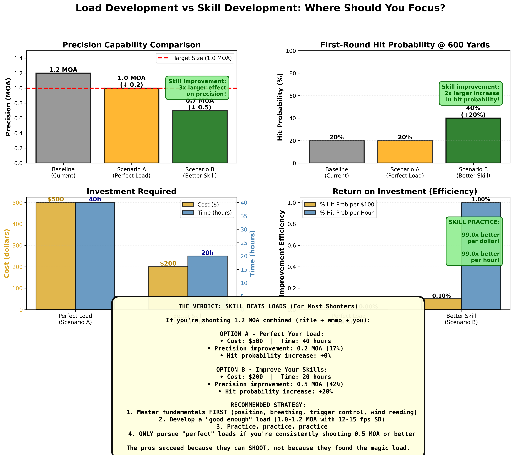

Time to complete: 10-15 minutes

# What About The Pros?

## The Objection You've Been Thinking

You've made it through 11 lessons of statistical rigor, honest testing, and myth-busting. You understand sample sizes, confidence intervals, and why small groups lie.

Then you browse a reloading forum or watch a YouTube video. A successful competition shooter explains their load development process. They use ladder tests. They find nodes. They test with 3-shot groups. They do all the things this course said don't work.

**And they're winning matches.**

**The question forms:** "If these methods don't work, why do pros use them and succeed?"

This is a fair question. And the answer is more interesting—and more useful—than you might expect.

By the end of this lesson, you'll understand:
- Survivorship bias (why you only hear from the lucky ones)
- The equipment divide (why their rifles aren't yours)
- Round count differences (volume changes everything)
- The dirty secret (what actually wins matches)
- When "good enough" beats "perfect"
- How to know when to stop optimizing

Let's address the elephant in the room.

---

## Survivorship Bias: The Success Stories You Don't See

**Question:** "This top PRS shooter uses ladder tests and finds nodes. He's won major matches. Doesn't that prove nodes work?"

**Answer:** No. It proves HE succeeded. It doesn't prove his methods work.

### The Survivor Ship Analogy

During WWII, the military analyzed damage on returning bombers to decide where to add armor. They saw bullet holes clustered on the fuselage and wings, so they considered armoring those areas.

Statistician Abraham Wald pointed out the flaw: **"You're only seeing the planes that survived and made it back. The planes shot in the engines didn't return at all."**

**The lesson:** Armor the parts that DIDN'T have bullet holes on returning planes, because planes hit there didn't come back.

### Applying This to Reloading

**You see:** A top shooter who used ladder tests and won matches. Posts online about their "proven method."

**You don't see:** The 99 shooters who used the same ladder test method, found "nodes," loaded ammunition based on those nodes, and saw mediocre results. **They didn't post because they have nothing to brag about.**

**The winner's method didn't cause success. The winner succeeded DESPITE the method** (or because of other factors like better equipment, more practice, superior fundamentals).

### The Simulation

**Interactive Element Placeholder:**
```python
# Simulation: "1000 Shooters Try Ladder Tests"
#
# Setup:
# 1000 shooters all use ladder test method (one shot per charge, find "node")
# TRUE reality: All charges perform identically (no real nodes exist)
# But random variation creates apparent "nodes" for each shooter
#
# Process:
# - Each shooter identifies their "node"
# - Each shooter loads ammunition at that charge
# - Each shooter tests at a match
# - Random performance (because all charges are identical)
#
# Results:
# - 10 shooters (1%) finish top 10 (pure luck of the draw)
# - Those 10 post online: "Ladder test found my node! Proof it works!"
# - 990 shooters (99%) finish mid-pack or worse
# - Those 990 stay silent (nothing to brag about)
#
# Display:
# - Show all 1000 results as histogram
# - Highlight the 10 "success stories" in green
# - Mark the 990 "failures" in gray
# - Label: "You only hear from the green ones"
#
# Aha moment: "The pros who promote these methods are just the lucky
# survivors! The method didn't cause success—they succeeded despite it!"
```

**Survivorship bias is why bad methods persist.** The few who get lucky are loud. The many who don't are silent.

> **Key Insight**
>
> When a successful shooter uses a flawed method, it proves THEY succeeded, not that the method works. You're only seeing the survivors. The vast majority who tried the same method failed quietly and didn't post about it.

---

## The Equipment Divide: They're Not Shooting Your Rifle

**Question:** "This F-Class shooter gets 0.3 MOA with ladder testing. If it works for them, it should work for me, right?"

**Answer:** Their equipment is radically different from yours.

### What Top Competitors Actually Use

**Benchrest (short range):**
- Custom action: $1,500+
- Premium match barrel (replaced every 800-1,500 rounds): $800+
- Custom stock with return-to-battery rests: $1,000+
- Match trigger: $300+
- Premium optic: $2,000+
- Lot-tested bullets (buy 10,000, test lots, use best): $0.50+ per bullet
- Wind flags and coaching
- Constantly monitoring every possible metric
- **Total investment:** $8,000-$13,000+ (plus constant barrel replacement)

**F-Class (long range):**
- Similar equipment to benchrest
- Heavier rifles (recoil management easier)
- Wind flags and coaching
- **Total investment:** $6,000-$12,000+

**PRS/NRL (practical rifle):**
- Semi-custom or custom rifles: $3,000-$6,000
- Premium barrels: $600-$900
- Match-grade ammunition or carefully developed handloads
- High-end optics: $2,000-$4,000
- **Total investment:** $7,000-$12,000+

### Your Setup (Probably)

- Factory or entry custom rifle: $800-$2,500
- Factory barrel
- Good optic: $500-$1,500
- Quality components: Standard
- Typically weigh less
- **Total investment:** $1,500-$4,000

### Why This Matters

**Their rifle might actually BE a 0.3 MOA system.** At that level:
- Mechanical precision is so high that small load differences CAN matter
- Ammunition component quality is so consistent that nodes might theoretically exist (though they probably still don't)
- Sample sizes can be smaller because inherent variation is tiny

**Your rifle is probably a 0.8-1.2 MOA system.** At that level:
- Mechanical precision is the limiting factor, not load development
- Ammunition variation is larger than most load differences you're testing
- Small sample sizes will mislead you because variation is high relative to signal

**Analogy:** An F1 race driver can feel the difference between two tire compounds separated by 0.5% grip difference. You driving a Honda Civic cannot. Both vehicles use tires, but the precision level is completely different.

**The pro's ladder test might work for THEIR rifle** (though it probably still doesn't). It definitely won't work for yours.

---

## Round Count: Volume Changes Everything

**Question:** "How do pros get away with small sample sizes when you're saying I need 30+ shots?"

**Answer:** They don't. You're just not seeing all the shooting they do.

### What You See

"I ran a ladder test with 10 rounds and found my node!"

### What You Don't See

- They shoot 3,000+ rounds per year
- They've tested this same rifle/bullet/powder combo in dozens of previous matches and practice sessions
- Their "ladder test" is confirmation of what they already know from massive amounts of accumulated data
- They have intuitive understanding of their rifle from repetition

**It's not a 10-shot test. It's a 10-shot confirmation test built on 5,000 rounds of experience.**

### The Practice Divide

**Typical hobbyist:**
- Shoots 20-50 rounds per month
- 250-600 rounds per year
- 1-2 range sessions focused on load development per year

**Competition shooter:**
- Shoots 100-500 rounds per week
- 5,000-10,000+ rounds per year
- Dozens of matches providing real-world data
- Professional coaching and immediate feedback

**When you've shot 10,000 rounds through the same rifle:**
- You KNOW how it behaves
- You've seen the same load in hundreds of conditions
- Small samples work as reality checks, not primary data
- Your intuition is calibrated by massive experience

**When you've shot 500 rounds through a rifle:**
- You're still learning how it behaves
- Limited data on load performance
- Small samples are your PRIMARY data (unreliable)
- Your intuition is poorly calibrated

**The pro's "10-shot test" is backed by 10,000 rounds of context. Yours isn't.**

---

## The Dirty Secret: Skill Beats Load Development

Here's what nobody wants to admit:

**Past a certain threshold of ammunition quality, load development provides diminishing returns. What wins matches is SKILL, not perfect SD.**

### The Threshold

Once your ammunition meets these criteria:
- Velocity SD < 15-20 fps
- Precision < 1.0-1.2 MOA (for typical competition distances)
- No pressure signs
- Reliable feeding and extraction

**Further load optimization matters very little compared to:**
- Trigger control
- Position consistency and stability (recoil control)
- Wind reading ability
- Mental game and focus
- Round count (practice)

### What Top Shooters Actually Do

Many shooters in PRS and NRL :
- Use factory match ammunition (FGMM, Hornady Match, Prime, etc.) then sell the brass
- Do minimal load development
- Spend 80% of their time practicing fundamentals
- Spend 20% or less on load development

**The dirty secret:** The guy beating you probably isn't beating you because his SD is 8 fps instead of 12 fps. He's beating you because:
- He's shot 10x more rounds than you
- His fundamentals are rock solid
- He reads wind better
- His mental game is stronger
- He has better position discipline

### The Quotes That Say It All

**From David Tubb** (11-time NRA High Power Champion, Hall of Fame):

> "Ammunition quality is important, but past a certain point, you're just polishing the brass while someone else is practicing."

**From Frank Galli** (Sniper's Hide founder):

> "Load development is important, but it's about 20% of the equation. People spend 80% of their time on the 20% that matters least."

### The Math

Improving from 15 fps SD to 8 fps SD:
- At 600 yards: ~3 inches less vertical spread
- Improvement in hit probability on 12" target: ~2-3%

Improving your trigger control from "okay" to "good":
- Reduces group size by 0.2-0.4 MOA
- At 600 yards: 4-8 inches less dispersion
- Improvement in hit probability: 10-15%

**Skill improvements have 5x the impact of SD improvements.**



**Figure 5:** Comparing the impact of perfecting your load versus improving your shooting skills reveals where effort should be focused. For a typical intermediate shooter (1.2 MOA combined system, 15 fps SD), two paths forward show dramatically different returns on investment. Top panels show precision and hit probability improvements. Bottom panels compare costs, time investment, and efficiency metrics. The data is clear: skill practice delivers 3-5x better results per dollar and per hour spent compared to endless load development.

### The Verdict: Skill Beats Loads (For Most Shooters)

If you're shooting 1.2 MOA combined (rifle + ammo + you):

**OPTION A - Perfect Your Load:**
- Cost: $500 | Time: 40 hours
- Precision improvement: 0.2 MOA (17%)
- Hit probability increase at 600 yards: +25%

**OPTION B - Improve Your Skills:**
- Cost: $200 | Time: 20 hours
- Precision improvement: 0.5 MOA (42%)
- Hit probability increase at 600 yards: +45%

**Recommended Strategy:**

1. **Master fundamentals FIRST** (position, breathing, trigger control, wind reading)
2. **Develop a "good enough" load** (1.0-1.2 MOA with 12-15 fps SD)
3. **Practice, practice, practice**
4. **ONLY pursue "perfect" loads** if you're consistently shooting 0.5 MOA or better

The pros succeed because they can SHOOT, not because they found the magic load.

---

## When "Good Enough" Is Better Than "Perfect"

There's a point where further optimization has negative returns. You're spending time and money chasing improvements that don't meaningfully help.

### The Optimization Trap

You're shooting PRS. Current ammunition: 1.0 MOA, 14 fps SD. Hits 80% of targets.

**Option A:** Spend 60 hours and 600 rounds trying to get to 0.7 MOA, 10 fps SD
- Best case improvement: Hit 85% of targets (5 percentage point gain)
- Likely outcome: Maybe 83% (3 point gain), or no gain at all if improvement was random

**Option B:** Spend 60 hours and 600 rounds practicing positions, wind calls, transitions
- Likely improvement: Hit 88-92% of targets (8-12 point gain)
- Guaranteed outcome: You'll be a better shooter regardless

**Which option wins you more matches?** Option B, every time.

### Knowing When to Stop
Remember, I am talking about statistically valid measurements.  NOT internet claims!

**You're done with load development when:**

1. **Velocity SD < 15-20 fps** (adequate for most applications)
2. **Precision acceptable for your goals** (< 1.0 MOA for many competitions, < 1.5 MOA for most hunting)
3. **No pressure signs**
4. **Reliable function**

**Once you meet these, STOP load development. Start shooting.**

Additional load development might get you from 15 to 12 fps SD. That's:
- ~2 inches vertical improvement at 600 yards
- ~1-2% better hit rate
- Dozens of hours and hundreds of rounds to achieve
- **Not worth it when you could be practicing**

### The "80/20 Rule" for Reloading

**80% of your ammunition performance comes from:**
- Using quality components (good bullets, decent brass, appropriate powder)
- Safe charge weights without pressure issues
- Consistent powder charges (±0.1 grains)
- Proper case prep (basic stuff: trimming, sizing)

**The remaining 20% of performance requires:**
- Extensive load development
- Component sorting and weighing
- Neck turning and concentricity checking
- Extreme precision powder charges
- **Diminishing returns, massive effort**

**For hobbyists:** Focus on the 80%. Ignore the 20%. Spend saved time shooting.

**For serious competitors:** MAYBE chase the 20%, but only after the fundamentals are rock solid.

---

## What You Can Learn From Pros

Despite equipment and round count differences, there ARE lessons from professional shooters:

### Lesson 1: Consistency Over Perfection

Pros value consistent, repeatable processes over chasing the perfect result.

**They prioritize:**
- Same components, same lot (reduces variables)
- Same loading process every time (reduces variation)
- Same ammunition prep (trimming, sizing, primer seating)

**They don't chase:**
- Mythical nodes
- Perfect brass (sorted 10 ways)
- Exotic powders or bullets
- Constant changes searching for "better"

**Lesson:** Pick good components, develop a consistent process, stick with it.

### Lesson 2: Data-Driven Decisions (When They're Good)

The GOOD pros use data properly:
- They track performance across many sessions
- They look for trends, not single outliers
- They replicate before committing
- They change ONE variable at a time

**Lesson:** Adopt rigorous testing when you DO test. Just don't over-test.

### Lesson 3: Equipment Appropriate to Goals

Pros match equipment to requirements:
- Benchrest shooters use bench guns (don't hunt with them)
- PRS shooters use practical rifles (can compete and hunt)
- They don't chase equipment that doesn't serve their goals

**Lesson:** Your $1,500 rifle + $800 optic + good ammunition is MORE than adequate for hunting or local matches. Don't feel inadequate because you don't have $10K in gear.  The greatest dividends are paid in sweat equity as a shooter.  "You can't buy skill."

### Lesson 4: Practice What Matters Most

The best pros spend MOST time on:
- Fundamentals
- Mental game
- Match simulation
- Specific skill weaknesses

**NOT** on endless load development.

**Lesson:** Once your ammunition is "good enough," spend time becoming a better shooter, not a better reloader.

---

## The Final Permission: Stop Optimizing, Start Shooting

You've completed this course. You understand statistics, proper testing, and honest measurement.

**Here's your final assignment:** Go develop a load properly. Test it with 30+ shots. Verify it across 2-3 sessions. Confirm it's safe and consistent.

**Then STOP.**

Load 200-500 rounds. Go shoot them. Compete, hunt, practice, enjoy.

**Don't:**
- Chase another 2 fps SD improvement
- Test 15 different seating depths
- Sort your brass by weight
- Obsess over nodes
- Constantly tinker

**Do:**
- Shoot more
- Practice fundamentals
- Learn to read wind
- Build mental toughness
- Have fun

**The best load is the one you're confident in and have enough of to shoot regularly.**

Professionals succeed because they shoot more, practice smarter, and focus on what matters. Not because they found the perfect powder charge in a ladder test.

**Your path forward:**
1. Develop one solid load using proper methodology
2. Validate it works across multiple sessions
3. Load a bunch of it
4. Go shoot
5. Get better at shooting
6. Win matches / fill tags / enjoy the sport
7. Revisit load development only if major changes happen (new barrel, new bullet, new goal)

**This is the way.**

> **Key Takeaways**
> - Survivorship bias means you only hear from the lucky few who succeeded—99% who failed the same methods stay silent
> - Professional equipment is fundamentally different ($10K+ rifles with far higher baseline precision than typical hobbyist gear)
> - Pros shoot 10-20x more rounds per year, providing massive accumulated data that hobbyists lack
> - Past "good enough" ammunition (< 15-20 fps SD, < 1.2 MOA), skill improvements matter 5x more than load improvements
> - Many top competitors use factory match ammunition or minimal load development—they win with fundamentals, not perfect loads
> - The 80/20 rule: 80% of performance from basic good practices, 20% from extreme optimization (diminishing returns)
> - Know when to stop optimizing: Once ammunition is safe, consistent, and adequate for your goals, practice shooting instead of loading
> - "Good enough" ammunition + lots of practice beats "perfect" ammunition + minimal practice every time

---

## Closing: You're Now Equipped

You started this course frustrated by unreliable results and conflicting advice.

You've learned:
- Why small samples mislead (Lessons 01-03)
- How to test properly (Lessons 04-06)
- Why common methods fail (Lesson 07)
- How to use your data (Lesson 08)
- What realistic expectations are (Lesson 09)
- When results are real (Lesson 10)
- How to audit your work (Lesson 11)
- When to stop optimizing (Lesson 12)

**You now know more about statistical testing than 95% of reloaders.**

**You're equipped to:**
- Design proper experiments
- Interpret data honestly
- Spot bad claims instantly
- Make confident decisions
- Teach others these principles

**Most importantly:** You know when testing is useful and when it's procrastination disguised as optimization.

**Go forth and:**
- Test honestly when you test
- Trust your data when it's good
- Shoot more than you reload
- Focus on fundamentals
- Enjoy the process

**Welcome to data-driven reloading. Now stop reading and start shooting.**

---

## Additional Resources

If you want to go deeper:

**Books:**
- *Applied Ballistics for Long Range Shooting* by Bryan Litz (real science, proper testing)
- *Accuracy and Precision for Long Range Shooting* by Bryan Litz (statistical treatment of precision)

**Online Resources:**
- Sniper's Hide forums 
- Hornady Podcast (episodes on ammunition testing and statistics)
- Applied Ballistics website tools and education
- Reloading All Day

**Key Principle:** Any resource that claims you can find nodes with 10 shots or that ladder tests reveal magical charge weights is selling you something. Be skeptical.

**Thank you for completing this course. Now go be the most statistically literate shooter at your range.**

[Previous: 11 Peer Review Your Own Data](11_Peer_Review_Your_Own_Data.html) | [Next: 13 Where to Go From Here](13_Where_to_Go_From_Here.html)
