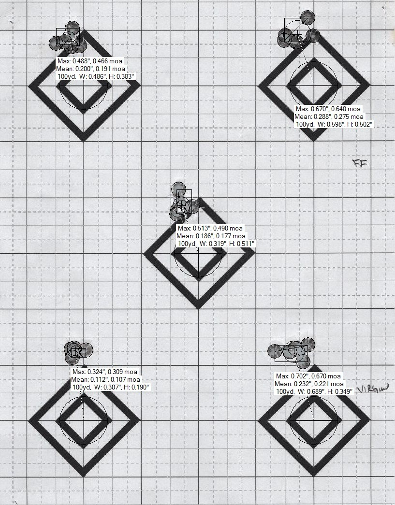
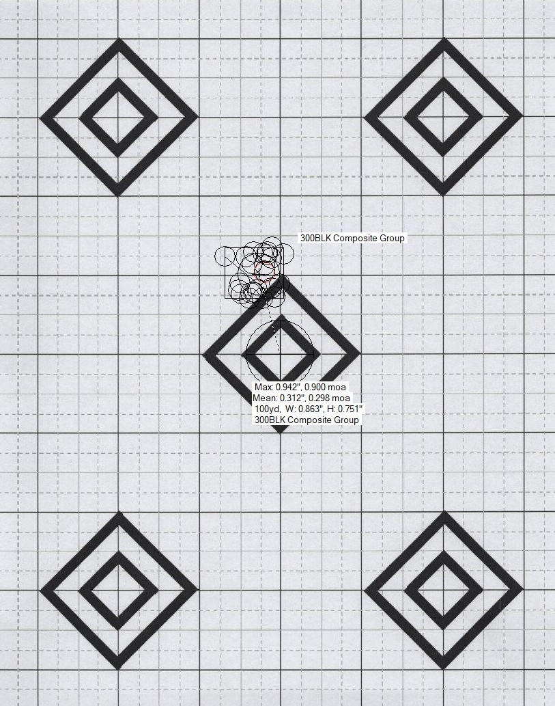

Time to complete: 10 minutes

**Prerequisites**: Understanding of group analysis (Lessons 01-02) and sample sizes (Lesson 03)

# Appendix C: Composite Groups

## Introduction

Composite groups let you combine separate groups (shot at different aiming points) into one combined group that shows your overall precision pattern.

**The key feature**: Each shot keeps its distance from its original aiming point. This gives you a complete picture of how your shots spread without losing any data.

**Why does this matter?**

If you shoot 30 rounds at the same aiming point, later bullets destroy earlier ones. You lose data. You can't see individual impacts. This is called "shooting out the group" or creating "keyholes."

**Solution**: Shoot 6 groups of 5 shots at different aiming points. Then combine them mathematically by aligning their centers. Now you have 30 usable data points showing your rifle's true spread pattern.

**Everyday Analogy**: Imagine throwing darts at a dartboard. Throwing all 30 at one bullseye means later darts stick into earlier ones, and you can't measure each throw. Instead, throw 5 at each of 6 different dartboards, then measure each dart from its own bullseye. Overlay those measurements as if aimed at one point. That's a composite group.  You preserve each throw's data while seeing your overall consistency.

This is especially useful when testing multiple loads, seating depths, or powder charges—situations where you need large sample sizes (remember Lesson 03) but don't want to destroy your target data.

## What Are Composite Groups?

In traditional group analysis, each group is evaluated separately. If you shoot Group A at one aiming point and Group B at another, you can't directly compare their overall spread patterns because the centers are at different locations on the target.

Composite groups solve this by:
- Combining all shots into one dataset
- Preserving each shot's position relative to its original group center (its own aiming point)
- Creating a combined view of your total spread pattern

Think of it as "translating" each group so all the centers align, then overlaying them.

## What Composite Groups DO and DON'T Do

**Composite groups help you:**

- ✓ Get large sample statistics without destroying target data (shoot 6 groups of 5 instead of 1 group of 30)
- ✓ Visualize overall precision across multiple sessions or aiming points
- ✓ Preserve individual shot data for accurate measurement
- ✓ Achieve the 30+ shot requirement from Lesson 03 without "shooting out the group"

**Composite groups DON'T:**

- ✗ Make small samples statistically valid 
- ✗ Help you compare different loads unless you create a separate composite for EACH load with equal sample sizes
- ✗ Replace proper sample sizes you still need 30+ total shots across all groups combined

**Critical Misconception to Avoid:**

❌ **WRONG**: "I shot 3-shot groups of Load A and Load B at different aiming points, created composites, and Load A's composite is smaller, so Load A is better!"

**Problem**: You still only have 3 shots per load at each condition—not enough to detect real differences (Lesson 03).

✅ **RIGHT**: "I shot 30 rounds of Load A (as 6 groups of 5) and 30 rounds of Load B (as 6 groups of 5), created composite groups for each load, and now I can reliably compare them."

**Remember from Lesson 03**: Sample size requirements don't change just because you combine groups differently. You still need 30+ shots total to reliably measure your rifle's precision.

## Visual Example



*Above: Three separate 5-shot groups, each centered on different aiming points. Each group looks tight individually.*



*Above: The same 15 shots combined into a composite group. The computer has "moved" each group so all centers align, showing total spread pattern while preserving each shot's distance from its original aiming point. This reveals your rifle's overall precision across all shots.*

### Why This Matters: Real Data

In Lesson 01, we show actual range data that perfectly demonstrates why composite groups are essential. Five 5-shot groups from a .300 BLK rifle measured:
- Smallest group: **0.324"**
- Largest group: **0.702"** (2.16× larger!)
- 25-shot composite: **0.924"** ES, **0.312"** MR

**The problem**: If you'd shot only one of those groups, you'd have been wildly misled about your rifle's precision.

**The solution**: Composite groups revealed the truth. This rifle shoots around 0.88-0.94 MOA with this load, with a Mean Radius of 0.312" (a more reliable metric than ES, as discussed in Lesson 06).

This wasn't a custom precision rifle. Budget $400 rifle, $300 budget optic, factory chamber, NO modifications - like NONE at all. Yet the individual 5-shot groups varied by more than 2:1. **Small samples consistently lie** and composite groups or aggregate groups reveal the truth.

For the complete analysis of this data and why small samples are unreliable, see [Lesson 01: Real Data - Confirming the Simulation at the Range](01_The_Biggest_Lie_in_Reloading_Testing.html#real-data-confirming-the-simulation-at-the-range).

## How to Create Composite Groups

The most efficient way to create composite groups is using target analysis software. OnTarget TDS is the most popular option, but alternatives exist (see below).

### Method 1: Using OnTarget TDS (Recommended)

OnTarget TDS includes a "Virtual Group" or "Composite Group" feature that automatically combines multiple groups while preserving individual aiming points.

**Software Information:**
- **Website**: [OnTarget Shooting](https://ontargetshooting.com/ontarget-tds/)
- **Cost**: $34.99 (15-day free trial available)
- **Platforms**: Windows
- **Key Feature**: Automated target scanning and composite group creation

**Step-by-Step Process:**

#### 1. Shoot Your Groups
- Shoot multiple small groups at different aiming points (6 or more groups of 5 shots = 30+ total)
- Use separate aiming points on one target or multiple targets
- Ensure good lighting and contrasting target for scanning

#### 2. Scan or Photograph Your Target(s)
- High-quality scan (300+ DPI recommended) or clear photo
- Ensure target is well-lit with minimal shadows
- Save as JPG or PNG

#### 3. Import into OnTarget TDS
- Open OnTarget TDS
- File → Open Image (or drag image into window)
- Software will attempt to auto-detect bullet holes
- Review and correct any missed or false detections

#### 4. Define Individual Groups
- Click shots belonging to first group
- Right-click → "Create Group" (or use toolbar button)
- Label clearly ("Load_A_Group_1", "42.5gr", etc.)
- Repeat for each group on your target

#### 5. Create the Composite/Virtual Group
- Select multiple groups (Ctrl+click or Shift+click)
- Right-click → "Create Virtual Group" or "Create Composite Group"
- **CRITICAL**: Ensure software retains individual centers (default behavior in TDS)
- Name descriptively ("Load_A_30shot_Composite")

#### 6. View Statistics
The composite group now shows combined statistics:
- **Extreme Spread (ES)**: Maximum distance between any two shots
- **Mean Radius (MR)**: Average distance from center (more reliable—see Lesson 06)
- **Total shot count**: Verify this matches your expected total
- **Visual overlay**: See all shots as if aimed at same point

#### 7. Verification Checklist
- [ ] Total shots in composite = sum of individual groups
- [ ] Each shot appears exactly once
- [ ] Group centers were retained (not combined to common center)
- [ ] Statistics look reasonable (no extreme outliers from measurement error)

**Efficiency Tips:**
- Save your project file (.otds) to preserve group definitions
- Use consistent naming: Load_Primer_Group# makes analysis easier
- Take notes in the "Notes" field for each group (conditions, temperature, etc.)
- Export images with annotations for sharing or record-keeping

### Method 2: Manual CSV Method (For Advanced Users)

If you measure targets manually with calipers:

#### 1. Measure Each Shot
- Record X/Y coordinates from center of each group
- Use consistent measurement units (inches, mm)
- Record which group each shot belongs to

#### 2. Create CSV File
Required columns (exact names matter for import):
```
Group, Shot, Point_X, Point_Y
Load_A_Grp1, 1, 0.25, -0.10
Load_A_Grp1, 2, -0.15, 0.30
Load_A_Grp2, 1, 0.10, 0.20
...
```

#### 3. Import to OnTarget TDS
- Tools → Import Point Data
- Select your CSV file
- Map columns if needed
- Groups will be created automatically based on "Group" column

#### 4. Create Composite
- Follow steps 5-7 above

### Method 3: Alternative Software

**Other Software with Composite Capability:**
- **TargetScan** (iOS/Android app): Basic composite features
- **Orion Scoring System**: Professional-grade, expensive
- **R shotGroups package**: Free, requires coding knowledge
  - Can import OnTarget TDS export files
  - Full statistical analysis capabilities
  - Reference: [shotGroups CRAN package](https://cran.r-project.org/web/packages/shotGroups/)

**DIY Spreadsheet Method** (if no software available):
1. Measure all X/Y coordinates manually
2. In Excel/Google Sheets:
   - Keep all shots' coordinates
   - Calculate overall mean X and mean Y
   - Calculate distance of each shot from overall mean
   - Compute statistics (ES, MR, SD) on combined dataset
3. Create scatter plot with all points
4. Manual but functional for understanding the concept

## When to Use Composite Groups

### Ideal Applications

**1. Single Load Precision Assessment (30+ total shots needed)**
- You want to know your rifle's true precision with a specific load
- Shooting 30+ rounds at one aiming point would destroy the target
- Solution: Shoot 6 groups of 5 shots (or 3 groups of 10), create composite
- Gives you reliable statistics without losing individual bullet information

**2. Load Development with Adequate Samples**
- Testing 3 different powder charges
- Shoot 30 rounds of each charge (as 6 groups of 5 per charge)
- Create separate composites: Charge_A_composite (30 shots), Charge_B_composite (30 shots), Charge_C_composite (30 shots)
- Now you can reliably compare them (see Lesson 04 on testing one thing at a time)

**3. Seating Depth Testing**
- Testing 4 seating depths (e.g., 0.010", 0.020", 0.030", 0.040" off lands)
- Shoot 30 rounds at each depth (as 5 groups of 6 shots per depth)
- Create 4 composites, one per depth
- Compare with proper sample sizes (see Lesson 07)

**4. Long-Term Precision Tracking**
- Shoot 5-shot groups each range session over several months
- Combine all groups into a composite to see overall rifle consistency
- Useful for tracking barrel life, confirming ammunition lot consistency
- Related to concepts in Lesson 09 (Reasonable Expectations)

**5. Multi-Session Testing**
- Can't shoot 30 rounds in one session (time, fatigue, barrel heating)
- Shoot 10 rounds per session over 3 sessions
- Composite gives you the 30-shot statistics you need
- Be aware: introduces more variables (see Common Mistakes below)


## Common Mistakes to Avoid

### Mistake 1: Using "Common Center" Instead of "Retain Individual Centers"

**Problem**: Some software offers a "common center" option that moves all shots to a single calculated center point. This destroys the composite group concept.

**Why it matters**: Each shot should maintain its distance from its ORIGINAL aiming point, not be recalculated to a new combined center.

**Fix**: In OnTarget TDS, the default behavior is correct (retains individual centers). In other software, ensure you select "retain individual group centers" or "preserve aiming points."

**How to verify**: After creating composite, total ES should be larger than any individual group's ES. If composite ES equals or is smaller than individual groups, you likely used common center by mistake.

### Mistake 2: Mixing Conditions That Shouldn't Be Mixed

**Don't composite together:**
- Groups shot in significantly different weather (40°F vs 90°F)
- Groups shot by different shooters (unless studying shooter variation specifically)
- Groups shot before and after scope adjustment
- Groups with different ammunition lots (unless studying lot variation)
- Groups with intentionally different loads (comparing powder charges)

**Why**: Composite groups show overall precision for a SINGLE condition. Mixing conditions creates a meaningless "everything averaged together" number.

**Correct approach for comparing conditions**: Create separate composites for each condition, then compare the composites.

### Mistake 3: Thinking Composite Groups Bypass Sample Size Requirements

**Myth**: "I only shot 3-shot groups, but compositing 10 of them gives me a 30-shot group, so now it's statistically valid!"

**Reality**: While you do get 30 total data points, if you're trying to find the "best" charge weight and only shot 3 rounds at each charge, you still can't tell which charge is truly better (Lesson 03 and Lesson 05).

**Composite groups help with**: Measuring the precision of ONE load with adequate total sample
**They don't help with**: Comparing multiple loads when each load has insufficient samples

### Mistake 4: Forgetting to Document Which Groups Went Into the Composite

**Problem**: Six months later, you have a composite labeled "Load_A" but can't remember which shooting session(s) it came from, what the conditions were, or which groups were included.

**Fix**: Use descriptive naming and take notes:
- Good: "308_Varget_42.5gr_CCI200_30shots_10Oct2024"
- Bad: "Composite_1"
- Include in notes: Date, temperature, barrel condition, brass lot, load information, etc.

### Mistake 5: Not Verifying the Composite Was Created Correctly

**Always check:**
- [ ] Shot count: Does composite total = sum of individual groups?
- [ ] No duplicate shots: Each point appears once
- [ ] Reasonable statistics: ES/MR make sense given individual groups
- [ ] Visual check: Does the overlay pattern look correct?


## Real-World Application: Load Development Done Right

**Scenario**: You're developing a load for your .308 bolt gun. You want to test three powder charges (42.0gr, 42.5gr, 43.0gr) to find which gives best precision.

**Wrong Approach** (violates Lesson 03):
- Shoot 5-shot groups at each charge
- Pick the charge with the smallest group
- Problem: 5 shots isn't enough (Lesson 01 explains why)

**Better Approach Using Composites**:

1. **Prepare ammunition**: Load 30 rounds at each charge weight (90 rounds total)

2. **Shoot systematically**:
   - For each charge weight, shoot 6 separate 5-shot groups at different aiming points
   - Randomize order to control for barrel heating, fouling, etc. (Lesson 04)
   - Take breaks to prevent fatigue

3. **Create composites**:
   - Import all targets into OnTarget TDS
   - Create composite for 42.0gr (combining all six 5-shot groups = 30 shots)
   - Create composite for 42.5gr (combining all six 5-shot groups = 30 shots)
   - Create composite for 43.0gr (combining all six 5-shot groups = 30 shots)

4. **Compare statistics**:
   - Compare Mean Radius for each composite (Lesson 06: why MR is better than ES)
   - Calculate confidence intervals (Lesson 10)
   - Look for meaningful differences (not just which is smallest)

5. **Result**: You now have statistically valid comparison between three loads, with 30 shots per load and preserved target data.

**Benefits of this approach**:
- Adequate sample size (30 per load)
- Preserved individual shot data (no keyholes)
- Controlled variables (Lesson 04)
- Reliable statistical comparison (Lesson 10)
- Clear documentation for future reference

## Statistical Considerations

### What Composite Groups Preserve
- **Overall Extreme Spread (ES)**: Maximum distance between any two shots across all groups
- **Overall Mean Radius (MR)**: Average distance from combined center (preferred metric—Lesson 06)
- **Total shot count**: For calculating confidence intervals
- **Visual dispersion pattern**: See the full spread

### What Changes or Is Lost
- **Individual group statistics**: You can't get per-group ES/MR after compositing (save these before combining)
- **Group-to-group variation**: Can't study whether one group was an outlier
- **Temporal patterns**: If groups were shot in sequence, time-based trends are harder to see

### Sample Size Reminder (Critical!)

Creating a composite doesn't change sample size requirements from Lesson 03:

| Purpose | Minimum Total Shots | How to Achieve with Composites |
|---------|-------------------|-------------------------------|
| Estimate rifle precision | 30+ shots | 6 groups of 5, or 3 groups of 10 |
| Compare two loads | 30+ per load | 6 groups of 5 per load (60 shots total) |
| Detect small differences | 50+ per load | 10 groups of 5 per load (100 shots total) |

**Key point**: The 30-shot requirement is for the TOTAL across all groups in the composite, not 30 shots per individual group.

## Key Takeaways

✓ **Composite groups solve the keyhole problem**: Get 30+ shot statistics without destroying target data

✓ **Preserve individual centers**: Each shot keeps its distance from its original aiming point—this is critical

✓ **Sample size requirements still apply**: Compositing doesn't make 3-shot groups suddenly reliable

✓ **One composite per condition**: If comparing loads, create separate composites with equal sample sizes

✓ **Document thoroughly**: Future you will thank present you for clear naming and notes

✓ **Verify your work**: Check that shot counts add up and statistics make sense

**When to use composite groups**: Any time you need 30+ shots for statistical validity but can't (or don't want to) shoot them all at one aiming point. Perfect for load development, precision assessment, and long-term tracking.

**When NOT to use**: Don't try to bypass sample size requirements by compositing inadequate samples. Three 3-shot groups (9 shots total) is still insufficient, even when composited.

---

## Resources and References

### Software
- **OnTarget TDS**: [OnTarget Shooting](https://ontargetshooting.com/ontarget-tds/)
  - Cost: $34.99 (15-day free trial)
  - Features: Automated target analysis, virtual/composite groups, CSV import/export
  - [Product Information](http://ontargetshooting.com/ontarget-info/)

- **R shotGroups Package**: [CRAN shotGroups](https://cran.r-project.org/web/packages/shotGroups/)
  - Free, open-source statistical analysis
  - Can import OnTarget TDS export files
  - Full documentation: [shotGroups vignette](https://cran.r-project.org/web/packages/shotGroups/vignettes/shotGroups.pdf)

### Community Discussions and Reviews
- [OnTarget TDS Review - The Dental Warrior](https://thedentalwarrior.com/2019/05/05/ontarget-shot-group-analysis-software-a-shooters-review/)
- [OnTarget Composite Groups Feature - Sniper's Hide Forum](https://www.snipershide.com/shooting/threads/ontarget-group-calculator-composite-groups-feature.6945613/)
- [OnTarget TDS Instructions - The Avid Shooter](https://theavidshooter.com/ontarget-tds-instructions)

### Related Reading
- Lesson 01: Why small groups mislead
- Lesson 03: How many shots you really need
- Lesson 06: Mean Radius vs Extreme Spread
- Appendix B: Research Status and Evidence Levels

---

[Previous: Appendix B - Research Status](../md/Appendix_B_Research_Status.md) | [Next: Appendix A - Glossary](../md/Appendix_A_Glossary.md)


